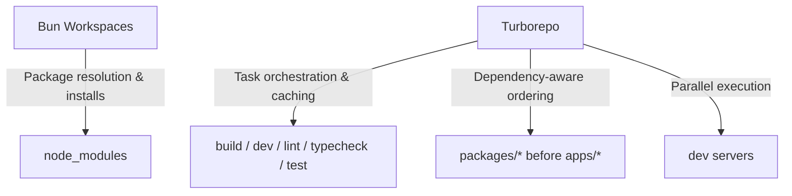
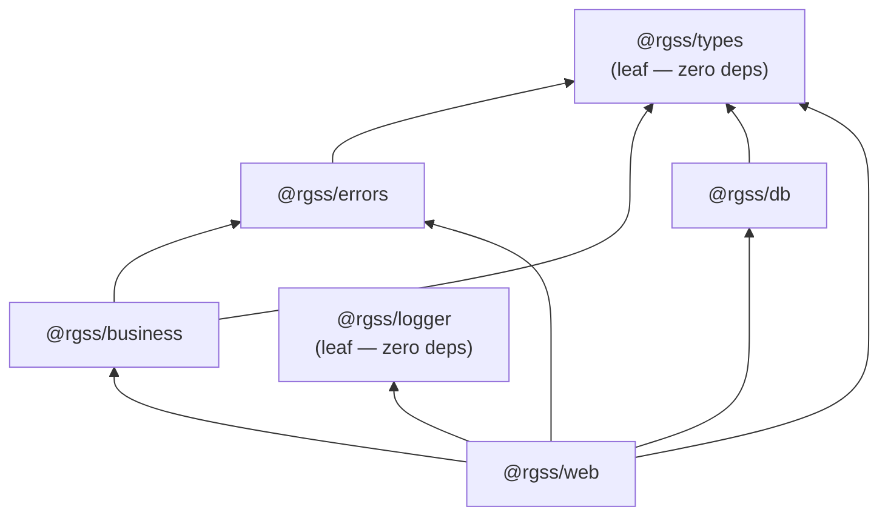

# Design Document — Monorepo Scaffolding (Phase 0)

## Overview

This design covers the complete foundation scaffold for the Royal Glow Salon & Spa monorepo. The goal is a fully buildable, lintable, type-safe monorepo skeleton using Turborepo + Bun workspaces, with Next.js 16.2.6 as the primary web application, shared packages for business logic, database, types, errors, and logging, and a fully integrated design token system via Tailwind CSS v4 + shadcn/ui.

The scaffold produces zero runtime functionality — it establishes the architectural skeleton, tooling configuration, and dependency graph that all subsequent phases build upon.

---

## Architecture

### Monorepo Tool Responsibilities



| Tool | Responsibility |
|------|---------------|
| **Bun workspaces** | Resolves inter-package dependencies, hoists `node_modules`, manages lockfile (`bun.lockb`) |
| **Turborepo** | Orchestrates task pipelines (`build`, `dev`, `lint`, `typecheck`, `test`), provides incremental caching, enforces dependency ordering |

### Directory Structure

```
rgss_solutions/
├── .husky/
│   └── pre-commit                 # lint-staged trigger
├── apps/
│   ├── web/                       # Next.js 16.2.6 — theroyalglow.in
│   │   ├── public/
│   │   ├── src/
│   │   │   ├── app/
│   │   │   │   ├── layout.tsx
│   │   │   │   └── page.tsx
│   │   │   ├── components/
│   │   │   │   └── ui/           # shadcn/ui components land here
│   │   │   ├── lib/
│   │   │   │   └── utils.ts      # cn() utility
│   │   │   ├── styles/
│   │   │   │   └── globals.css   # Tailwind v4 @theme + @import
│   │   │   └── env.ts            # t3-env validation
│   │   ├── components.json        # shadcn/ui config
│   │   ├── next.config.ts
│   │   ├── package.json
│   │   └── tsconfig.json
│   └── cms/                       # Placeholder — Payload CMS (Phase 8)
│       ├── package.json
│       └── README.md
├── docs/                          # Placeholder — Fumadocs (Phase 10)
│   ├── package.json
│   └── README.md
├── packages/
│   ├── business/                  # Pure business logic
│   │   ├── src/
│   │   │   ├── index.ts
│   │   │   └── utils/
│   │   │       ├── currency.ts   # formatINR()
│   │   │       └── date.ts       # formatDateIN()
│   │   ├── package.json
│   │   └── tsconfig.json
│   ├── db/                        # Drizzle ORM + Neon
│   │   ├── src/
│   │   │   ├── index.ts          # Drizzle client export
│   │   │   └── schema/
│   │   │       └── index.ts      # Barrel file
│   │   ├── migrations/           # drizzle-kit output
│   │   ├── drizzle.config.ts
│   │   ├── package.json
│   │   └── tsconfig.json
│   ├── errors/                    # AppError + codes registry
│   │   ├── src/
│   │   │   ├── index.ts
│   │   │   ├── app-error.ts
│   │   │   └── codes.ts
│   │   ├── package.json
│   │   └── tsconfig.json
│   ├── logger/                    # Structured JSON logger
│   │   ├── src/
│   │   │   └── index.ts
│   │   ├── package.json
│   │   └── tsconfig.json
│   └── types/                     # Shared Zod schemas
│       ├── src/
│       │   ├── index.ts
│       │   └── api.ts            # ApiSuccessResponse, ApiErrorResponse
│       ├── package.json
│       └── tsconfig.json
├── .env.example                   # All 55 vars documented
├── .gitignore
├── biome.json                     # Root Biome config
├── package.json                   # Root — workspaces + scripts
├── tsconfig.json                  # Root — strict base config
├── turbo.json                     # Pipeline definitions
└── bun.lockb
```

---

## Components and Interfaces

### Package Dependency Graph



### Layer Dependency Rules (Enforced via package.json)

| Package | Can Import | Cannot Import |
|---------|-----------|---------------|
| `@rgss/types` | `zod` only | Everything else |
| `@rgss/errors` | `@rgss/types` | `@rgss/db`, `@rgss/business`, framework |
| `@rgss/logger` | Nothing internal | Everything else |
| `@rgss/db` | `@rgss/types`, `drizzle-orm`, `@neondatabase/serverless` | `@rgss/business`, `@rgss/errors`, framework |
| `@rgss/business` | `@rgss/types`, `@rgss/errors` | `@rgss/db`, framework, UI |
| `@rgss/web` | All `@rgss/*` packages | — |

Enforcement mechanism: TypeScript module resolution fails if a dependency is not listed in the consuming package's `package.json`. No additional tooling needed.

### Key Configuration Files

#### `turbo.json`

```jsonc
{
  "$schema": "https://turbo.build/schema.json",
  "tasks": {
    "build": {
      "dependsOn": ["^build"],
      "outputs": [".next/**", "dist/**"]
    },
    "dev": {
      "dependsOn": ["^build"],
      "persistent": true,
      "cache": false
    },
    "lint": {
      "dependsOn": ["^build"]
    },
    "typecheck": {
      "dependsOn": ["^build"]
    },
    "test": {
      "dependsOn": ["^build"]
    },
    "clean": {
      "cache": false
    }
  }
}
```

#### Root `package.json` (shape)

```jsonc
{
  "name": "rgss-solutions",
  "private": true,
  "type": "module",
  "workspaces": ["apps/*", "packages/*", "docs"],
  "scripts": {
    "build": "turbo run build",
    "dev": "turbo run dev",
    "lint": "turbo run lint",
    "typecheck": "turbo run typecheck",
    "test": "turbo run test",
    "clean": "turbo run clean",
    "prepare": "husky"
  },
  "devDependencies": {
    "@biomejs/biome": "^1.9.x",
    "husky": "^9.x",
    "lint-staged": "^15.x",
    "turbo": "^2.x",
    "typescript": "^5.7.x"
  },
  "lint-staged": {
    "*.{ts,tsx,json,css}": ["biome check --write"]
  }
}
```

#### Root `tsconfig.json`

```jsonc
{
  "$schema": "https://json.schemastore.org/tsconfig",
  "compilerOptions": {
    "strict": true,
    "noUncheckedIndexedAccess": true,
    "exactOptionalPropertyTypes": true,
    "noEmit": true,
    "target": "ES2022",
    "module": "ESNext",
    "moduleResolution": "bundler",
    "esModuleInterop": true,
    "skipLibCheck": true,
    "forceConsistentCasingInFileNames": true,
    "resolveJsonModule": true,
    "isolatedModules": true,
    "verbatimModuleSyntax": true
  },
  "exclude": ["node_modules", "dist", ".next"]
}
```

#### `biome.json`

```jsonc
{
  "$schema": "https://biomejs.dev/schemas/1.9.4/schema.json",
  "organizeImports": {
    "enabled": true
  },
  "formatter": {
    "enabled": true,
    "indentStyle": "space",
    "indentWidth": 2,
    "lineWidth": 100
  },
  "javascript": {
    "formatter": {
      "quoteStyle": "single",
      "semicolons": "asNeeded",
      "trailingCommas": "all"
    }
  },
  "linter": {
    "enabled": true,
    "rules": {
      "recommended": true,
      "suspicious": {
        "noExplicitAny": "error"
      },
      "correctness": {
        "noUnusedVariables": "error",
        "noUnusedImports": "error"
      },
      "style": {
        "noNonNullAssertion": "warn",
        "useConst": "error"
      }
    }
  },
  "files": {
    "ignore": [
      "node_modules",
      ".next",
      "dist",
      "migrations",
      "*.gen.ts"
    ]
  }
}
```

---

## Data Models

### API Response Schemas (`packages/types/src/api.ts`)

```typescript
import { z } from 'zod'

// Pagination metadata
const paginationMetaSchema = z.object({
  page: z.number().int().positive(),
  totalPages: z.number().int().nonnegative(),
  totalCount: z.number().int().nonnegative(),
})

// Success response — generic over data type
export function apiSuccessSchema<T extends z.ZodTypeAny>(dataSchema: T) {
  return z.object({
    success: z.literal(true),
    data: dataSchema,
    meta: paginationMetaSchema.optional(),
  })
}

// Error response — fixed shape
export const apiErrorResponseSchema = z.object({
  success: z.literal(false),
  error: z.object({
    code: z.string(),
    message: z.string(),
    statusCode: z.number().int().min(400).max(599),
    requestId: z.string(),
    details: z.unknown().optional(),
    retryable: z.boolean().optional(),
  }),
})

// TypeScript types inferred from schemas
export type ApiSuccessResponse<T> = {
  success: true
  data: T
  meta?: z.infer<typeof paginationMetaSchema>
}

export type ApiErrorResponse = z.infer<typeof apiErrorResponseSchema>
```

### AppError Class (`packages/errors/src/app-error.ts`)

```typescript
import type { ErrorCode } from './codes'

export class AppError extends Error {
  readonly code: ErrorCode
  readonly statusCode: number
  readonly isOperational: boolean
  readonly retryable: boolean
  readonly details?: unknown

  constructor(params: {
    code: ErrorCode
    message: string
    statusCode: number
    isOperational?: boolean
    retryable?: boolean
    details?: unknown
    cause?: Error
  }) {
    super(params.message, { cause: params.cause })
    this.name = 'AppError'
    this.code = params.code
    this.statusCode = params.statusCode
    this.isOperational = params.isOperational ?? true
    this.retryable = params.retryable ?? false
    this.details = params.details
  }
}
```

### Logger Output Shape (`packages/logger/`)

```typescript
interface LogEntry {
  level: 'debug' | 'info' | 'warn' | 'error' | 'fatal'
  message: string
  service: string
  environment: string
  timestamp: string  // ISO 8601 UTC
  data?: Record<string, unknown>
}
```

### Business Utilities

```typescript
// packages/business/src/utils/currency.ts
export function formatINR(paise: number): string {
  const rupees = paise / 100
  return new Intl.NumberFormat('en-IN', {
    style: 'currency',
    currency: 'INR',
    minimumFractionDigits: 2,
    maximumFractionDigits: 2,
  }).format(rupees)
}

// packages/business/src/utils/date.ts
export function formatDateIN(date: Date): string {
  return new Intl.DateTimeFormat('en-IN', {
    day: '2-digit',
    month: '2-digit',
    year: 'numeric',
  }).format(date)
}
```

---

## Tailwind CSS v4 Integration

### How `@theme` Works in Tailwind v4

Tailwind CSS v4 reads design tokens directly from the `@theme` block in CSS. Any `--color-*` token automatically becomes available as `bg-*`, `text-*`, `border-*` utilities. Any `--font-*` becomes `font-*`. No `tailwind.config.ts` file is needed.

### `apps/web/src/styles/globals.css`

```css
@import "tailwindcss";

@theme {
  /* Colors — Brand */
  --color-royal-gold: #F4E09B;
  --color-deep-gold: #C8A961;
  --color-warm-gold: #F4E09B;
  --color-warm-stone: #D4C5A9;
  --color-warm-cream: #FFF8E7;
  --color-golden-mist: #FFF3D4;

  /* Colors — Neutrals */
  --color-canvas-white: #FFFFFF;
  --color-cocoa-dark: #1A0F0A;
  --color-rich-chocolate: #2D1810;
  --color-warm-gray: #3D2E1F;
  --color-dusty-gray: #8C8C8C;
  --color-outline-gray: #CCCCCC;
  --color-cloud-gray: #F4F5F9;

  /* Colors — Functional */
  --color-success: #3F7D5C;
  --color-warning: #C8A961;
  --color-error: #B5482E;

  /* Colors — Accent */
  --color-accent-pink: #F8C8D8;

  /* Fonts */
  --font-display: 'Cabinet Grotesk', ui-sans-serif, system-ui, sans-serif;
  --font-sans: 'Clash Grotesk', ui-sans-serif, system-ui, sans-serif;
  --font-ui: 'Plus Jakarta Sans', ui-sans-serif, system-ui, sans-serif;

  /* Radius */
  --radius-cards: 6px;
  --radius-buttons: 8px;
  --radius-pill: 9999px;

  /* Shadows */
  --shadow-card-hover: 0 18px 40px -22px rgba(26, 15, 10, 0.25);
  --shadow-elevated: 0 24px 50px -20px rgba(26, 15, 10, 0.45);

  /* Layout */
  --container-rg: 1278px;
}

/* Base layer — font loading, focus styles */
@layer base {
  :root {
    --radius: 6px;
  }

  body {
    font-family: var(--font-sans);
    color: var(--color-cocoa-dark);
    background-color: var(--color-canvas-white);
  }

  *:focus-visible {
    outline: 2px solid var(--color-deep-gold);
    outline-offset: 2px;
  }

  @media (prefers-reduced-motion: reduce) {
    *, *::before, *::after {
      animation-duration: 0.01ms !important;
      transition-duration: 0.01ms !important;
    }
  }
}
```

### Token → Utility Class Mapping

| DESIGN.md Token | CSS Variable | Tailwind Utility |
|----------------|-------------|-----------------|
| `royal-gold` (#F4E09B) | `--color-royal-gold` | `bg-royal-gold`, `text-royal-gold`, `border-royal-gold` |
| `cocoa-dark` (#1A0F0A) | `--color-cocoa-dark` | `bg-cocoa-dark`, `text-cocoa-dark`, `border-cocoa-dark` |
| `deep-gold` (#C8A961) | `--color-deep-gold` | `bg-deep-gold`, `text-deep-gold`, `border-deep-gold` |
| Cabinet Grotesk | `--font-display` | `font-display` |
| Clash Grotesk | `--font-sans` | `font-sans` |
| Plus Jakarta Sans | `--font-ui` | `font-ui` |
| 6px | `--radius-cards` | `rounded-cards` |
| 9999px | `--radius-pill` | `rounded-pill` |

---

## shadcn/ui Configuration

### `apps/web/components.json`

```jsonc
{
  "$schema": "https://ui.shadcn.com/schema.json",
  "style": "new-york",
  "rsc": true,
  "tsx": true,
  "tailwind": {
    "config": "",
    "css": "src/styles/globals.css",
    "baseColor": "neutral",
    "cssVariables": true
  },
  "aliases": {
    "components": "@/components",
    "utils": "@/lib/utils",
    "ui": "@/components/ui",
    "lib": "@/lib",
    "hooks": "@/hooks"
  },
  "iconLibrary": "lucide"
}
```

### `cn()` Utility (`apps/web/src/lib/utils.ts`)

```typescript
import { type ClassValue, clsx } from 'clsx'
import { twMerge } from 'tailwind-merge'

export function cn(...inputs: ClassValue[]) {
  return twMerge(clsx(inputs))
}
```

### shadcn/ui + Royal Glow Theme Integration

shadcn/ui components use CSS variables for theming. The Royal Glow tokens are mapped via the `@layer base` block in `globals.css`. When shadcn components reference `--primary`, `--background`, etc., they resolve to our design tokens:

```css
@layer base {
  :root {
    --background: 0 0% 100%;           /* canvas-white */
    --foreground: 20 33% 5%;           /* cocoa-dark */
    --primary: 43 82% 78%;             /* royal-gold */
    --primary-foreground: 20 33% 5%;   /* cocoa-dark (text on gold) */
    --secondary: 30 5% 96%;            /* cloud-gray */
    --secondary-foreground: 20 33% 5%; /* cocoa-dark */
    --muted: 30 5% 96%;                /* cloud-gray */
    --muted-foreground: 20 5% 55%;     /* dusty-gray */
    --accent: 43 42% 60%;              /* deep-gold */
    --accent-foreground: 20 33% 5%;    /* cocoa-dark */
    --destructive: 14 60% 44%;         /* error */
    --border: 0 0% 80%;                /* outline-gray */
    --input: 0 0% 80%;                 /* outline-gray */
    --ring: 43 42% 60%;                /* deep-gold */
    --radius: 6px;                     /* radius-cards */
  }
}
```

This means shadcn/ui components (Button, Card, Dialog, etc.) automatically use Royal Glow colors without per-component overrides.

---

## Correctness Properties

*A property is a characteristic or behavior that should hold true across all valid executions of a system — essentially, a formal statement about what the system should do. Properties serve as the bridge between human-readable specifications and machine-verifiable correctness guarantees.*

### Property 1: API Response Schema Validation Round-Trip

*For any* valid data object `T`, wrapping it in the `ApiSuccessResponse` shape (`{ success: true, data: T }`) SHALL pass schema validation, and *for any* object missing the `success` field or with `success: false` in the success schema, validation SHALL reject it. Similarly, *for any* valid error object with `code`, `message`, `statusCode`, and `requestId`, the `ApiErrorResponse` schema SHALL validate it, and *for any* object missing required error fields, validation SHALL reject it.

**Validates: Requirements 10.2, 10.3**

### Property 2: AppError Construction Invariants

*For any* valid error code from the `ErrorCode` registry, any HTTP status code (400–599), any message string, and any combination of optional fields (`isOperational`, `retryable`, `details`), constructing an `AppError` SHALL produce an instance that: (a) is `instanceof Error`, (b) has `name === 'AppError'`, (c) preserves all provided fields exactly, (d) defaults `isOperational` to `true` and `retryable` to `false` when not specified. Additionally, *for any* message string, the factory functions `notFound()`, `forbidden()`, `badRequest()`, `conflict()`, and `serviceUnavailable()` SHALL produce AppError instances with their documented `code` and `statusCode`.

**Validates: Requirements 11.2, 11.4**

### Property 3: Indian Currency Formatting

*For any* non-negative integer `paise` (0 ≤ paise ≤ 9,999,999,999), `formatINR(paise)` SHALL produce a string that: (a) starts with `₹`, (b) contains exactly 2 decimal digits, (c) represents the value `paise / 100` correctly, and (d) uses Indian lakh/crore comma grouping (commas after the first 3 digits from the right, then every 2 digits).

**Validates: Requirements 12.2, 12.5**

### Property 4: Indian Date Formatting Round-Trip

*For any* valid `Date` object, `formatDateIN(date)` SHALL produce a string matching the pattern `DD/MM/YYYY` where the day, month, and year components correspond to the input date's day, month, and year in the `en-IN` locale (IST interpretation for display).

**Validates: Requirements 12.3**

### Property 5: Structured Logger JSON Output

*For any* valid configuration (`service`: non-empty string, `environment`: non-empty string), `createLogger(config)` SHALL return an object with methods `debug`, `info`, `warn`, `error`, and `fatal`. *For any* log level, message string, and optional data object, calling the corresponding method SHALL produce a JSON-parseable string containing: `level` (matching the called method), `message` (matching the input), `service` (matching config), `environment` (matching config), and `timestamp` (valid ISO 8601 UTC string).

**Validates: Requirements 13.2, 13.3, 13.4**

---

## Error Handling

### Strategy

The monorepo scaffold establishes the error handling foundation used by all subsequent phases:

1. **`packages/errors/`** — Defines `AppError` class and error codes registry. All business logic throws `AppError` instances; it never catches them.
2. **`packages/types/`** — Defines the `ApiErrorResponse` Zod schema ensuring all error responses share a consistent shape.
3. **API routes** (future phases) — Use a `withErrorHandler()` wrapper that catches `AppError` and formats the response. Unknown errors get logged to Sentry and return a generic 500.

### Error Codes Registry

The `codes.ts` file exports a `const` object with all error codes. This prevents magic strings and enables TypeScript autocompletion:

- Generic: `VALIDATION_ERROR`, `INTERNAL_ERROR`, `UNAUTHENTICATED`, `FORBIDDEN`, `NOT_FOUND`, `RATE_LIMITED`, `METHOD_NOT_ALLOWED`, `TIMEOUT`, `UPSTREAM_ERROR`, `SERVICE_UNAVAILABLE`
- Domain-specific codes added in later phases (booking, membership, invoice, gems, offer, branch)

### Factory Functions

Convenience factories reduce boilerplate for common error patterns:
- `notFound(message?)` → 404
- `forbidden(message?)` → 403
- `badRequest(message, details?)` → 400
- `conflict(code, message)` → 409
- `serviceUnavailable(service, cause?)` → 502

---

## Testing Strategy

### Approach

This scaffold uses a **dual testing approach**:

1. **Property-based tests** (via `fast-check`) — Verify universal properties of pure functions and data schemas across many generated inputs. Minimum 100 iterations per property.
2. **Example-based unit tests** (via `vitest`) — Verify specific configurations, file structures, and integration points with concrete examples.
3. **Smoke tests** — Verify configuration files exist with correct structure (run as part of CI).
4. **Integration tests** — Verify the full build pipeline, typecheck, and lint pass on the clean scaffold.

### Property-Based Testing Configuration

- **Library:** `fast-check` (TypeScript-native, works with Vitest)
- **Iterations:** Minimum 100 per property test
- **Tag format:** `Feature: monorepo-scaffolding, Property {N}: {description}`

### Test Organization

```
packages/
├── types/
│   └── src/__tests__/
│       └── api.property.test.ts      # Property 1
├── errors/
│   └── src/__tests__/
│       └── app-error.property.test.ts # Property 2
├── business/
│   └── src/__tests__/
│       ├── currency.property.test.ts  # Property 3
│       └── date.property.test.ts      # Property 4
└── logger/
    └── src/__tests__/
        └── logger.property.test.ts    # Property 5
```

### What NOT to Property-Test

The following are verified via smoke/integration tests only:
- Configuration file contents (turbo.json, biome.json, tsconfig.json, package.json)
- Directory structure existence
- Turborepo pipeline execution order
- Tailwind CSS class resolution (build-time integration)
- Husky/lint-staged hook execution
- Environment variable validation (build-time failure)

### CI Verification

The scaffold is considered correct when:
1. `bun install` completes without errors
2. `bun run typecheck` passes with zero errors
3. `bun run lint` passes with zero violations
4. `bun run build` completes successfully
5. All property tests pass (100+ iterations each)
