# Database Schema Design

## Overview

Production-level schema for Royal Glow Salon & Spa. **38 tables** covering auth, profiles, services, scheduling, bookings, billing, SPA memberships, offers, CRM, leads, loyalty (gems), notifications, branches, and system operations.

**ORM:** Drizzle ORM (pure TypeScript, edge-native)
**Database:** Neon DB (PostgreSQL 16, serverless, branching)
**Schema location:** `packages/db/schema/`

---

## Conventions

| Convention | Rule |
|-----------|------|
| **Primary keys** | `text` — application-generated via `nanoid()` or `cuid2()`. No auto-increment serial IDs (prevents enumeration attacks). |
| **Money** | All monetary values stored as `integer` in **paise** (1/100th of ₹). Example: ₹1,000.00 = `100000`. Avoids floating-point precision issues. App converts paise → ₹ for display using **Indian numbering format** (see below). |
| **Timestamps** | `timestamp with time zone` (`timestamptz`) everywhere. Stored as UTC, displayed in IST (UTC+5:30). |
| **Soft deletes** | Not used. Hard deletes with `audit_log` tracking. Keeps queries simple, avoids `WHERE deleted_at IS NULL` on every query. |
| **Naming** | `snake_case` for tables and columns. Singular table names (`booking`, not `bookings`) — except Better Auth tables which use their own naming. |
| **Enums** | PostgreSQL native `CREATE TYPE` enums for type safety. Defined in schema, not stringly-typed. |
| **Foreign keys** | All FKs use `ON DELETE` rules appropriate to the relationship. Cascade for child records, restrict for referenced data. |
| **Indexes** | Explicit indexes on all FK columns, all columns used in `WHERE` / `ORDER BY`, and composite indexes for common query patterns. |
| **Snapshots** | Price, service name, and staff name are snapshotted on `invoice_item` and `booking_service`. Original records can change without corrupting historical data. |
| **Currency display** | Indian numbering system — `en-IN` locale. Format: `₹X,XX,XXX.XX`. Always show 2 decimal places. See formatting utility below. |
| **Date display** | Indian format: `DD/MM/YYYY` via `Intl.DateTimeFormat('en-IN')`. e.g., `09/05/2026`. Used everywhere: UI, invoices, emails. |
| **GST-inclusive pricing** | All customer-facing prices include 18% GST (SAC 999721). `service.price_paise` = GST-inclusive amount. Invoice back-calculates: base = price ÷ 1.18, GST = price − base. |

### Currency Display Format — Indian Numbering System

All ₹ values displayed to users use `en-IN` locale formatting (lakhs, crores — NOT Western millions).

| Paise (stored) | Rupees (display) | Western (wrong) |
|---------------|-----------------|----------------|
| `50000` | ₹500.00 | ₹500.00 |
| `99900` | ₹999.00 | ₹999.00 |
| `100000` | ₹1,000.00 | ₹1,000.00 |
| `149900` | ₹1,499.00 | ₹1,499.00 |
| `250000` | ₹2,500.00 | ₹2,500.00 |
| `10000000` | ₹1,00,000.00 | ₹100,000.00 |
| `100000000` | ₹10,00,000.00 | ₹1,000,000.00 |
| `1000000000` | ₹1,00,00,000.00 | ₹10,000,000.00 |

**Formatting utility** (in `packages/business/utils/currency.ts`):
```ts
/** Convert paise to display string in Indian format */
export function formatINR(paise: number): string {
  return new Intl.NumberFormat('en-IN', {
    style: 'currency',
    currency: 'INR',
    minimumFractionDigits: 2,
    maximumFractionDigits: 2,
  }).format(paise / 100)
}

// formatINR(100000)    → "₹1,000.00"
// formatINR(10000000)  → "₹1,00,000.00"
// formatINR(149900)    → "₹1,499.00"
```

**Rules:**
- Always show 2 decimal places (₹1,000.00 not ₹1,000)
- Use `Intl.NumberFormat('en-IN')` — never manually format commas
- Indian grouping: last 3 digits grouped, then groups of 2 (1,00,000 not 100,000)
- PDF invoices, email templates, and UI all use the same `formatINR()` utility
- No `toFixed()` or string hacks — `Intl.NumberFormat` handles edge cases

### Date Display Format — DD/MM/YYYY (Indian Standard)

All dates displayed to users use `DD/MM/YYYY` format (Indian standard, not US `MM/DD/YYYY`).

| DB Stored | Display |
|-----------|---------|
| `2026-05-09` | `09/05/2026` |
| `2026-12-25` | `25/12/2026` |

**Formatting utility** (in `packages/business/utils/date.ts`):
```ts
/** Format a date to DD/MM/YYYY Indian format */
export function formatDateIN(date: Date): string {
  return new Intl.DateTimeFormat('en-IN', {
    day: '2-digit',
    month: '2-digit',
    year: 'numeric',
  }).format(date)
}

// formatDateIN(new Date('2026-05-09')) → "09/05/2026"
```

**Rules:**
- All customer-facing dates: `DD/MM/YYYY` (profile, bookings, invoices, emails)
- Admin dashboards: same format for consistency
- "Member since" and "Last updated" on `/profile`: `DD/MM/YYYY`

### GST-Inclusive Pricing

All customer-facing prices **include 18% GST** (SAC 999721). The `service.price_paise` column stores the GST-inclusive amount.

**Invoice back-calculation** (in `packages/business/invoicing/`):
```ts
const GST_RATE = 0.18

/** Back-calculate base and GST from inclusive price */
export function splitGST(inclusivePaise: number) {
  const basePaise = Math.round(inclusivePaise / (1 + GST_RATE))
  const gstPaise = inclusivePaise - basePaise
  return { basePaise, gstPaise, totalPaise: inclusivePaise }
}

// splitGST(118000) → { basePaise: 100000, gstPaise: 18000, totalPaise: 118000 }
// ₹1,180.00 inclusive = ₹1,000.00 base + ₹180.00 GST
```

**Rules:**
- Customer sees: `₹1,180.00` (that's it — no "plus tax")
- Invoice line items show: Base ₹1,000.00 + GST ₹180.00 = Total ₹1,180.00
- Gems earned on the GST-inclusive total (the amount customer actually paid)
- **Gems are earned on `invoice_type = 'service'` ONLY** — this covers both Salon AND SPA non-member sessions
- Gems are NOT earned on `membership_purchase` or `membership_session` invoices (SPA membership)

---

## Enum Definitions

```sql
-- Booking lifecycle
CREATE TYPE booking_status AS ENUM (
  'pending',       -- just created, awaiting staff approval
  'confirmed',     -- approved by receptionist/manager
  'rejected',      -- rejected by receptionist/manager (with reason)
  'in_progress',   -- customer in salon, service ongoing
  'completed',     -- service finished
  'cancelled',     -- cancelled by customer or staff
  'no_show',       -- customer didn't show up
  'rescheduled'    -- moved to different time (new booking created)
);

-- Lead pipeline
CREATE TYPE lead_status AS ENUM (
  'new',           -- just captured from Meta ad / form
  'contacted',     -- first outreach made
  'follow_up',     -- needs follow-up
  'booked',        -- converted to a booking
  'won',           -- became a paying customer
  'lost'           -- didn't convert
);

-- Payment
CREATE TYPE payment_status AS ENUM (
  'pending',       -- not yet paid
  'paid',          -- payment received
  'refunded'       -- refunded (Phase 2)
);

CREATE TYPE payment_method AS ENUM (
  'cash',          -- Phase 1: physical cash
  'upi',           -- Phase 1: customer pays to store UPI, receptionist records
  'card',          -- Phase 1: card swipe machine at store, receptionist records
  'online'         -- Phase 2: generic online (Razorpay/Cashfree)
);

-- Waitlist
CREATE TYPE waitlist_status AS ENUM (
  'waiting',       -- in queue
  'notified',      -- slot opened, customer notified
  'booked',        -- customer booked the opened slot
  'expired',       -- customer didn't respond in time
  'cancelled'      -- customer removed themselves
);

-- Notifications
CREATE TYPE notification_type AS ENUM (
  'reminder_24h',
  'reminder_1h',
  'booking_confirmed',
  'booking_rescheduled',
  'booking_cancelled',
  'booking_rejected',
  -- Membership notifications
  'membership_created',
  'membership_session_recorded',
  'membership_expiry_30d',
  'membership_expiry_7d',
  'membership_expiry_1d',
  'membership_expired',
  'membership_hours_low',
  'membership_usage_nudge',
  'birthday_offer',
  'post_service_followup',
  -- Leave notifications
  'leave_submitted',         -- to all receptionists/managers: new leave request pending review
  'leave_approved',          -- to staff: leave request approved
  'leave_rejected',          -- to staff: leave request rejected (with reason)
  -- Internal/admin notifications
  'lead_follow_up_due',      -- to receptionist/manager: lead needs follow-up
  'stale_pending_booking',   -- to receptionist/manager: booking pending too long
  'no_show_check',           -- to receptionist/manager: booking may need no-show marking
  -- Gems notifications (push only, no email)
  'gems_expiry_7d',          -- push: "Your X gems expire in 7 days — book now to use them!"
  'gems_expired'             -- push: "Your gems have expired and been removed from your balance."
);

CREATE TYPE notification_channel AS ENUM (
  'push',          -- Web Push API
  'email'          -- Resend for transactional, Brevo for marketing
);

CREATE TYPE notification_status AS ENUM (
  'pending',       -- queued
  'sent',          -- delivered
  'failed'         -- delivery failed
);

-- Loyalty
CREATE TYPE loyalty_tx_type AS ENUM (
  'earned',        -- from invoice payment
  'redeemed',      -- used as discount
  'expired',       -- gems expired (future)
  'adjusted'       -- manual adjustment by admin
);

-- Staff
CREATE TYPE staff_designation AS ENUM (
  'receptionist',
  'stylist',
  'therapist',
  'manager'
);

-- Customer
CREATE TYPE gender AS ENUM (
  'male',
  'female',
  'other',
  'prefer_not_to_say'
);

-- Audit
CREATE TYPE audit_action AS ENUM (
  'create',
  'update',
  'delete',
  'status_change'
);

-- Service classification
CREATE TYPE service_type AS ENUM (
  'salon',         -- Haircut, Facial, Waxing, etc.
  'spa'            -- Standard/Premium/VVIP SPA packages
);

-- Offer/combo discount type
CREATE TYPE discount_type AS ENUM (
  'percentage',    -- e.g., 20% off linked services
  'flat',          -- e.g., ₹500 off
  'combo_price'    -- bundle price replaces individual prices
);

-- SPA membership lifecycle
CREATE TYPE spa_membership_status AS ENUM (
  'active',        -- currently valid, hours remaining
  'expired',       -- auto-set by pg_cron after expires_at
  'cancelled'      -- manually cancelled by admin
);

-- Invoice type — drives email template and PDF format
CREATE TYPE invoice_type AS ENUM (
  'service',              -- normal salon/spa non-member session (has ₹ amount)
  'membership_purchase',  -- lump sum when membership created (has ₹ amount, no gems earned)
  'membership_session'    -- ₹0 usage record per SPA membership session
);

-- Staff leave approval lifecycle
CREATE TYPE leave_approval_status AS ENUM (
  'pending',    -- submitted by staff, awaiting review — does NOT block bookings
  'approved',   -- approved by receptionist/manager — BLOCKS slot availability
  'rejected'    -- rejected with reason — does not block bookings
);

-- Leave category
CREATE TYPE leave_type AS ENUM (
  'sick',       -- sick leave
  'casual',     -- casual leave
  'personal',   -- personal reason
  'other'       -- any other reason
);

-- Branch operational status
CREATE TYPE branch_status AS ENUM (
  'operational',         -- currently serving customers
  'temporarily_closed',  -- closed for renovation, emergency, etc.
  'opens_soon',          -- announced but not yet operational (non-selectable in booking)
  'shutdown'             -- permanently closed
);
```

---

## Entity-Relationship Diagram (ERD)

```mermaid
erDiagram
    %% ══════════════════════════════════════════
    %% AUTH (Better Auth managed)
    %% ══════════════════════════════════════════

    user {
        text id PK
        text name
        text email UK
        boolean email_verified
        text image
        text role
        boolean banned
        text ban_reason
        timestamp ban_expires
        timestamp created_at
        timestamp updated_at
    }

    session {
        text id PK
        text user_id FK
        timestamp expires_at
        text token UK
        text ip_address
        text user_agent
        timestamp created_at
        timestamp updated_at
    }

    account {
        text id PK
        text user_id FK
        text account_id
        text provider_id
        text access_token
        text refresh_token
        text id_token
        timestamp access_token_expires_at
        timestamp refresh_token_expires_at
        text scope
        text password
        timestamp created_at
        timestamp updated_at
    }

    verification {
        text id PK
        text identifier
        text value
        timestamp expires_at
        timestamp created_at
        timestamp updated_at
    }

    %% ══════════════════════════════════════════
    %% PROFILES
    %% ══════════════════════════════════════════

    customer_profile {
        text id PK
        text user_id FK "UK"
        text phone
        gender gender
        date date_of_birth
        boolean marketing_consent
        timestamp marketing_consent_at
        boolean appointment_reminders_enabled
        boolean membership_alerts_enabled
        text acquisition_source
        text utm_campaign
        text utm_medium
        text utm_source
        timestamp first_visit_at
        timestamp last_visit_at
        integer total_visits
        integer total_spent_paise
        integer noshow_count
        integer late_cancellation_count
        integer consecutive_completed_bookings
        boolean booking_requires_approval
        timestamp created_at
        timestamp updated_at
    }

    staff_profile {
        text id PK
        text user_id FK "UK"
        text phone
        staff_designation designation
        text bio
        text specialization
        boolean is_active
        date hire_date
        timestamp created_at
        timestamp updated_at
    }

    %% ══════════════════════════════════════════
    %% SERVICES
    %% ══════════════════════════════════════════

    service_category {
        text id PK
        text name
        text slug UK
        service_type service_type
        integer display_order
        boolean is_active
    }

    service {
        text id PK
        text category_id FK
        text name
        text slug UK
        text description
        integer duration_minutes
        integer buffer_minutes
        integer price_paise
        boolean is_active
        text image_url
        integer display_order
        timestamp created_at
        timestamp updated_at
    }

    staff_service {
        text staff_id FK "PK"
        text service_id FK "PK"
    }

    %% ══════════════════════════════════════════
    %% SCHEDULING
    %% ══════════════════════════════════════════

    staff_schedule {
        text id PK
        text staff_id FK
        integer day_of_week
        time start_time
        time end_time
        boolean is_working
    }

    staff_time_off {
        text id PK
        text staff_id FK
        leave_type leave_type
        date date
        text reason
        leave_approval_status approval_status
        text reviewed_by FK
        timestamp reviewed_at
        text rejection_reason
        timestamp created_at
        timestamp updated_at
    }

    business_hour {
        text id PK
        integer day_of_week UK
        time open_time
        time close_time
        boolean is_open
    }

    holiday {
        text id PK
        date date UK
        text name
        timestamp created_at
    }

    %% ══════════════════════════════════════════
    %% BOOKINGS
    %% ══════════════════════════════════════════

    booking {
        text id PK
        text booking_number UK
        text branch_id FK
        text customer_id FK
        booking_status status
        service_type service_type
        date booking_date
        time start_time
        time end_time
        integer total_amount_paise
        integer total_duration_minutes
        text notes
        boolean is_walkin
        boolean is_membership_session
        text offer_id FK
        text spa_membership_id FK
        text cancellation_reason
        text rejection_reason
    }

    booking_service {
        text id PK
        text booking_id FK
        text service_id FK
        text staff_id FK
        text service_name_snapshot
        integer price_at_booking_paise
        integer duration_minutes
        integer display_order
    }

    booking_status_log {
        text id PK
        text booking_id FK
        booking_status from_status
        booking_status to_status
        text changed_by FK
        text notes
        timestamp created_at
    }

    waitlist {
        text id PK
        text customer_id FK
        text service_id FK
        text preferred_staff_id FK
        date preferred_date
        time preferred_time_start
        time preferred_time_end
        waitlist_status status
        timestamp notified_at
        timestamp created_at
    }

    %% ══════════════════════════════════════════
    %% BILLING
    %% ══════════════════════════════════════════

    invoice {
        text id PK
        text invoice_number UK
        text branch_id FK
        invoice_type invoice_type
        text booking_id FK
        text customer_id FK
        integer subtotal_paise
        integer discount_amount_paise
        integer taxable_value_paise
        integer gst_amount_paise
        integer total_amount_paise
        payment_method payment_method
        payment_status payment_status
        integer gems_earned
        integer gems_redeemed
        text pdf_url
    }

    invoice_item {
        text id PK
        text invoice_id FK
        text service_id FK
        text service_name_snapshot
        text staff_name_snapshot
        integer unit_price_paise
        integer total_price_paise
    }

    %% ══════════════════════════════════════════
    %% OFFERS
    %% ══════════════════════════════════════════

    offer {
        text id PK
        text name
        text slug UK
        discount_type offer_type
        integer discount_percentage
        integer discount_amount_paise
        integer combo_price_paise
        date start_date
        date end_date
        boolean is_active
        text terms
    }

    offer_service {
        text offer_id PK
        text service_id PK
    }

    offer_redemption {
        text id PK
        text offer_id FK
        text customer_id FK
        text booking_id FK
        date redeemed_date
    }

    %% ══════════════════════════════════════════
    %% CRM & LEADS
    %% ══════════════════════════════════════════

    lead {
        text id PK
        text name
        text phone
        text email
        text service_interested_id FK
        lead_status status
        text source
        text utm_campaign
        text utm_medium
        text utm_source
        text utm_content
        text utm_term
        text assigned_to FK
        text converted_booking_id FK
        timestamp last_contacted_at
        timestamp created_at
        timestamp updated_at
    }

    lead_note {
        text id PK
        text lead_id FK
        text author_id FK
        text content
        timestamp created_at
    }

    customer_tag {
        text id PK
        text name
        text slug UK
        text color
        text description
        timestamp created_at
    }

    customer_tag_assignment {
        text customer_id FK "PK"
        text tag_id FK "PK"
        text assigned_by FK
        timestamp assigned_at
    }

    customer_note {
        text id PK
        text customer_id FK
        text author_id FK
        text booking_id FK
        text content
        timestamp created_at
    }

    %% ══════════════════════════════════════════
    %% LOYALTY
    %% ══════════════════════════════════════════

    loyalty_account {
        text id PK
        text customer_id FK "UK"
        integer gems_balance
        integer total_gems_earned
        integer total_gems_redeemed
        timestamp created_at
        timestamp updated_at
    }

    loyalty_transaction {
        text id PK
        text loyalty_account_id FK
        loyalty_tx_type type
        integer gems_amount
        text invoice_id FK
        text description
        timestamp expires_at
        timestamp created_at
    }

    %% ══════════════════════════════════════════
    %% NOTIFICATIONS
    %% ══════════════════════════════════════════

    push_subscription {
        text id PK
        text user_id FK
        text endpoint
        text p256dh_key
        text auth_key
        boolean is_active
        timestamp created_at
        timestamp updated_at
    }

    notification {
        text id PK
        text user_id FK
        text booking_id FK
        notification_type type
        text title
        text body
        notification_channel channel
        notification_status status
        timestamp sent_at
        timestamp created_at
    }

    %% ══════════════════════════════════════════
    %% SYSTEM
    %% ══════════════════════════════════════════

    daily_sales_summary {
        text id PK
        date date
        text branch_id FK
        integer salon_revenue_paise
        integer spa_revenue_paise
        integer membership_revenue_paise
        integer total_revenue_paise
        integer invoice_count
        integer total_bookings
        integer total_walkins
        integer total_cancellations
        integer total_no_shows
        integer total_new_customers
        integer total_gems_earned
        integer total_gems_redeemed
        text top_service_id FK
        timestamp created_at
    }

      monthly_gst_summary {
        text id PK
        date month
        integer taxable_value_paise
        integer gst_amount_paise
        integer invoice_count
        text sac_code
        timestamp created_at
      }

    audit_log {
        text id PK
        text actor_id FK
        audit_action action
        text entity_type
        text entity_id
        jsonb old_values
        jsonb new_values
        text ip_address
        timestamp created_at
    }

    system_setting {
        text id PK
        text key UK
        jsonb value
        text description
        text updated_by FK
        timestamp updated_at
    }

    branch {
        text id PK
        integer number UK
        text code UK
        text name
        text address_line1
        text address_line2
        text city
        text state
        text pincode
        text phone
        text email
        text google_maps_url
        text google_maps_place_id
        numeric latitude
        numeric longitude
        branch_status status
        date opening_date
        date closing_date
        text temporary_close_reason
        boolean is_primary
        integer display_order
        text created_by FK
        timestamptz created_at
        timestamptz updated_at
    }

    %% ══════════════════════════════════════════
    %% RELATIONSHIPS
    %% ══════════════════════════════════════════

    user ||--o{ session : "has sessions"
    user ||--o{ account : "has accounts"

    user ||--o| customer_profile : "has customer profile"
    user ||--o| staff_profile : "has staff profile"

    service_category ||--o{ service : "contains"

    staff_profile ||--o{ staff_service : "can perform"
    service ||--o{ staff_service : "performed by"

    staff_profile ||--o{ staff_schedule : "has schedule"
    staff_profile ||--o{ staff_time_off : "takes time off"

    user ||--o{ booking : "makes"
    booking ||--o{ booking_service : "includes"
    service ||--o{ booking_service : "booked as"
    staff_profile ||--o{ booking_service : "assigned to"
    booking ||--o{ booking_status_log : "status tracked by"

    user ||--o{ waitlist : "joins"
    service ||--o{ waitlist : "waiting for"

    booking ||--o| invoice : "generates"
    user ||--o{ invoice : "billed to"
    invoice ||--o{ invoice_item : "contains"

    service ||--o{ lead : "interested in"
    lead ||--o{ lead_note : "has notes"

    customer_tag ||--o{ customer_tag_assignment : "applied via"
    user ||--o{ customer_tag_assignment : "tagged"
    user ||--o{ customer_note : "has notes"

    user ||--o| loyalty_account : "has"
    loyalty_account ||--o{ loyalty_transaction : "tracks"
    invoice ||--o{ loyalty_transaction : "triggers"

    user ||--o{ push_subscription : "subscribes"
    user ||--o{ notification : "receives"
    booking ||--o{ notification : "triggers"

    user ||--o{ audit_log : "performed by"

    offer ||--o{ offer_service : "includes"
    service ||--o{ offer_service : "in"
    offer ||--o{ offer_redemption : "used"
    user ||--o{ offer_redemption : "redeems"
    booking ||--o{ offer_redemption : "applied"
    offer ||--o{ booking : "applied"

    branch ||--o{ booking : "hosted at"
    branch ||--o{ invoice : "billed from"
    branch ||--o{ daily_sales_summary : "aggregated per"
    user ||--o{ branch : "created by"

    %% ══════════════════════════════════════════
    %% SPA MEMBERSHIPS
    %% ══════════════════════════════════════════

    spa_membership_tier {
        text id PK
        text name UK
        text slug UK
        integer default_hours_minutes
        integer default_price_paise
        integer default_validity_days
        boolean is_active
        integer display_order
    }

    spa_membership {
        text id PK
        text membership_number UK
        text customer_id FK
        text tier_id FK
        text tier_name_snapshot
        integer total_hours_minutes
        integer used_hours_minutes
        integer price_paid_paise
        date starts_at
        date expires_at
        spa_membership_status status
        text created_by FK
        text invoice_id FK
    }

    spa_membership_tier ||--o{ spa_membership : "template for"
    user ||--o{ spa_membership : "holds"
    booking ||--o{ spa_membership : "session of"
    invoice ||--o| spa_membership : "purchase invoice"
```



---

## Table Definitions

### Auth — Better Auth Managed

> These tables are created and managed by Better Auth's Drizzle adapter. We define them in `packages/db/schema/auth.ts` and Better Auth reads/writes them. **Do not add custom columns directly** — use the separate profile tables instead.

#### `user`

Better Auth core user table. Extended with admin plugin columns (`role`, `banned`, `ban_reason`, `ban_expires`).

| Column | Type | Constraints | Description |
|--------|------|-------------|-------------|
| `id` | `text` | PK | Application-generated ID |
| `name` | `text` | NOT NULL | Display name (from Google OAuth) |
| `email` | `text` | NOT NULL, UNIQUE | Google email address |
| `email_verified` | `boolean` | NOT NULL | Always `true` for Google OAuth |
| `image` | `text` | nullable | Google profile picture URL |
| `role` | `text` | nullable | `'customer'` \| `'receptionist'` \| `'staff'` \| `'manager'` \| `'owner'` \| `'developer'` — Better Auth RBAC plugin |
| `banned` | `boolean` | DEFAULT false | Better Auth admin plugin |
| `ban_reason` | `text` | nullable | Better Auth admin plugin |
| `ban_expires` | `timestamptz` | nullable | Better Auth admin plugin |
| `created_at` | `timestamptz` | NOT NULL | |
| `updated_at` | `timestamptz` | NOT NULL | |

#### `session`

| Column | Type | Constraints | Description |
|--------|------|-------------|-------------|
| `id` | `text` | PK | |
| `user_id` | `text` | NOT NULL, FK → `user.id` | |
| `expires_at` | `timestamptz` | NOT NULL | Session expiry |
| `token` | `text` | NOT NULL, UNIQUE | Session token (HttpOnly cookie) |
| `ip_address` | `text` | nullable | Client IP |
| `user_agent` | `text` | nullable | Browser user agent |
| `created_at` | `timestamptz` | NOT NULL | |
| `updated_at` | `timestamptz` | NOT NULL | |

#### `account`

| Column | Type | Constraints | Description |
|--------|------|-------------|-------------|
| `id` | `text` | PK | |
| `user_id` | `text` | NOT NULL, FK → `user.id` | |
| `account_id` | `text` | NOT NULL | Google account ID |
| `provider_id` | `text` | NOT NULL | `'google'` |
| `access_token` | `text` | nullable | OAuth access token |
| `refresh_token` | `text` | nullable | OAuth refresh token |
| `id_token` | `text` | nullable | OIDC ID token |
| `access_token_expires_at` | `timestamptz` | nullable | |
| `refresh_token_expires_at` | `timestamptz` | nullable | |
| `scope` | `text` | nullable | OAuth scopes |
| `password` | `text` | nullable | Not used (Google OAuth only) |
| `created_at` | `timestamptz` | NOT NULL | |
| `updated_at` | `timestamptz` | NOT NULL | |

#### `verification`

| Column | Type | Constraints | Description |
|--------|------|-------------|-------------|
| `id` | `text` | PK | |
| `identifier` | `text` | NOT NULL | What's being verified |
| `value` | `text` | NOT NULL | Verification token |
| `expires_at` | `timestamptz` | NOT NULL | |
| `created_at` | `timestamptz` | nullable | |
| `updated_at` | `timestamptz` | nullable | |

---

### Profiles

#### `customer_profile`

Extended profile data for customers. One-to-one with `user`.

| Column | Type | Constraints | Description |
|--------|------|-------------|-------------|
| `id` | `text` | PK | |
| `user_id` | `text` | NOT NULL, UNIQUE, FK → `user.id` ON DELETE CASCADE | |
| `phone` | `text` | nullable | Indian mobile number |
| `gender` | `gender` | nullable | Enum: male, female, other, prefer_not_to_say |
| `date_of_birth` | `date` | nullable | For birthday offers |
| `marketing_consent` | `boolean` | NOT NULL, DEFAULT false | DPDP Act: explicit opt-in required. Controls birthday offers, promotional emails, re-engagement emails via Brevo. |
| `marketing_consent_at` | `timestamptz` | nullable | When consent was given (legal audit trail) |
| `appointment_reminders_enabled` | `boolean` | NOT NULL, DEFAULT true | 24h + 1h appointment reminders (push + email). Defaults on silently — customer can turn off from `/profile`. |
| `membership_alerts_enabled` | `boolean` | NOT NULL, DEFAULT true | Membership expiry alerts (30d/7d/1d) and hours low warning (push + email). Defaults on silently — customer can turn off from `/profile`. |
| `acquisition_source` | `text` | nullable | First-touch source: `'organic'`, `'meta_ad'`, `'gmb'`, `'walkin'` |
| `utm_campaign` | `text` | nullable | First-touch Meta campaign |
| `utm_medium` | `text` | nullable | First-touch medium |
| `utm_source` | `text` | nullable | First-touch source |
| `first_visit_at` | `timestamptz` | nullable | First completed booking date |
| `last_visit_at` | `timestamptz` | nullable | Most recent completed booking date |
| `total_visits` | `integer` | NOT NULL, DEFAULT 0 | Denormalized — updated on booking completion |
| `total_spent_paise` | `integer` | NOT NULL, DEFAULT 0 | Denormalized — lifetime value in paise |
| `noshow_count` | `integer` | NOT NULL, DEFAULT 0 | Lifetime no-show count. Incremented on each `no_show` status for non-walk-in bookings only (`is_walkin = false`). |
| `late_cancellation_count` | `integer` | NOT NULL, DEFAULT 0 | Cancellations within `cancellation_window_hours`. CRM visibility only — no fee ever. Staff phones customer to understand reason. |
| `consecutive_completed_bookings` | `integer` | NOT NULL, DEFAULT 0 | Resets to 0 on every no-show. Increments on every completed booking. When it reaches `noshow_recovery_bookings` (3) → restrictions auto-lifted, tag removed. |
| `booking_requires_approval` | `boolean` | NOT NULL, DEFAULT false | `true` when `noshow_count` reaches 4. All future bookings require manager approval. Receptionist can override per-booking. |
| `created_at` | `timestamptz` | NOT NULL, DEFAULT now() | |
| `updated_at` | `timestamptz` | NOT NULL, DEFAULT now() | |

**Acquisition source rule:** `customer_profile.acquisition_source` is first-touch attribution and should not be overwritten by later visits. Resolve it during onboarding/profile creation from persisted pre-auth context:
- `https://theroyalglow.in` with no UTM → `organic`
- `https://theroyalglow.in/?book=1&utm_source=gmb` → `gmb`
- `https://theroyalglow.in/?book=1&utm_source=walkin` → `walkin`
- A converted `/book` lead linked by `leadId` or normalized phone → `meta_ad`

Before Google OAuth redirect, persist `book=1`, `utm_source`, and other UTM fields in session/local storage so the onboarding write can still assign the correct source after auth callback.

**Why denormalize `total_visits` and `total_spent_paise`?** — These are queried on every customer profile view and CRM list. Computing from JOINs across bookings + invoices on every page load is wasteful. Updated atomically on booking completion via a single `UPDATE` in the same transaction.

**No-show counter rule:** `noshow_count` is only incremented when `is_walkin = false`. Walk-in bookings are only created when the customer is physically present at the salon — a no-show status on a walk-in is a receptionist error (e.g., they pre-created the booking for someone who said "I’m on my way"), not a genuine customer no-show.

#### `staff_profile`

Extended profile data for staff. One-to-one with `user`.

| Column | Type | Constraints | Description |
|--------|------|-------------|-------------|
| `id` | `text` | PK | |
| `user_id` | `text` | NOT NULL, UNIQUE, FK → `user.id` ON DELETE CASCADE | |
| `phone` | `text` | nullable | |
| `designation` | `staff_designation` | NOT NULL | Enum: receptionist, stylist, therapist, manager |
| `bio` | `text` | nullable | Displayed on website "Our Team" section |
| `specialization` | `text` | nullable | e.g., "Bridal makeup, Keratin treatment" |
| `is_active` | `boolean` | NOT NULL, DEFAULT true | Soft-disable without deleting |
| `hire_date` | `date` | nullable | |
| `created_at` | `timestamptz` | NOT NULL, DEFAULT now() | |
| `updated_at` | `timestamptz` | NOT NULL, DEFAULT now() | |

---

### Services

#### `service_category`

Groups services. Separated into Salon vs SPA via `service_type` toggle.

| Column | Type | Constraints | Description |
|--------|------|-------------|-------------|
| `id` | `text` | PK | |
| `name` | `text` | NOT NULL | "Haircut & Styling", "Premium SPA Service" |
| `slug` | `text` | NOT NULL, UNIQUE | URL-safe: "haircut-styling", "premium-spa" |
| `description` | `text` | nullable | |
| `service_type` | `service_type` | NOT NULL | Enum: `'salon'` or `'spa'` — powers the Salon/SPA toggle on booking dialog |
| `display_order` | `integer` | NOT NULL, DEFAULT 0 | Sort order on website |
| `is_active` | `boolean` | NOT NULL, DEFAULT true | |
| `created_at` | `timestamptz` | NOT NULL, DEFAULT now() | |
| `updated_at` | `timestamptz` | NOT NULL, DEFAULT now() | |

**Seed categories:**
| # | Name | Slug | Type |
|---|------|------|------|
| 1 | Haircut & Styling | `haircut-styling` | salon |
| 2 | Hair Colouring / Treatment | `hair-colouring-treatment` | salon |
| 3 | Facial & Skincare | `facial-skincare` | salon |
| 4 | Waxing | `waxing` | salon |
| 5 | Manicure & Pedicure | `manicure-pedicure` | salon |
| 6 | Makeup Services | `makeup-services` | salon |
| 7 | Hair SPA & Head Therapies | `hair-spa-head-therapies` | salon |
| 8 | Standard SPA Service | `standard-spa` | spa |
| 9 | Premium SPA Service | `premium-spa` | spa |
| 10 | VVIP SPA Service | `vvip-spa` | spa |

**Why "Hair SPA & Head Therapies" for category 7?** — The services here are head massage, hair spa, scalp treatments. "Massage & Relaxation" sounded like full-body spa which is a separate SPA section, causing customer confusion.
| `description` | `text` | nullable | |
| `display_order` | `integer` | NOT NULL, DEFAULT 0 | Sort order on website |
| `is_active` | `boolean` | NOT NULL, DEFAULT true | |
| `created_at` | `timestamptz` | NOT NULL, DEFAULT now() | |
| `updated_at` | `timestamptz` | NOT NULL, DEFAULT now() | |

#### `service`

Individual services offered.

| Column | Type | Constraints | Description |
|--------|------|-------------|-------------|
| `id` | `text` | PK | |
| `category_id` | `text` | NOT NULL, FK → `service_category.id` ON DELETE RESTRICT | |
| `name` | `text` | NOT NULL | "Keratin Treatment", "Deep Tissue Massage" |
| `slug` | `text` | NOT NULL, UNIQUE | URL-safe identifier |
| `description` | `text` | nullable | Displayed on services page |
| `duration_minutes` | `integer` | NOT NULL | Service time (e.g., 60) |
| `buffer_minutes` | `integer` | NOT NULL, DEFAULT 0 | Gap after service before next booking (cleanup, prep) |
| `price_paise` | `integer` | NOT NULL | Price in paise. ₹2,500.00 = `250000` |
| `is_active` | `boolean` | NOT NULL, DEFAULT true | |
| `image_url` | `text` | nullable | R2 URL for service image |
| `display_order` | `integer` | NOT NULL, DEFAULT 0 | Sort order within category |
| `gems_redeemable` | `boolean` | NOT NULL, DEFAULT false | Whether this service can be unlocked with gems. `true` = appears in the Gems Catalogue. |
| `gems_required` | `integer` | nullable | Gems needed to redeem this service. Required when `gems_redeemable = true`. e.g., `500` |
| `gems_catalogue_order` | `integer` | nullable | Sort order within the Gems Catalogue page. Lower = shown first. |
| `created_at` | `timestamptz` | NOT NULL, DEFAULT now() | |
| `updated_at` | `timestamptz` | NOT NULL, DEFAULT now() | |

**Constraint:** `CHECK (gems_redeemable = false OR gems_required IS NOT NULL)` — a redeemable service must have a gems cost.

**Gems Catalogue rule:** Only services where `gems_redeemable = true AND is_active = true` are shown in the Gems Catalogue. Normal services page never shows `gems_required` — they are separate lists.

#### `staff_service`

Junction table — which staff can perform which services.

| Column | Type | Constraints | Description |
|--------|------|-------------|-------------|
| `staff_id` | `text` | PK (composite), FK → `staff_profile.id` ON DELETE CASCADE | |
| `service_id` | `text` | PK (composite), FK → `service.id` ON DELETE CASCADE | |

---

### Scheduling

#### `staff_schedule`

Weekly recurring schedule template per staff member. 7 rows per staff (one per day).

| Column | Type | Constraints | Description |
|--------|------|-------------|-------------|
| `id` | `text` | PK | |
| `staff_id` | `text` | NOT NULL, FK → `staff_profile.id` ON DELETE CASCADE | |
| `day_of_week` | `integer` | NOT NULL | 0 = Sunday, 6 = Saturday |
| `start_time` | `time` | nullable | Working start (e.g., `09:00`) |
| `end_time` | `time` | nullable | Working end (e.g., `19:00`) |
| `is_working` | `boolean` | NOT NULL, DEFAULT true | `false` = day off |

**Constraint:** UNIQUE(`staff_id`, `day_of_week`)

#### `staff_time_off`

Leave requests submitted by staff, plus direct mark-offs by receptionists/managers. Only `approved` entries block slot availability — `pending` requests do not affect bookings.

| Column | Type | Constraints | Description |
|--------|------|-------------|-------------|
| `id` | `text` | PK | |
| `staff_id` | `text` | NOT NULL, FK → `staff_profile.id` ON DELETE CASCADE | The staff member taking leave |
| `leave_type` | `leave_type` | NOT NULL, DEFAULT 'personal' | Sick / casual / personal / other |
| `date` | `date` | NOT NULL | The specific date off |
| `reason` | `text` | nullable | Staff's note explaining the request |
| `approval_status` | `leave_approval_status` | NOT NULL, DEFAULT 'pending' | State machine: pending → approved / rejected |
| `reviewed_by` | `text` | nullable, FK → `staff_profile.id` | Receptionist/Manager who made the decision |
| `reviewed_at` | `timestamptz` | nullable | When the approval/rejection happened |
| `rejection_reason` | `text` | nullable | Shown to staff when rejected |
| `created_at` | `timestamptz` | NOT NULL, DEFAULT now() | |
| `updated_at` | `timestamptz` | NOT NULL, DEFAULT now() | |

**Constraint:** UNIQUE(`staff_id`, `date`)

**Key business rules:**
- **Only `approved` entries block slot availability.** The booking system filters by `approval_status = 'approved'` when computing staff availability.
- `pending` entries appear highlighted on the admin schedule view but do not block any booking.
- `rejected` entries are retained for records — staff is notified, no availability impact.
- **Self-submitted requests** (staff role submits for their own `staff_id`) always start as `pending` and require review.
- **Admin direct mark-off** (Receptionist/Manager creates the entry) sets `approval_status = 'approved'` immediately — no pending step.
- Staff can withdraw a `pending` request themselves (sets status to `rejected` with `rejection_reason = 'withdrawn_by_staff'`). Cannot withdraw `approved` leave — requires Manager.
- **Booking conflict warning:** When a leave request is approved for a date on which the staff member already has confirmed bookings, the UI shows a warning: *"[Name] has X confirmed booking(s) on [date]. Reassign them manually."* Approval is not blocked — reassignment is the receptionist's responsibility.

#### `business_hour`

Salon operating hours. 7 rows (one per day of week).

| Column | Type | Constraints | Description |
|--------|------|-------------|-------------|
| `id` | `text` | PK | |
| `day_of_week` | `integer` | NOT NULL, UNIQUE | 0 = Sunday, 6 = Saturday |
| `open_time` | `time` | nullable | e.g., `09:00` |
| `close_time` | `time` | nullable | e.g., `21:00` |
| `is_open` | `boolean` | NOT NULL, DEFAULT true | `false` = closed that day |

#### `holiday`

Salon-wide closures (Diwali, Christmas, etc.).

| Column | Type | Constraints | Description |
|--------|------|-------------|-------------|
| `id` | `text` | PK | |
| `date` | `date` | NOT NULL, UNIQUE | |
| `name` | `text` | NOT NULL | "Diwali", "Independence Day" |
| `created_at` | `timestamptz` | NOT NULL, DEFAULT now() | |

---

### Bookings

#### `booking`

Core business entity — one appointment, potentially multiple services.

| Column | Type | Constraints | Description |
|--------|------|-------------|-------------|
| `id` | `text` | PK | |
| `booking_number` | `text` | NOT NULL, UNIQUE | Auto-generated: `BK-RS-2605-H-38291`. Display: `#BKRS2605H38291`. Branch code + YYMM + type (H=salon, S=spa) + 5-digit random. Suffix `-M` for membership sessions. Retry on collision. |
| `branch_id` | `text` | NOT NULL, FK → `branch.id` ON DELETE RESTRICT | Branch where service is performed |
| `customer_id` | `text` | NOT NULL, FK → `user.id` ON DELETE RESTRICT | |
| `status` | `booking_status` | NOT NULL, DEFAULT 'pending' | Enum — see lifecycle below |
| `booking_date` | `date` | NOT NULL | Date of the appointment |
| `start_time` | `time` | NOT NULL | Appointment start |
| `end_time` | `time` | NOT NULL | Appointment end (computed: start + total duration + buffers) |
| `total_amount_paise` | `integer` | NOT NULL | Sum of all services at time of booking (GST-inclusive) |
| `total_duration_minutes` | `integer` | NOT NULL | Sum of all service durations |
| `notes` | `text` | nullable | Customer notes ("Prefer Anjali for haircut") |
| `is_walkin` | `boolean` | NOT NULL, DEFAULT false | Walk-in vs online booking. Walk-ins skip pending → directly confirmed. |
| `service_type` | `service_type` | NOT NULL | `'salon'` or `'spa'`. Enforces Salon/SPA separation at DB level. Enables clean analytics. |
| `offer_id` | `text` | nullable, FK → `offer.id` ON DELETE SET NULL | Offer/combo applied to this booking (if any). Salon bookings only. |
| `is_membership_session` | `boolean` | NOT NULL, DEFAULT false | `true` = SPA membership session. Total = ₹0. Requires `spa_membership_id`. |
| `spa_membership_id` | `text` | nullable, FK → `spa_membership.id` ON DELETE RESTRICT | The membership whose hours are consumed. Null for non-member bookings. |
| `cancellation_reason` | `text` | nullable | Filled when status → cancelled |
| `cancelled_at` | `timestamptz` | nullable | When cancellation happened |
| `rejection_reason` | `text` | nullable | Filled when receptionist rejects the booking |
| `rejected_at` | `timestamptz` | nullable | When rejection happened |
| `reschedule_count` | `integer` | NOT NULL, DEFAULT 0 | Times this booking has been rescheduled. Max = `reschedule_limit_per_booking` (2). 3rd attempt blocked in business logic — customer must cancel and re-book fresh. |
| `created_at` | `timestamptz` | NOT NULL, DEFAULT now() | |
| `updated_at` | `timestamptz` | NOT NULL, DEFAULT now() | |

**Booking type constraints:**
```sql
-- Membership session must reference a membership
CHECK (is_membership_session = false OR spa_membership_id IS NOT NULL)
-- Membership sessions are always SPA type
CHECK (is_membership_session = false OR service_type = 'spa')
-- Offers only on non-membership bookings
CHECK (offer_id IS NULL OR is_membership_session = false)
```

**Booking Status Lifecycle:**
```
Customer books online → pending
                          ↓
              Receptionist/Manager decision:
                ┌──────┬───────┐
             approves    rejects
                ↓           ↓
           confirmed    rejected (reason stored)
                ↓
           in_progress (customer in salon)
                ↓
           completed (invoice generated)

At any point before in_progress:
  confirmed → cancelled (by customer/staff)
  confirmed → no_show
  confirmed → rescheduled (new booking created)
  pending   → cancelled (by customer)

Walk-in: receptionist creates → confirmed (skips pending)
```

**Customer actions by status:**
| Status | Edit Services | Reschedule | Cancel | View Invoice |
|--------|:---:|:---:|:---:|:---:|
| pending | ✅ | ✅ | ✅ | — |
| confirmed | — | ✅ | ✅ | — |
| rejected | — | — | — | — |
| in_progress | — | — | — | — |
| completed | — | — | — | ✅ |
| cancelled | — | — | — | — |

#### `booking_service`

Junction — individual services within a booking. Each service can have a different staff member.

| Column | Type | Constraints | Description |
|--------|------|-------------|-------------|
| `id` | `text` | PK | |
| `booking_id` | `text` | NOT NULL, FK → `booking.id` ON DELETE CASCADE | |
| `service_id` | `text` | NOT NULL, FK → `service.id` ON DELETE RESTRICT | |
| `staff_id` | `text` | NOT NULL, FK → `staff_profile.id` ON DELETE RESTRICT | The specific staff performing this service |
| `service_name_snapshot` | `text` | NOT NULL | Frozen service name at time of booking |
| `price_at_booking_paise` | `integer` | NOT NULL | Frozen price — original service price may change later |
| `duration_minutes` | `integer` | NOT NULL | Frozen duration |
| `display_order` | `integer` | NOT NULL, DEFAULT 0 | Order of services in this booking |

#### `booking_status_log`

Audit trail for every booking status change.

| Column | Type | Constraints | Description |
|--------|------|-------------|-------------|
| `id` | `text` | PK | |
| `booking_id` | `text` | NOT NULL, FK → `booking.id` ON DELETE CASCADE | |
| `from_status` | `booking_status` | nullable | null for initial creation |
| `to_status` | `booking_status` | NOT NULL | |
| `changed_by` | `text` | NOT NULL, FK → `user.id` ON DELETE RESTRICT | Staff or customer who changed it |
| `notes` | `text` | nullable | "Customer called to cancel" |
| `created_at` | `timestamptz` | NOT NULL, DEFAULT now() | |

#### `waitlist`

Customers waiting for a fully-booked slot to open up.

| Column | Type | Constraints | Description |
|--------|------|-------------|-------------|
| `id` | `text` | PK | |
| `customer_id` | `text` | NOT NULL, FK → `user.id` ON DELETE CASCADE | |
| `service_id` | `text` | NOT NULL, FK → `service.id` ON DELETE RESTRICT | |
| `preferred_staff_id` | `text` | nullable, FK → `staff_profile.id` | null = any staff |
| `preferred_date` | `date` | NOT NULL | |
| `preferred_time_start` | `time` | nullable | null = any time that day |
| `preferred_time_end` | `time` | nullable | |
| `status` | `waitlist_status` | NOT NULL, DEFAULT 'waiting' | |
| `notified_at` | `timestamptz` | nullable | When we notified them a slot opened |
| `created_at` | `timestamptz` | NOT NULL, DEFAULT now() | |

---

### Billing

#### `invoice`

Generated at checkout after service completion.

| Column | Type | Constraints | Description |
|--------|------|-------------|-------------|
| `id` | `text` | PK | |
| `invoice_number` | `text` | NOT NULL, UNIQUE | Auto-generated: `INV-1-2627-92921`. Display: `#INV1262792921`. Branch number + financial year + 5-digit random. Single format for ALL types. Retry on collision. |
| `branch_id` | `text` | NOT NULL, FK → `branch.id` ON DELETE RESTRICT | Branch that generated this invoice |
| `booking_id` | `text` | NOT NULL, FK → `booking.id` ON DELETE RESTRICT | |
| `customer_id` | `text` | NOT NULL, FK → `user.id` ON DELETE RESTRICT | |
| `subtotal_paise` | `integer` | NOT NULL | GST-inclusive sum of line items before discount |
| `discount_amount_paise` | `integer` | NOT NULL, DEFAULT 0 | GST-inclusive manual discount or gems redemption value |
| `taxable_value_paise` | `integer` | NOT NULL, DEFAULT 0 | GST-exclusive taxable value after discount, back-calculated from inclusive pricing |
| `gst_amount_paise` | `integer` | NOT NULL, DEFAULT 0 | GST component after discount (18%, SAC 999721) |
| `total_amount_paise` | `integer` | NOT NULL | Final GST-inclusive amount payable: `subtotal - discount = taxable_value + gst_amount` |
| `invoice_type` | `invoice_type` | NOT NULL, DEFAULT 'service' | Drives email template + PDF format. See invoice types below. |
| `payment_method` | `payment_method` | NOT NULL, DEFAULT 'cash' | Enum: cash, upi, card (Phase 1 — receptionist selects), online (Phase 2) |
| `payment_status` | `payment_status` | NOT NULL, DEFAULT 'pending' | For `membership_session` type: always `'paid'` at ₹0. |
| `payment_reference` | `text` | nullable | Phase 2: Razorpay/Cashfree transaction ID |
| `gems_earned` | `integer` | NOT NULL, DEFAULT 0 | Gems earned from this invoice (always from paid amount) |
| `gems_redeemed` | `integer` | NOT NULL, DEFAULT 0 | Gems spent to unlock a catalogue service on this booking |
| `gems_redeemed_service_id` | `text` | nullable, FK → `service.id` ON DELETE RESTRICT | The specific catalogue service that was unlocked with gems. Null if no gems redeemed. |
| `pdf_url` | `text` | nullable | R2 URL of generated PDF invoice |
| `notes` | `text` | nullable | Internal notes |
| `paid_at` | `timestamptz` | nullable | When payment was marked received |
| `created_at` | `timestamptz` | NOT NULL, DEFAULT now() | |
| `updated_at` | `timestamptz` | NOT NULL, DEFAULT now() | |

**Invoice types:**
| `invoice_type` | Amount | Gems Earned | PDF/Email Template |
|---------------|--------|------------|-------------------|
| `service` | ₹ amount (GST-inclusive) | ✅ Yes (1% of total) | Standard service invoice |
| `membership_purchase` | ₹ amount (lump sum) | ❌ No | Membership welcome invoice |
| `membership_session` | ₹0 | ❌ No | Session usage confirmation |

**Invoice Number Generation:**
```
-- No sequences. Random 5-digit generation with retry on unique constraint collision.
-- Format: INV-{branch_number}-{financial_year}-{5_digit_random}
-- Example: INV-1-2627-92921 (Rayasandra, FY April 2026 → March 2027)
-- Display: #INV1262792921 (stripped dashes, prefixed with #)
-- Single format for ALL invoice types (service, membership_purchase, membership_session)
-- The invoice_type column differentiates internally — no separate numbering per type.
-- Financial year: April 2026 → March 2027 = "2627". Rolls over April 1st.
-- Pool: 90,000 values per branch per financial year. At max ~900 invoices/month, collision probability per insert < 1%.
```

#### `invoice_item`

Line items on an invoice — one per service.

| Column | Type | Constraints | Description |
|--------|------|-------------|-------------|
| `id` | `text` | PK | |
| `invoice_id` | `text` | NOT NULL, FK → `invoice.id` ON DELETE CASCADE | |
| `service_id` | `text` | NOT NULL, FK → `service.id` ON DELETE RESTRICT | |
| `service_name_snapshot` | `text` | NOT NULL | Frozen — service name can change |
| `staff_name_snapshot` | `text` | NOT NULL | Frozen — who performed the service |
| `quantity` | `integer` | NOT NULL, DEFAULT 1 | Usually 1 |
| `unit_price_paise` | `integer` | NOT NULL | Price per unit at time of invoice |
| `total_price_paise` | `integer` | NOT NULL | `quantity × unit_price` |
| `display_order` | `integer` | NOT NULL, DEFAULT 0 | |

---

### SPA Memberships

#### `spa_membership_tier`

Admin-configurable tier templates. Receptionists/Managers edit these defaults in the admin portal. When creating a per-customer membership, these are the starting values — all can be overridden at creation time.

| Column | Type | Constraints | Description |
|--------|------|-------------|-------------|
| `id` | `text` | PK | |
| `name` | `text` | NOT NULL, UNIQUE | "Silver", "Gold", "Platinum" |
| `slug` | `text` | NOT NULL, UNIQUE | "silver", "gold", "platinum" |
| `description` | `text` | nullable | Displayed on `/membership` info page |
| `default_hours_minutes` | `integer` | NOT NULL | Template hours. 8 hrs = 480, 15 hrs = 900 |
| `default_price_paise` | `integer` | NOT NULL | Template price. ₹10,000 = 1000000 |
| `default_validity_days` | `integer` | NOT NULL | e.g., 90 days |
| `is_active` | `boolean` | NOT NULL, DEFAULT true | Hide tier from creation form without deleting |
| `display_order` | `integer` | NOT NULL, DEFAULT 0 | Order on the `/membership` info page |
| `created_at` | `timestamptz` | NOT NULL, DEFAULT now() | |
| `updated_at` | `timestamptz` | NOT NULL, DEFAULT now() | |

**Seed data:**
| Tier | Slug | Default Hours | Default Price | Default Validity |
|------|------|-------------|---------------|------------------|
| Silver | silver | 8 hrs (480 min) | ₹10,000 | 90 days |
| Gold | gold | 15 hrs (900 min) | ₹15,000 | 90 days |
| Platinum | platinum | (set by Owner/Manager) | (set by Owner/Manager) | (set by Owner/Manager) |

**Access:** Open — all membership tiers give access to ALL SPA services. Hours are the only constraint (Option B).

#### `spa_membership`

Per-customer membership instance. Created by Receptionist/Manager/Owner/Developer.

| Column | Type | Constraints | Description |
|--------|------|-------------|-------------|
| `id` | `text` | PK | |
| `membership_number` | `text` | NOT NULL, UNIQUE | Auto-generated: `RG-MEM-26-90872`. Display: `#RGMEM2690872`. Calendar year (last 2 digits) + 5-digit random. No branch code — members can use any branch. Retry on collision. |
| `customer_id` | `text` | NOT NULL, FK → `user.id` ON DELETE RESTRICT | |
| `tier_id` | `text` | NOT NULL, FK → `spa_membership_tier.id` ON DELETE RESTRICT | |
| `tier_name_snapshot` | `text` | NOT NULL | Frozen tier name — tier can be renamed later |
| `total_hours_minutes` | `integer` | NOT NULL | Agreed hours (overridable from tier default at creation). 8 hrs = 480. |
| `used_hours_minutes` | `integer` | NOT NULL, DEFAULT 0 | Denormalized running total. Updated on each session. |
| `price_paid_paise` | `integer` | NOT NULL | Negotiated price at time of membership creation |
| `starts_at` | `date` | NOT NULL | Membership start date |
| `expires_at` | `date` | NOT NULL | `starts_at + validity_days` |
| `status` | `spa_membership_status` | NOT NULL, DEFAULT 'active' | active / expired / cancelled |
| `created_by` | `text` | NOT NULL, FK → `user.id` ON DELETE RESTRICT | Staff who created this membership |
| `invoice_id` | `text` | nullable, FK → `invoice.id` ON DELETE RESTRICT | The `membership_purchase` invoice for this enrollment |
| `notes` | `text` | nullable | Negotiation notes, special terms |
| `created_at` | `timestamptz` | NOT NULL, DEFAULT now() | |
| `updated_at` | `timestamptz` | NOT NULL, DEFAULT now() | |

**Constraints:**
```sql
-- Prevent overspend of hours
CHECK (used_hours_minutes <= total_hours_minutes)

-- One active membership per customer at a time
CREATE UNIQUE INDEX idx_membership_one_active
  ON spa_membership (customer_id)
  WHERE status = 'active';
```

**Membership number generation:**
```
-- No sequences. Random 5-digit generation with retry on unique constraint collision.
-- Format: RG-MEM-{YY}-{branch_number}-{5_digit_random}
-- Example: RG-MEM-26-1-90872
-- Display: #RGMEM26190872 (stripped dashes, prefixed with #)
-- YY = calendar year last 2 digits. Resets conceptually on Jan 1 (26 → 27).
-- Branch number embedded — sessions restricted to originating branch only.
-- Pool: 90,000 values per branch per calendar year. Collision rate negligible.
```

**Branch-locked sessions:** Membership sessions can ONLY be recorded at the branch where the membership was originally purchased. The session recording flow validates `booking.branch_id == spa_membership originating branch` and rejects with an error if they don't match. Customer must purchase a separate membership if they want SPA hours at a different branch.

**Membership flow:**
```
Admin creates membership for customer
  → Selects tier (Silver/Gold/Platinum)
  → Overrides hours and/or price if negotiated
  → Sets start date (today by default)
  → expires_at = starts_at + tier.default_validity_days
  → spa_membership record created (status: active)
  → membership_purchase invoice generated (₹ amount)
  → Invoice emailed to customer (Resend)
  → Push notification: "Your Royal Glow SPA Membership is active!"
  → Customer sees full details on /membership

On each session:
  Admin records session in admin portal
  → Selects customer + service performed
  → used_hours_minutes += service.duration_minutes
  → booking record created (status: completed, is_membership_session: true, total: ₹0)
  → membership_session invoice generated (₹0)
  → Invoice + session summary emailed to customer
  → Customer sees session in /bookings and /membership

Expiry reminders (pg_cron → QStash → Resend):
  → 30 days before expires_at: "Your membership expires in 30 days. X hours remaining."
  → 7 days before expires_at:  "Urgent: Expires in 7 days. Book your remaining hours!"
  → 1 day before expires_at:   "Last chance: Expires tomorrow. Unused hours forfeited."
  → When used_hours_minutes leaves < 60 min remaining: "Less than 1 hour left on your membership."

Auto-expiry (pg_cron daily 00:30 IST):
  → UPDATE spa_membership SET status = 'expired'
    WHERE expires_at < CURRENT_DATE AND status = 'active'
  → Notification: "Your membership has expired. Unused hours have been forfeited."
```

---

### Offers & Combos

#### `offer`

Promotions, discounts, and combo bundles displayed on `/offers`.

| Column | Type | Constraints | Description |
|--------|------|-------------|-------------|
| `id` | `text` | PK | |
| `name` | `text` | NOT NULL | "Summer Glow Combo", "20% Off Facials" |
| `slug` | `text` | NOT NULL, UNIQUE | URL-safe identifier |
| `description` | `text` | nullable | Displayed on the offer card |
| `offer_type` | `discount_type` | NOT NULL | Enum: percentage, flat, combo_price |
| `discount_percentage` | `integer` | nullable | For `percentage` type: 20 = 20% off. CHECK constraint below. |
| `discount_amount_paise` | `integer` | nullable | For `flat` type: flat ₹ discount. e.g., 50000 = ₹500.00 off |
| `combo_price_paise` | `integer` | nullable | For `combo_price` type: total bundle price. e.g., 299900 = ₹2,999.00 |
| `start_date` | `date` | NOT NULL | Offer active from |
| `end_date` | `date` | NOT NULL | Offer active until (inclusive) |
| `is_active` | `boolean` | NOT NULL, DEFAULT true | Manual kill switch |
| `terms` | `text` | nullable | "Valid on weekdays only", "Cannot combine with gems" |
| `image_url` | `text` | nullable | R2 URL for offer banner/card |
| `display_order` | `integer` | NOT NULL, DEFAULT 0 | Sort order on /offers page |
| `created_at` | `timestamptz` | NOT NULL, DEFAULT now() | |
| `updated_at` | `timestamptz` | NOT NULL, DEFAULT now() | |

**Constraints:**
```sql
CHECK (offer_type != 'percentage'  OR discount_percentage IS NOT NULL)
CHECK (offer_type != 'flat'        OR discount_amount_paise IS NOT NULL)
CHECK (offer_type != 'combo_price' OR combo_price_paise IS NOT NULL)
CHECK (start_date <= end_date)
CHECK (discount_percentage IS NULL OR (discount_percentage > 0 AND discount_percentage <= 100))
```

**Active offer query:** `WHERE is_active = true AND start_date <= CURRENT_DATE AND end_date >= CURRENT_DATE`

#### `offer_service`

Junction — which services are included in an offer/combo.

| Column | Type | Constraints | Description |
|--------|------|-------------|-------------|
| `offer_id` | `text` | PK (composite), FK → `offer.id` ON DELETE CASCADE | |
| `service_id` | `text` | PK (composite), FK → `service.id` ON DELETE CASCADE | |

For **combo_price** offers: customer must select ALL linked services to get the combo price.
For **percentage/flat** offers: discount applies to any of the linked services.

#### `offer_redemption`

Tracks which customer used which offer on which date. **One offer per customer per day** enforced here.

| Column | Type | Constraints | Description |
|--------|------|-------------|-------------|
| `id` | `text` | PK | |
| `offer_id` | `text` | NOT NULL, FK → `offer.id` ON DELETE RESTRICT | |
| `customer_id` | `text` | NOT NULL, FK → `user.id` ON DELETE RESTRICT | |
| `booking_id` | `text` | NOT NULL, FK → `booking.id` ON DELETE RESTRICT | |
| `redeemed_date` | `date` | NOT NULL | The date the offer was used |
| `created_at` | `timestamptz` | NOT NULL, DEFAULT now() | |

**Constraint:** `UNIQUE (customer_id, redeemed_date)` — one offer total per customer per day (any offer, not per-offer).

---

### CRM & Leads

#### `lead`

Prospects captured from Meta/Instagram ads through `/book` or Meta native lead forms. Organic root-domain discovery, GMB, in-store QR, and direct website bookings are normal `booking` rows, not leads, unless they first came through `/book`. Customers who fill `/book` but never book remain in `/admin/leads`; no `customer_profile` is created until they sign in/onboard or staff converts them.

| Column | Type | Constraints | Description |
|--------|------|-------------|-------------|
| `id` | `text` | PK | |
| `name` | `text` | NOT NULL | |
| `phone` | `text` | nullable | Indian mobile |
| `email` | `text` | nullable | |
| `service_interested_id` | `text` | nullable, FK → `service.id` ON DELETE SET NULL | What they enquired about |
| `status` | `lead_status` | NOT NULL, DEFAULT 'new' | Pipeline stage |
| `source` | `text` | NOT NULL, DEFAULT 'meta_ad' | Lead source. Phase 1 `/book` and Meta native webhooks both use `meta_ad`. |
| `utm_campaign` | `text` | nullable | Which Meta campaign |
| `utm_medium` | `text` | nullable | |
| `utm_source` | `text` | nullable | |
| `utm_content` | `text` | nullable | Which ad creative |
| `utm_term` | `text` | nullable | |
| `assigned_to` | `text` | nullable, FK → `user.id` ON DELETE SET NULL | Receptionist/manager handling this lead |
| `converted_booking_id` | `text` | nullable, FK → `booking.id` ON DELETE SET NULL | Set when lead converts → links to first booking |
| `last_contacted_at` | `timestamptz` | nullable | |
| `created_at` | `timestamptz` | NOT NULL, DEFAULT now() | |
| `updated_at` | `timestamptz` | NOT NULL, DEFAULT now() | |

#### `lead_note`

Call notes, conversation logs, follow-up notes per lead.

| Column | Type | Constraints | Description |
|--------|------|-------------|-------------|
| `id` | `text` | PK | |
| `lead_id` | `text` | NOT NULL, FK → `lead.id` ON DELETE CASCADE | |
| `author_id` | `text` | NOT NULL, FK → `user.id` ON DELETE RESTRICT | Staff member who wrote the note |
| `content` | `text` | NOT NULL | |
| `created_at` | `timestamptz` | NOT NULL, DEFAULT now() | |

#### `customer_tag`

Reusable tags for segmenting customers (VIP, Frequent, Inactive, Bridal, etc.).

| Column | Type | Constraints | Description |
|--------|------|-------------|-------------|
| `id` | `text` | PK | |
| `name` | `text` | NOT NULL | "VIP", "Frequent Visitor", "Inactive 60d+" |
| `slug` | `text` | NOT NULL, UNIQUE | "vip", "frequent-visitor" |
| `color` | `text` | nullable | Hex color for UI badge (e.g., `#FFD700`) |
| `description` | `text` | nullable | |
| `created_at` | `timestamptz` | NOT NULL, DEFAULT now() | |

#### `customer_tag_assignment`

Junction — which tags are applied to which customers.

| Column | Type | Constraints | Description |
|--------|------|-------------|-------------|
| `customer_id` | `text` | PK (composite), FK → `user.id` ON DELETE CASCADE | |
| `tag_id` | `text` | PK (composite), FK → `customer_tag.id` ON DELETE CASCADE | |
| `assigned_by` | `text` | NOT NULL, FK → `user.id` ON DELETE RESTRICT | Staff who applied the tag |
| `assigned_at` | `timestamptz` | NOT NULL, DEFAULT now() | |

#### `customer_note`

Staff notes about a customer — tied to specific visits or general.

| Column | Type | Constraints | Description |
|--------|------|-------------|-------------|
| `id` | `text` | PK | |
| `customer_id` | `text` | NOT NULL, FK → `user.id` ON DELETE CASCADE | |
| `author_id` | `text` | NOT NULL, FK → `user.id` ON DELETE RESTRICT | Staff who wrote it |
| `booking_id` | `text` | nullable, FK → `booking.id` ON DELETE SET NULL | If tied to a specific visit |
| `content` | `text` | NOT NULL | "Prefers shorter layers", "Allergic to ammonia" |
| `created_at` | `timestamptz` | NOT NULL, DEFAULT now() | |

---

### Loyalty — Gems System

#### `loyalty_account`

One account per customer. Created on first completed booking.

| Column | Type | Constraints | Description |
|--------|------|-------------|-------------|
| `id` | `text` | PK | |
| `customer_id` | `text` | NOT NULL, UNIQUE, FK → `user.id` ON DELETE CASCADE | |
| `gems_balance` | `integer` | NOT NULL, DEFAULT 0 | Current redeemable gems |
| `total_gems_earned` | `integer` | NOT NULL, DEFAULT 0 | Lifetime earned (never decreases) |
| `total_gems_redeemed` | `integer` | NOT NULL, DEFAULT 0 | Lifetime redeemed |
| `created_at` | `timestamptz` | NOT NULL, DEFAULT now() | |
| `updated_at` | `timestamptz` | NOT NULL, DEFAULT now() | |

**Invariant:** `gems_balance = total_gems_earned - total_gems_redeemed` (enforced in business logic, verified by reconciliation pg_cron job)

#### `loyalty_transaction`

Every gem earn, redeem, expiry, or manual adjustment. Immutable ledger — insert only, never update.

| Column | Type | Constraints | Description |
|--------|------|-------------|-------------|
| `id` | `text` | PK | |
| `loyalty_account_id` | `text` | NOT NULL, FK → `loyalty_account.id` ON DELETE RESTRICT | |
| `type` | `loyalty_tx_type` | NOT NULL | Enum: earned, redeemed, expired, adjusted |
| `gems_amount` | `integer` | NOT NULL | Positive for earn/adjust-up, negative for redeem/expire |
| `invoice_id` | `text` | nullable, FK → `invoice.id` ON DELETE RESTRICT | Which invoice triggered this (null for manual adjustments) |
| `description` | `text` | nullable | "Earned from invoice #INV1262792921", "Redeemed on booking" |
| `expires_at` | `timestamptz` | nullable | Set to `created_at + gems_expiry_days` (365 days / 1 year) for `type = 'earned'` only. `null` for redeemed / expired / adjusted rows. pg_cron scans this column nightly to expire gems. |
| `created_at` | `timestamptz` | NOT NULL, DEFAULT now() | |

---

### Notifications

#### `push_subscription`

Web Push API subscription data per user. A user can have multiple subscriptions (different browsers/devices).

| Column | Type | Constraints | Description |
|--------|------|-------------|-------------|
| `id` | `text` | PK | |
| `user_id` | `text` | NOT NULL, FK → `user.id` ON DELETE CASCADE | |
| `endpoint` | `text` | NOT NULL | Web Push endpoint URL |
| `p256dh_key` | `text` | NOT NULL | Public encryption key |
| `auth_key` | `text` | NOT NULL | Auth secret |
| `is_active` | `boolean` | NOT NULL, DEFAULT true | Set false on push failure (expired subscription) |
| `created_at` | `timestamptz` | NOT NULL, DEFAULT now() | |
| `updated_at` | `timestamptz` | NOT NULL, DEFAULT now() | |

#### `notification`

Log of all notifications sent (push + email).

| Column | Type | Constraints | Description |
|--------|------|-------------|-------------|
| `id` | `text` | PK | |
| `user_id` | `text` | NOT NULL, FK → `user.id` ON DELETE CASCADE | |
| `booking_id` | `text` | nullable, FK → `booking.id` ON DELETE SET NULL | |
| `type` | `notification_type` | NOT NULL | What kind of notification |
| `title` | `text` | NOT NULL | Notification title |
| `body` | `text` | NOT NULL | Notification body |
| `channel` | `notification_channel` | NOT NULL | push or email |
| `status` | `notification_status` | NOT NULL, DEFAULT 'pending' | |
| `sent_at` | `timestamptz` | nullable | When actually delivered |
| `created_at` | `timestamptz` | NOT NULL, DEFAULT now() | |

---

### Branches

#### `branch`

Business locations. Currently single-branch (Rayasandra). Multi-branch ready for future expansion.

| Column | Type | Constraints | Description |
|--------|------|-------------|-------------|
| `id` | `text` | PK | |
| `number` | `integer` | NOT NULL, UNIQUE | Single digit: 1, 2, 3… Used in invoice numbers (`INV-1-...`) |
| `code` | `text` | NOT NULL, UNIQUE | 2-char uppercase: `RS`, `MH`. Used in booking numbers (`BK-RS-...`) |
| `name` | `text` | NOT NULL | "Rayasandra", "Marathahalli" |
| `address_line1` | `text` | NOT NULL | Street address |
| `address_line2` | `text` | nullable | Landmark / floor |
| `city` | `text` | NOT NULL, DEFAULT 'Bengaluru' | |
| `state` | `text` | NOT NULL, DEFAULT 'Karnataka' | |
| `pincode` | `text` | NOT NULL | |
| `phone` | `text` | NOT NULL | Branch phone number |
| `email` | `text` | nullable | Branch-specific email |
| `google_maps_url` | `text` | nullable | Full GMB link for directions |
| `google_maps_place_id` | `text` | nullable | For embedded map + reviews |
| `latitude` | `numeric(10,7)` | nullable | GPS latitude |
| `longitude` | `numeric(10,7)` | nullable | GPS longitude |
| `status` | `branch_status` | NOT NULL, DEFAULT 'operational' | Controls visibility in booking flow |
| `opening_date` | `date` | nullable | When branch opened / will open |
| `closing_date` | `date` | nullable | When branch shut down (if applicable) |
| `temporary_close_reason` | `text` | nullable | "Renovation until June 2026" |
| `is_primary` | `boolean` | NOT NULL, DEFAULT false | Primary branch. Only one `true` at a time. |
| `display_order` | `integer` | NOT NULL, DEFAULT 0 | Sort order in branch selector |
| `created_by` | `text` | nullable, FK → `user.id` ON DELETE RESTRICT | Owner/Developer who added. Null only for seed/system-created bootstrap branches. |
| `created_at` | `timestamptz` | NOT NULL, DEFAULT now() | |
| `updated_at` | `timestamptz` | NOT NULL, DEFAULT now() | |

**Seed data:**
| number | code | name | status | is_primary | address_line1 |
|--------|------|------|--------|------------|---------------|
| 1 | RS | Rayasandra | operational | true | 1st Floor, Narmada Complex, 48/3, Rayasandra Main Rd |
| 2 | MH | Marathahalli | opens_soon | false | (TBD) |

**Permissions:** Only Owner and Developer can add/edit branches.

**Booking flow integration:**
- Single branch: branch picker hidden, auto-selects the primary branch
- Multi-branch: only branches with `status = 'operational'` are selectable
- Staff are NOT branch-scoped — all stylists/therapists are visible across branches, filtered by designation only

---

### Reference Number Generation

All reference numbers use **5-digit random generation** (not sequential) to prevent competitors from inferring business volume. Uniqueness enforced by DB UNIQUE constraint + application retry on collision (max 3 attempts).

**Booking Number:**
```
Format:  BK-{branch_code}-{YYMM}-{H|S}-{5_random}[-M]
Example: BK-RS-2605-H-38291     → display: #BKRS2605H38291
         BK-RS-2605-S-71042-M   → display: #BKRS2605S71042M  (membership session)
```
| Part | Source | Notes |
|------|--------|-------|
| `BK` | fixed prefix | |
| `RS` | `branch.code` | 2-char branch code |
| `2605` | booking creation date | YYMM (May 2026) |
| `H` / `S` | `booking.service_type` | `salon` → H (hair/beauty), `spa` → S |
| `38291` | `customAlphabet('0123456789', 5)` from nanoid | Range: 10000–99999 |
| `-M` | suffix | Only when `is_membership_session = true` |

**Invoice Number:**
```
Format:  INV-{branch_number}-{financial_year}-{5_random}
Example: INV-1-2627-92921       → display: #INV1262792921
```
| Part | Source | Notes |
|------|--------|-------|
| `INV` | fixed prefix | |
| `1` | `branch.number` | Single digit (Rayasandra = 1) |
| `2627` | financial year | April 2026 → March 2027 = `2627` |
| `92921` | 5-digit random | Range: 10000–99999 |

**Membership Number:**
```
Format:  RG-MEM-{YY}-{branch_number}-{5_random}
Example: RG-MEM-26-1-90872        → display: #RGMEM26190872
```
| Part | Source | Notes |
|------|--------|-------|
| `RG-MEM` | fixed prefix | |
| `26` | calendar year last 2 digits | Resets Jan 1 (26 → 27) |
| `1` | `branch.number` | Single digit (Rayasandra = 1) — tracks originating branch |
| `90872` | 5-digit random | Range: 10000–99999 |

**Branch-locked:** Membership sessions can only be recorded at the branch where the membership was purchased. Session recording validates that `booking.branch_id` matches the membership's originating branch — rejects if mismatch.

**Display format rules:**
- All dashes stripped + prefixed with `#` for customer-facing display
- Internal storage retains dashes for readability in admin views / DB queries

**Collision handling:**
```typescript
// packages/business/numbering/generate.ts
import { customAlphabet } from 'nanoid';
const generateDigits = customAlphabet('0123456789', 5);

async function generateWithRetry(
  generateFn: () => string,
  insertFn: (number: string) => Promise<void>,
  maxAttempts = 3
): Promise<string> {
  for (let attempt = 1; attempt <= maxAttempts; attempt++) {
    const number = generateFn();
    try {
      await insertFn(number);
      return number;
    } catch (error) {
      if (!isUniqueViolation(error) || attempt === maxAttempts) throw error;
    }
  }
  throw new Error('Max retry attempts exceeded');
}
```

**Pool capacity:** With 90,000 possible values (10000–99999) per bucket and a realistic max of ~900 bookings/month per branch, collision probability per insert is approximately 1%. Three retries makes generation failure astronomically unlikely.

**Staff assignment rule (at booking approval time):**
- Salon booking (`service_type = 'salon'`) → receptionist sees `staff_profile WHERE designation = 'stylist'`
- SPA booking (`service_type = 'spa'`) → receptionist sees `staff_profile WHERE designation = 'therapist'`
- Staff are **global** — not filtered by branch. Receptionist assigns from the full staff list regardless of which branch the booking is at.

---

### System

#### `daily_sales_summary`

Materialized daily aggregate — populated by pg_cron nightly at 00:30 IST. Powers the owner dashboard without expensive real-time aggregation queries.

| Column | Type | Constraints | Description |
|--------|------|-------------|-------------|
| `id` | `text` | PK | |
| `date` | `date` | NOT NULL | The business date |
| `branch_id` | `text` | NOT NULL, FK → `branch.id` ON DELETE RESTRICT | Branch this summary is for |
| `salon_revenue_paise` | `integer` | NOT NULL, DEFAULT 0 | Paid service invoices where `booking.service_type = 'salon'` |
| `spa_revenue_paise` | `integer` | NOT NULL, DEFAULT 0 | Paid non-membership SPA service invoices |
| `membership_revenue_paise` | `integer` | NOT NULL, DEFAULT 0 | Paid `membership_purchase` invoices |
| `total_revenue_paise` | `integer` | NOT NULL, DEFAULT 0 | Sum of paid invoices for the day |
| `invoice_count` | `integer` | NOT NULL, DEFAULT 0 | Count of paid invoices included in the summary |
| `total_bookings` | `integer` | NOT NULL, DEFAULT 0 | Completed bookings |
| `total_walkins` | `integer` | NOT NULL, DEFAULT 0 | Walk-in bookings |
| `total_cancellations` | `integer` | NOT NULL, DEFAULT 0 | |
| `total_no_shows` | `integer` | NOT NULL, DEFAULT 0 | |
| `total_new_customers` | `integer` | NOT NULL, DEFAULT 0 | First-time visitors |
| `total_gems_earned` | `integer` | NOT NULL, DEFAULT 0 | |
| `total_gems_redeemed` | `integer` | NOT NULL, DEFAULT 0 | |
| `top_service_id` | `text` | nullable, FK → `service.id` ON DELETE SET NULL | Most booked service that day |
| `created_at` | `timestamptz` | NOT NULL, DEFAULT now() | |

```sql
-- One summary row per branch per day
CREATE UNIQUE INDEX idx_daily_sales_branch_date ON daily_sales_summary (date, branch_id);
```

#### `monthly_gst_summary`

Monthly aggregate for GST filing support. Populated by pg_cron on the 1st of each month for the previous month.

| Column | Type | Constraints | Description |
|--------|------|-------------|-------------|
| `id` | `text` | PK | |
| `month` | `date` | NOT NULL, UNIQUE | First day of the month being summarized |
| `taxable_value_paise` | `integer` | NOT NULL, DEFAULT 0 | GST-exclusive taxable value from paid `service` and `membership_purchase` invoices |
| `gst_amount_paise` | `integer` | NOT NULL, DEFAULT 0 | GST collected for the month |
| `invoice_count` | `integer` | NOT NULL, DEFAULT 0 | Count of invoices included |
| `sac_code` | `text` | NOT NULL, DEFAULT '999721' | Salon/spa SAC code used for GST filing |
| `created_at` | `timestamptz` | NOT NULL, DEFAULT now() | |

```sql
CREATE UNIQUE INDEX idx_monthly_gst_month ON monthly_gst_summary (month);
```

#### `audit_log`

Admin action tracking — who changed what, when.

| Column | Type | Constraints | Description |
|--------|------|-------------|-------------|
| `id` | `text` | PK | |
| `actor_id` | `text` | NOT NULL, FK → `user.id` ON DELETE RESTRICT | Who performed the action |
| `action` | `audit_action` | NOT NULL | Enum: create, update, delete, status_change |
| `entity_type` | `text` | NOT NULL | Table name: 'booking', 'invoice', 'lead', etc. |
| `entity_id` | `text` | NOT NULL | PK of the affected row |
| `old_values` | `jsonb` | nullable | Previous state (null for create) |
| `new_values` | `jsonb` | nullable | New state (null for delete) |
| `ip_address` | `text` | nullable | |
| `created_at` | `timestamptz` | NOT NULL, DEFAULT now() | |

#### `system_setting`

Key-value configuration editable from Owner View → System Settings.

| Column | Type | Constraints | Description |
|--------|------|-------------|-------------|
| `id` | `text` | PK | |
| `key` | `text` | NOT NULL, UNIQUE | `'salon_name'`, `'gst_number'`, `'address'`, `'phone'` |
| `value` | `jsonb` | NOT NULL | Flexible value storage |
| `description` | `text` | nullable | Human-readable description |
| `updated_by` | `text` | nullable, FK → `user.id` ON DELETE SET NULL | Last person to update |
| `updated_at` | `timestamptz` | NOT NULL, DEFAULT now() | |

**Seed values:**
| Key | Value | Description |
|-----|-------|-------------|
| `salon_name` | `"Royal Glow Salon & Spa"` | Business name |
| `salon_phone` | `"+91 63601 35720"` | Primary contact |
| `salon_email` | `"hello@theroyalglow.in"` | Business email |
| `salon_address` | `{"line1":"1st Floor, Narmada Complex, 48/3, Rayasandra Main Rd","line2":"Above SBI Bank, Naganathapura, Parappana Agrahara","city":"Bengaluru","state":"Karnataka","pincode":"560100"}` | Full address (JSON) |
| `salon_lat` | `"12.877734987033477"` | GPS latitude (Google Maps) |
| `salon_lng` | `"77.66642516860671"` | GPS longitude (Google Maps) |
| `salon_plus_code` | `"VMF8+MW"` | Google Plus Code |
| `gmb_website_pending` | `"royalglowsalonspa.netlify.app"` | Current GMB website — update website to `https://theroyalglow.in` and booking/action link to `https://theroyalglow.in/?book=1&utm_source=gmb` on launch |
| `gst_number` | `"XXAAACR1234X1ZX"` | GSTIN for invoices |
| `sac_code` | `"999721"` | SAC code for salon services (GST) |
| `gst_rate` | `0.18` | 18% GST. Customer-facing prices are inclusive; invoices back-calculate: base = price ÷ 1.18 |
| `gems_earn_rate` | `0.01` | 1% — gems per rupee spent |
| `gems_value_paise` | `100` | 1 gem = ₹1.00 = 100 paise |
| `gems_expiry_days` | `365` | Days after earning before gems expire. Set as `expires_at = created_at + INTERVAL '365 days'` on every `earned` loyalty_transaction insert. 1 year validity. |
| `cancellation_window_hours` | `4` | Hours before appointment within which a cancellation is tagged as "late" in CRM. Staff phones customer. No fee ever. |
| `reschedule_window_hours` | `1` | Customer must reschedule at least this many hours before the appointment |
| `reschedule_limit_per_booking` | `2` | Max reschedules per booking. 3rd attempt blocked — must cancel and re-book fresh. |
| `noshow_approval_threshold` | `4` | 4th no-show triggers `booking_requires_approval = true` and "No-Show Risk" CRM tag |
| `noshow_flag_threshold` | `5` | 5th no-show adds ⚠️ warning note visible to receptionist on all future bookings |
| `noshow_recovery_bookings` | `3` | Consecutive completed bookings needed to clear restrictions and remove "No-Show Risk" tag |
| `noshow_reset_window_days` | `90` | 1st→4th no-show within this many days triggers the approval requirement |

---

## Indexes

### Critical Indexes (Performance-Sensitive Queries)

```sql
-- ══════ BOOKINGS — most queried table ══════

-- "Show today's bookings for Staff X" (receptionist/stylist dashboard)
CREATE INDEX idx_booking_service_staff_date
  ON booking_service (staff_id)
  INCLUDE (booking_id);

-- "Show all bookings on date X" (admin dashboard)
CREATE INDEX idx_booking_date ON booking (booking_date);

-- "Show customer's booking history"
CREATE INDEX idx_booking_customer ON booking (customer_id);

CREATE INDEX idx_booking_offer ON booking (offer_id)
  WHERE offer_id IS NOT NULL;

-- "Find active bookings" (exclude completed/cancelled)
CREATE INDEX idx_booking_status ON booking (status)
  WHERE status NOT IN ('completed', 'cancelled', 'no_show', 'rejected');

-- ══════ INVOICES ══════

-- "Revenue by date range" (analytics dashboard)
CREATE INDEX idx_invoice_paid_at ON invoice (paid_at)
  WHERE payment_status = 'paid';

-- "Customer invoice history"
CREATE INDEX idx_invoice_customer ON invoice (customer_id);

-- "Lookup by invoice number" (already UNIQUE)
-- invoice_number has a unique constraint — no extra index needed

-- ══════ LEADS ══════

-- "Show leads by pipeline stage" (admin/leads page)
CREATE INDEX idx_lead_status ON lead (status);

-- "Leads assigned to me"
CREATE INDEX idx_lead_assigned ON lead (assigned_to)
  WHERE status NOT IN ('won', 'lost');

-- "Leads by campaign" (Meta attribution dashboard)
CREATE INDEX idx_lead_campaign ON lead (utm_campaign)
  WHERE utm_campaign IS NOT NULL;

-- ══════ NOTIFICATIONS ══════

-- pg_cron job: "Find pending notifications to send"
CREATE INDEX idx_notification_pending ON notification (status, created_at)
  WHERE status = 'pending';

-- "Find bookings needing reminders" (pg_cron)
CREATE INDEX idx_booking_reminder ON booking (booking_date, start_time)
  WHERE status = 'confirmed';

-- ══════ LOYALTY ══════

-- "Customer gem balance lookup"
-- loyalty_account.customer_id has a unique constraint — no extra index needed

-- "Transaction history for account"
CREATE INDEX idx_loyalty_tx_account ON loyalty_transaction (loyalty_account_id, created_at DESC);

-- "Find gems expiring soon" (gems-expiry-reminder QStash job + gems-auto-expire pg_cron)
CREATE INDEX idx_loyalty_tx_expiry ON loyalty_transaction (expires_at)
  WHERE type = 'earned' AND expires_at IS NOT NULL;

-- "Gems Catalogue page — all redeemable active services"
CREATE INDEX idx_service_gems_catalogue ON service (gems_catalogue_order)
  WHERE gems_redeemable = true AND is_active = true;

-- ══════ SCHEDULING ══════

-- "Staff availability check" (booking flow)
CREATE INDEX idx_staff_schedule_lookup ON staff_schedule (staff_id, day_of_week);

-- "Is staff off on this date?" (only approved entries block bookings)
CREATE INDEX idx_staff_time_off_lookup ON staff_time_off (staff_id, date);

-- "Pending leave requests for admin review queue"
CREATE INDEX idx_staff_time_off_pending ON staff_time_off (approval_status) WHERE approval_status = 'pending';

-- ══════ CRM ══════

-- "Customers with a specific tag"
CREATE INDEX idx_tag_assignment_tag ON customer_tag_assignment (tag_id);

-- "Tags for a customer"
-- customer_tag_assignment PK (customer_id, tag_id) handles this

-- "Customer notes for a visit"
CREATE INDEX idx_customer_note_booking ON customer_note (booking_id)
  WHERE booking_id IS NOT NULL;

-- ══════ DAILY SALES ══════

-- "Daily sales by branch + date" (unique composite — replaces old date-only unique)
-- Defined inline: CREATE UNIQUE INDEX idx_daily_sales_branch_date ON daily_sales_summary (date, branch_id);

-- "Monthly GST by filing month"
-- Defined inline: CREATE UNIQUE INDEX idx_monthly_gst_month ON monthly_gst_summary (month);

-- ══════ BRANCHES ══════

-- "Booking number lookup" (already UNIQUE — auto-indexed)
-- "Branch lookup by code" (already UNIQUE — auto-indexed)
-- "Branch lookup by number" (already UNIQUE — auto-indexed)

-- "All bookings at a branch"
CREATE INDEX idx_booking_branch ON booking (branch_id, booking_date);

-- "All invoices at a branch"
CREATE INDEX idx_invoice_branch ON invoice (branch_id);

-- ══════ AUDIT LOG ══════

-- "Actions on entity X"
CREATE INDEX idx_audit_entity ON audit_log (entity_type, entity_id);

-- "Actions by user X"
CREATE INDEX idx_audit_actor ON audit_log (actor_id, created_at DESC);

-- ══════ PUSH SUBSCRIPTIONS ══════

-- "All active subscriptions for user"
CREATE INDEX idx_push_sub_user ON push_subscription (user_id)
  WHERE is_active = true;

-- "All sessions for a membership"
CREATE INDEX idx_booking_membership ON booking (spa_membership_id)
  WHERE spa_membership_id IS NOT NULL;

-- "All bookings by type" (Salon analytics vs SPA analytics)
CREATE INDEX idx_booking_service_type ON booking (service_type, booking_date);

-- ══════ SPA MEMBERSHIPS ══════

-- "Active membership for customer" (fast lookup at booking time)
-- Covered by UNIQUE INDEX idx_membership_one_active (customer_id) WHERE status = 'active'

-- "Memberships expiring soon" (pg_cron reminder job)
CREATE INDEX idx_membership_expiry ON spa_membership (expires_at)
  WHERE status = 'active';

-- "All memberships for customer" (/membership page history)
CREATE INDEX idx_membership_customer ON spa_membership (customer_id);

-- ══════ OFFERS ══════

-- "Active offers for /offers page"
CREATE INDEX idx_offer_active ON offer (display_order)
  WHERE is_active = true;

-- "Has this customer used an offer today?"
CREATE INDEX idx_offer_redemption_customer_date ON offer_redemption (customer_id, redeemed_date);
-- Also enforced by UNIQUE constraint on (customer_id, redeemed_date)

-- "All redemptions for an offer" (analytics)
CREATE INDEX idx_offer_redemption_offer ON offer_redemption (offer_id);

-- "Services in an offer" (offer detail page)
-- offer_service PK (offer_id, service_id) handles this
```

### Auto-Created Indexes (No Manual Action Needed)

PostgreSQL automatically creates indexes for:
- All `PRIMARY KEY` columns
- All `UNIQUE` constraint columns

These do NOT need manual index creation:
- `user.email`, `session.token`, `service.slug`, `service_category.slug`
- `customer_profile.user_id`, `staff_profile.user_id`, `loyalty_account.customer_id`
- `invoice.invoice_number`, `business_hour.day_of_week`, `holiday.date`
- `system_setting.key`, `customer_tag.slug`
- `booking.booking_number`, `spa_membership.membership_number`
- `branch.number`, `branch.code`

---

## SPA Service Seed Data

23 SPA services to seed across 3 categories. Each duration variant is a **separate `service` row** in the DB (individual `slug`, `price_paise`, `duration_minutes`). The frontend groups services by `name` within the same `category_id` and renders them as **one card with a duration selector** (60 min / 90 min). No extra schema column needed.

**Frontend grouping rule:** `GROUP BY (category_id, name)` — services with the same name in the same category become one card. Services with a unique name (e.g., Body Polish Massage, Body Scrub variants) render as standalone cards.

| # | Category | Service | Slug | Duration | Price (GST-incl.) | Price in Paise |
|---|----------|---------|------|----------|-------------------|----------------|
| 1 | Standard SPA | Swedish Therapy | `swedish-60` | 60 min | ₹2,000 | 200000 |
| 2 | Standard SPA | Swedish Therapy | `swedish-90` | 90 min | ₹3,000 | 300000 |
| 3 | Standard SPA | Thai Therapy | `thai-60` | 60 min | ₹2,500 | 250000 |
| 4 | Standard SPA | Thai Therapy | `thai-90` | 90 min | ₹3,500 | 350000 |
| 5 | Standard SPA | Aroma Therapy | `aroma-60` | 60 min | ₹2,500 | 250000 |
| 6 | Standard SPA | Aroma Therapy | `aroma-90` | 90 min | ₹3,500 | 350000 |
| 7 | Premium SPA | Lomi Lomi Spa | `lomi-lomi-60` | 60 min | ₹3,500 | 350000 |
| 8 | Premium SPA | Lomi Lomi Spa | `lomi-lomi-90` | 90 min | ₹4,500 | 450000 |
| 9 | Premium SPA | Balinese Therapy | `balinese-60` | 60 min | ₹3,000 | 300000 |
| 10 | Premium SPA | Balinese Therapy | `balinese-90` | 90 min | ₹4,000 | 400000 |
| 11 | Premium SPA | Deep Tissue Therapy | `deep-tissue-60` | 60 min | ₹3,500 | 350000 |
| 12 | Premium SPA | Deep Tissue Therapy | `deep-tissue-90` | 90 min | ₹4,500 | 450000 |
| 13 | VVIP SPA | Hot Stone Massage | `hot-stone-60` | 60 min | ₹3,500 | 350000 |
| 14 | VVIP SPA | Hot Stone Massage | `hot-stone-90` | 90 min | ₹4,500 | 450000 |
| 15 | VVIP SPA | Kerala Potli Massage | `kerala-potli-60` | 60 min | ₹3,500 | 350000 |
| 16 | VVIP SPA | Kerala Potli Massage | `kerala-potli-90` | 90 min | ₹4,500 | 450000 |
| 17 | VVIP SPA | Synchronic Massage | `synchronic-60` | 60 min | ₹4,500 | 450000 |
| 18 | VVIP SPA | Synchronic Massage | `synchronic-90` | 90 min | ₹5,500 | 550000 |
| 19 | VVIP SPA | Body Polish Massage | `body-polish-60` | 60 min | ₹3,000 | 300000 |
| 20 | VVIP SPA | Body Scrub & Cleansing – Normal | `body-scrub-normal` | 60 min | ₹2,600 | 260000 |
| 21 | VVIP SPA | Body Scrub & Cleansing – Fruit | `body-scrub-fruit` | 60 min | ₹2,800 | 280000 |
| 22 | VVIP SPA | Body Scrub & Cleansing – Coffee | `body-scrub-coffee` | 60 min | ₹2,800 | 280000 |
| 23 | VVIP SPA | Body Scrub & Cleansing – Almond / Coconut | `body-scrub-almond` | 60 min | ₹3,000 | 300000 |

---

## Billing: Salon vs SPA

Salon and SPA have separate billing flows. Both use the same `invoice` table, distinguished by `invoice_type` and `booking.service_type`.

### Salon Billing (service_type = 'salon')

Standard per-service billing.

```
Customer completes salon visit
    ↓
Receptionist marks booking → completed
    ↓
invoice (type: 'service') generated:
  - subtotal_paise = sum of booked services (GST-inclusive)
  - discount_amount_paise = 0 (or offer/gems value if applied)
  - total_amount_paise = subtotal_paise - discount_amount_paise
  - taxable_value_paise + gst_amount_paise are back-calculated from total_amount_paise
  - payment_method: cash
    ↓
Cash received → payment_status: 'paid'
    ↓
Gems earned: floor(total_amount_in_rupees × 0.01)
    ↓
Invoice PDF generated → emailed to customer (Resend)
```

**Invoice PDF sections (Salon):**
- Header: Royal Glow logo, invoice number (#INV1262XXXXXXX), date
- Customer name + phone
- Line items: service name, staff name, price each
- Taxable value (base price ex-GST, back-calculated)
- GST 18% (SAC 999721)
- Discount (if any)
- **Total (GST-inclusive)**
- Payment method: Cash
- Gems earned this visit
- Footer: thank you note, theroyalglow.in

### SPA Billing — Non-Member (service_type = 'spa', is_membership_session = false)

Identical flow to Salon billing. Each service has its own price (see SPA Seed Data above). Gems earned normally.

### SPA Billing — Membership Session (is_membership_session = true)

```
Customer attends SPA session (membership)
    ↓
Admin records session in /admin/memberships:
  - Select customer → active membership auto-loads
  - Select service(s) performed (from SPA catalog)
  - Confirm session duration (e.g., 60 min)
    ↓
System validates: used_hours_minutes + session_minutes ≤ total_hours_minutes
    ↓
booking created (status: completed, total: ₹0, is_membership_session: true)
    ↓
spa_membership.used_hours_minutes += session_minutes
    ↓
invoice (type: 'membership_session') generated:
  - total: ₹0
  - service listed with note "Included in SPA Membership [#RGMEM26XXXXX]"
  - hours used / hours remaining shown
  - NO gems earned on membership sessions
    ↓
₹0 invoice emailed to customer → confirmation of session + remaining balance
    ↓
If hours_remaining < 60 min → send membership_hours_low notification
```

**Invoice PDF sections (Membership Session):**
- Header: Royal Glow logo, invoice number, date
- Customer name + Membership ID: #RGMEM26XXXXX (Tier: Gold)
- Service performed, staff name, duration
- **Session Total: ₹0.00 (Included in SPA Membership)**
- Hours used: X hrs / Total: Y hrs / Remaining: Z hrs
- Membership valid until: DD/MM/YYYY
- Footer: remaining hours reminder, contact for renewal

### SPA Billing — Membership Purchase

```
Admin creates membership for customer
    ↓
spa_membership record created (status: active)
    ↓
invoice (type: 'membership_purchase') generated:
  - total: negotiated price (e.g., ₹10,000)
  - GST-inclusive
  - NO gems earned on membership purchase
    ↓
Cash received → payment_status: 'paid'
    ↓
Invoice PDF emailed to customer — membership welcome invoice
```

**Invoice PDF sections (Membership Purchase):**
- Header: Royal Glow logo, invoice number, date
- Customer name + phone
- **Membership: Silver / Gold / Platinum**
- Membership ID: #RGMEM26XXXXX
- Hours included: X hours
- Valid from: DD/MM/YYYY — Valid until: DD/MM/YYYY
- Amount paid: ₹X,XXX.00 (GST-inclusive)
- GST 18% (SAC 999721) back-calculated
- Payment method: Cash
- Footer: welcome message, /membership page link

---

### How It Works (McDonald's-style Catalogue)

Gems are **not a discount currency**. They are used to **unlock specific services** from a curated Gems Catalogue — a separate menu of redeemable experiences. You cannot apply gems as a rupee discount on any arbitrary service.

**Analogy:** Like McDonald's MyRewards — you don't get ₹50 off your burger, you unlock a free McFlurry. At Royal Glow, you don't get ₹100 off your haircut — you unlock a free scalp massage or a complimentary add-on treatment.

```
Customer earns gems on every paid visit
            ↓
Gems accumulate in their account
            ↓
Customer visits Gems Catalogue (separate page)
            ↓
Customer selects a redeemable service (e.g., "Head Massage" = 300 gems)
            ↓
If gems_balance ≥ gems_required → unlock it
Service added to their booking at ₹0.00 cost
            ↓
Gems deducted from balance
```

---

### Earning Formula

```
gems_earned = floor(total_amount_in_rupees × 0.01)
            = floor(total_amount_paise / 10000)
```

**1% of the bill value, rounded DOWN (floor).**

| Bill Amount | Calculation | Gems Earned |
|-------------|-------------|-------------|
| ₹500.00 | floor(500 × 0.01) = floor(5) | 5 |
| ₹999.00 | floor(999 × 0.01) = floor(9.99) | 9 |
| ₹1,000.00 | floor(1000 × 0.01) = floor(10) | **10** |
| ₹1,499.00 | floor(1499 × 0.01) = floor(14.99) | 14 |
| ₹2,500.00 | floor(2500 × 0.01) = floor(25) | 25 |
| ₹5,000.00 | floor(5000 × 0.01) = floor(50) | 50 |
| ₹1,00,000.00 | floor(100000 × 0.01) = floor(1000) | 1,000 |

### Gems Catalogue

A separate page at `/gems` (customer-facing) and `/admin/gems-catalogue` (admin to manage offerings).

**How the catalogue is managed:**
- Owner/manager marks any service as `gems_redeemable = true` and sets `gems_required`
- That service appears in the Gems Catalogue automatically
- Normal services page is unaffected — the two lists are completely separate

**Example catalogue:**
| Service | Gems Required | Normal Price |
|---------|--------------|-------------|
| Head & Scalp Massage (30 min) | 200 gems | ₹600.00 |
| Express Manicure | 300 gems | ₹800.00 |
| Hair Spa Treatment | 500 gems | ₹1,200.00 |
| Deep Conditioning Mask | 250 gems | ₹700.00 |
| Eyebrow Threading + Tint | 150 gems | ₹400.00 |

**Rules:**
- Only `gems_redeemable = true AND is_active = true` services appear in catalogue
- One catalogue service redeemable per booking (not multiple)
- Gems redeemed = `service.gems_required` (fixed cost, not a sliding scale)
- Redeemed service is added to the booking at ₹0.00 — it's free for the customer
- Gems are NOT earned on the redeemed (free) service — only on the paid portion of the invoice
- The redeemed service still occupies staff time and appears on the invoice

### Redemption Value

**Gems unlock a service from the catalogue — not a rupee discount.**

| Gems Spent | What Customer Gets |
|-----------|-------------------|
| 150 | 1 catalogue service worth 150 gems (e.g., Threading) |
| 300 | 1 catalogue service worth 300 gems (e.g., Manicure) |
| 500 | 1 catalogue service worth 500 gems (e.g., Hair Spa) |

### Flow (in `packages/business/loyalty/`)

**Earning (unchanged):**
```
1. Customer completes service → invoice marked paid
2. gems_earned = floor(invoice.total_amount_paise / 10000)
3. INSERT into loyalty_transaction (type: 'earned', gems_amount: +gems_earned)
4. UPDATE loyalty_account SET
     gems_balance = gems_balance + gems_earned,
     total_gems_earned = total_gems_earned + gems_earned
5. UPDATE invoice SET gems_earned = gems_earned
```

**Redemption (catalogue-based):**
```
1. Customer browses Gems Catalogue → selects a service (e.g., Hair Spa = 500 gems)
2. Validate: loyalty_account.gems_balance ≥ service.gems_required
3. Validate: service.gems_redeemable = true AND service.is_active = true
4. Add the redeemed service to the booking at ₹0.00 cost
5. INSERT into loyalty_transaction
     (type: 'redeemed', gems_amount: -service.gems_required, invoice_id: null)
6. UPDATE loyalty_account SET
     gems_balance = gems_balance - service.gems_required,
     total_gems_redeemed = total_gems_redeemed + service.gems_required
7. On checkout: UPDATE invoice SET
     gems_redeemed = service.gems_required,
     gems_redeemed_service_id = service.id
8. Add redeemed service as invoice_item with unit_price_paise = 0
     (clearly labelled "Redeemed with Gems" on the invoice)
```

### Rules

- Gems earned AFTER payment confirmation (not at booking time)
- Gems earned on the **paid portion only** — not on any redeemed (free) catalogue service
- No gems earned on gems-redeemed services (prevents infinite loop)
- Minimum bill to earn gems: ₹100.00 (1 gem minimum)
- **Only one catalogue service redeemable per booking**
- Gems are all-or-nothing per catalogue item — no partial redemption
- Customer must have ≥ `service.gems_required` gems to unlock that item
- Gems expire **1 year (365 days)** after earning. `expires_at = created_at + INTERVAL '365 days'`. Auto-expired nightly by pg_cron Job 7. Customer notified 7 days before via QStash Job 15.
- Admin can manually adjust gems via `type: 'adjusted'` with reason in `description`
- Catalogue is managed by owner/manager only — receptionists cannot change it

---

## Scheduled Jobs Overview

The schema depends on several scheduling mechanisms, but the detailed operational inventory lives in [background-jobs.md](./background-jobs.md) to avoid drift between docs.

| Mechanism | Examples | Data Touched |
|-----------|----------|--------------|
| **pg_cron** | Sales summaries, membership/offer expiry, session cleanup, GST summaries, gems expiry | `daily_sales_summary`, `monthly_gst_summary`, `spa_membership`, `offer`, `session`, `loyalty_*` |
| **QStash scheduled** | Appointment reminders, membership expiry alerts, birthday offers, membership usage nudges, reports, gems reminders | `notification`, API routes, email/push queues |
| **GitHub Actions cron** | Preprod DB sync + anonymisation | `preprod` Neon branch copy |
| **Triggered jobs** | Post-service follow-up, stale pending booking alerts, no-show checks, membership expired notices | `notification`, `audit_log`, booking status workflows |

> See [background-jobs.md](./background-jobs.md) for the authoritative job-by-job schedule, endpoints, heartbeats, and ownership.

---

## Schema File Mapping

Maps to `packages/db/schema/` in the monorepo:

```
packages/db/schema/
├── auth.ts              → user, session, account, verification
├── profile.ts           → customer_profile, staff_profile
├── service.ts           → service_category, service, staff_service
├── schedule.ts          → staff_schedule, staff_time_off, business_hour, holiday
├── booking.ts           → booking, booking_service, booking_status_log, waitlist
├── invoice.ts           → invoice, invoice_item
├── membership.ts        → spa_membership_tier, spa_membership
├── lead.ts              → lead, lead_note
├── crm.ts               → customer_tag, customer_tag_assignment, customer_note
├── loyalty.ts           → loyalty_account, loyalty_transaction
├── notification.ts      → push_subscription, notification
├── system.ts            → daily_sales_summary, monthly_gst_summary, audit_log, system_setting
├── branch.ts            → branch
└── enums.ts             → all PostgreSQL enum type definitions
```

---

## Table Count Summary

| Domain | Tables | Names |
|--------|--------|-------|
| Auth (Better Auth) | 4 | user, session, account, verification |
| Profiles | 2 | customer_profile, staff_profile |
| Services | 3 | service_category, service, staff_service |
| Scheduling | 4 | staff_schedule, staff_time_off, business_hour, holiday |
| Bookings | 4 | booking, booking_service, booking_status_log, waitlist |
| Billing | 2 | invoice, invoice_item |
| CRM & Leads | 5 | lead, lead_note, customer_tag, customer_tag_assignment, customer_note |
| Loyalty | 2 | loyalty_account, loyalty_transaction |
| SPA Memberships | 2 | spa_membership_tier, spa_membership |
| Offers | 3 | offer, offer_service, offer_redemption |
| Notifications | 2 | push_subscription, notification |
| Branches | 1 | branch |
| System | 4 | daily_sales_summary, monthly_gst_summary, audit_log, system_setting |
| **Total** | **38** | |


---

### favourite_service

Stores customer's favourited/hearted services. Used to personalize the booking flow by showing favourited services first in Step 3.

| Column | Type | Constraints | Description |
|--------|------|-------------|-------------|
| user_id | TEXT | NOT NULL, FK → user(id) ON DELETE CASCADE | The customer who favourited |
| service_id | TEXT | NOT NULL, FK → service(id) ON DELETE CASCADE | The service that was favourited |
| created_at | TIMESTAMPTZ | NOT NULL, DEFAULT now() | When the favourite was added |

**Primary Key:** `(user_id, service_id)` — composite, prevents duplicates  
**Index:** `idx_favourite_service_user` on `user_id` — fast lookup of a user's favourites  
**Cascade:** Both FKs cascade on delete — if user or service is removed, favourites are cleaned up automatically.
