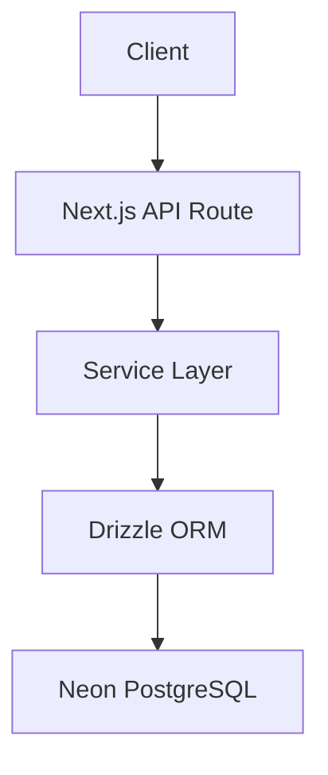
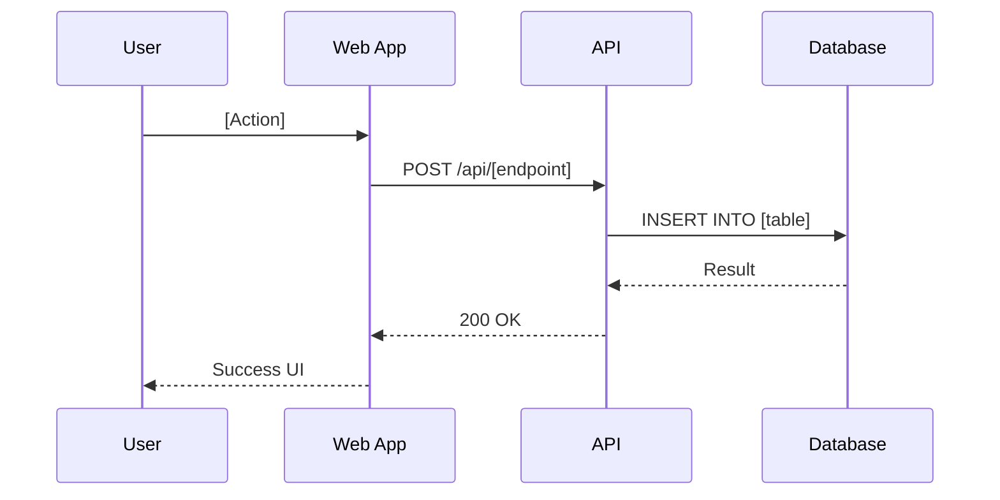

# Release Documents — Per-Release Artifacts

> **Purpose:** Documents that must be prepared, reviewed, and signed off for EVERY release.  
> **Inspired by:** FAANG/MAANG release engineering practices (Google Launch Process, Meta Release Train, Amazon OP1 docs)  
> **Audience:** Developer, Business Analyst (future), QA (future), Stakeholders

---

## Document Index

| # | Document | Abbreviation | Owner | When Created | When Signed Off |
|---|----------|-------------|-------|-------------|----------------|
| 1 | [Feature Specification Document](#1-feature-specification-document-fsd) | FSD | BA / Developer | Sprint planning | Before development starts |
| 2 | [Technical Design Document](#2-technical-design-document-tdd) | TDD | Developer | Sprint planning | Before development starts |
| 3 | [Impact Analysis Report](#3-impact-analysis-report-iar) | IAR | Developer | During development | Before PR merge |
| 4 | [Test Plan & Test Report](#4-test-plan--test-report-tptr) | TP/TR | QA / Developer | Before testing starts | After testing complete |
| 5 | [Change Request](#5-change-request-cr) | CR | BA / Developer | When scope changes | Before implementing change |
| 6 | [UAT Report](#6-uat-report) | UAT | BA / Stakeholder | After pprd deploy | Before prod deploy |
| 7 | [Release Notes](#7-release-notes) | RN | Developer | During development | At release time |
| 8 | [Deployment Runbook](#8-deployment-runbook) | DR | Developer | Before deploy | Reviewed pre-deploy |
| 9 | [Rollback Plan](#9-rollback-plan) | RBP | Developer | Before deploy | Reviewed pre-deploy |
| 10 | [Sign-Off Sheet](#10-sign-off-sheet) | SOS | All | At release | All parties sign |
| 11 | [Post-Release Report](#11-post-release-report-prr) | PRR | Developer | T+24h after release | Within 48h |

---

## Release Document Workflow

```
┌────────────────────────────────────────────────────────────────────────────┐
│                        RELEASE DOCUMENT LIFECYCLE                            │
├────────────────────────────────────────────────────────────────────────────┤
│                                                                             │
│  PLANNING PHASE                                                             │
│  ├─ FSD created (what are we building?)                                    │
│  ├─ TDD created (how are we building it?)                                  │
│  └─ Test Plan created (how will we verify it?)                             │
│                                                                             │
│  DEVELOPMENT PHASE                                                          │
│  ├─ Impact Analysis (what does this change affect?)                        │
│  ├─ Change Requests (if scope changes mid-sprint)                          │
│  └─ Release Notes drafted (incrementally)                                  │
│                                                                             │
│  TESTING PHASE                                                              │
│  ├─ Test Report completed (all tests pass?)                                │
│  ├─ UAT conducted on pprd (stakeholder approves?)                          │
│  └─ Deployment Runbook + Rollback Plan finalized                           │
│                                                                             │
│  RELEASE PHASE                                                              │
│  ├─ Sign-Off Sheet signed by all parties                                   │
│  ├─ Release Notes published                                                │
│  └─ Deploy to production                                                    │
│                                                                             │
│  POST-RELEASE                                                               │
│  └─ Post-Release Report (within 48h)                                       │
│                                                                             │
└────────────────────────────────────────────────────────────────────────────┘
```

---

## 1. Feature Specification Document (FSD)

**Also called:** PRD (Product Requirements Document), BRD (Business Requirements Document)  
**Owner:** Business Analyst / Product Owner (or Developer if no BA)  
**Template location:** `docs/releases/templates/fsd-template.md`

### Template

```markdown
# FSD: [Feature Name]

| Field | Value |
|-------|-------|
| Version | 1.0 |
| Author | [Name] |
| Date | [YYYY-MM-DD] |
| Release | v[X.Y.Z] |
| Status | Draft / In Review / Approved |
| Reviewers | [Names] |

---

## 1. Executive Summary
[2-3 sentences: what is this feature and why does it matter to the business?]

## 2. Business Objective
- What problem does this solve?
- Who requested it? (salon owner, customer feedback, analytics insight)
- What is the expected business impact? (more bookings, higher retention, etc.)

## 3. User Stories

| # | As a... | I want to... | So that... | Priority |
|---|---------|-------------|-----------|----------|
| 1 | Customer | [action] | [benefit] | Must |
| 2 | Admin | [action] | [benefit] | Must |
| 3 | Receptionist | [action] | [benefit] | Should |

## 4. Functional Requirements

### 4.1 [Feature Area 1]
- FR-001: [Requirement description]
- FR-002: [Requirement description]

### 4.2 [Feature Area 2]
- FR-003: [Requirement description]

## 5. Non-Functional Requirements
- NFR-001: Page must load in < 2.5s (LCP)
- NFR-002: Must work on mobile (320px minimum width)
- NFR-003: Must support 50 concurrent users without degradation
- NFR-004: Must be accessible (WCAG 2.1 AA)

## 6. UI/UX Specifications
- Wireframes: [link or embedded images]
- User flow diagram: [link]
- Design system components used: [list]

## 7. Acceptance Criteria
| # | Given | When | Then |
|---|-------|------|------|
| 1 | [precondition] | [action] | [expected result] |
| 2 | [precondition] | [action] | [expected result] |

## 8. Out of Scope
- [What this feature explicitly does NOT include]
- [Features deferred to future releases]

## 9. Dependencies
- [External services needed]
- [Other features that must be built first]
- [Third-party approvals needed]

## 10. Risks & Mitigations
| Risk | Probability | Impact | Mitigation |
|------|------------|--------|-----------|
| [risk] | Low/Med/High | Low/Med/High | [how to handle] |

## 11. Success Metrics
- [KPI 1]: [target] (e.g., "Booking conversion > 60%")
- [KPI 2]: [target]

## 12. Sign-Off

| Role | Name | Date | Signature |
|------|------|------|-----------|
| Product Owner | | | □ Approved |
| Developer | | | □ Approved |
| Stakeholder | | | □ Approved |
```

---

## 2. Technical Design Document (TDD)

**Also called:** HLD (High-Level Design), LLD (Low-Level Design), RFC (Request for Comments)  
**Owner:** Developer  
**Template location:** `docs/releases/templates/tdd-template.md`

### Template

```markdown
# TDD: [Feature Name]

| Field | Value |
|-------|-------|
| Version | 1.0 |
| Author | [Developer Name] |
| Date | [YYYY-MM-DD] |
| FSD Reference | FSD-[XXX] |
| Status | Draft / In Review / Approved |

---

## 1. Overview
[Brief description of the technical approach]

## 2. Architecture

### 2.1 System Context Diagram
[How this feature fits into the overall system]

### 2.2 Component Diagram


### 2.3 Sequence Diagram


## 3. Database Changes

### 3.1 New Tables
| Table | Purpose |
|-------|---------|
| [table_name] | [purpose] |

### 3.2 Schema Definition
```sql
CREATE TABLE [table_name] (
  id text PRIMARY KEY, -- generated in app with nanoid/cuid2
  -- columns
  created_at TIMESTAMPTZ DEFAULT now(),
  updated_at TIMESTAMPTZ DEFAULT now()
);
```

### 3.3 Migration Strategy
- [ ] Forward-compatible (old code works with new schema)
- [ ] Expand-contract needed? If yes, describe phases
- [ ] Indexes needed: [list]
- [ ] Estimated data volume: [X rows in 1 year]

## 4. API Design

### 4.1 New Endpoints
| Method | Path | Auth | Rate Limit | Description |
|--------|------|------|-----------|-------------|
| POST | /api/[resource] | Required | 30/min | [description] |
| GET | /api/[resource] | Optional | 120/min | [description] |

### 4.2 Request/Response Schemas
```typescript
// Request
interface CreateResourceRequest {
  field1: string
  field2: number
}

// Response
interface CreateResourceResponse {
  success: true
  data: {
    id: string
    // ...
  }
}
```

## 5. Security Considerations
- [ ] Input validation (Zod schema defined)
- [ ] Authorization check (role-based)
- [ ] Rate limiting configured
- [ ] SQL injection prevented (Drizzle parameterized queries)
- [ ] XSS prevented (DOMPurify on user input)
- [ ] CSRF protected (Better Auth handles)
- [ ] Sensitive data encrypted at rest? (N/A or specify)

## 6. Performance Considerations
- Expected query count per request: [N]
- Need caching? (Redis key pattern: `[prefix]:[id]`)
- Need pagination? (cursor-based / offset)
- Estimated response time: < [X]ms

## 7. Error Handling
- [List specific errors this feature can throw]
- [Map to error codes from error-handling.md]
- [Retry strategy for external service calls]

## 8. Feature Flag
- Flag name: `[feature-flag-name]`
- Default state: OFF
- Rollout plan: 10% → 50% → 100%
- Kill switch behavior: [what happens when turned OFF]

## 9. Testing Strategy
- Unit tests: [what to test, estimated count]
- Integration tests: [API endpoint tests]
- E2E tests: [user journey tests]
- Edge cases: [list]

## 10. Deployment Notes
- Migration order: [if multi-step]
- Feature flag prerequisite: [if depends on another flag]
- Environment variables needed: [list new env vars]
- External service setup: [if new integration]

## 11. Rollback Plan
- Can this be rolled back by turning off feature flag? Yes/No
- If No, what's the rollback procedure?
- Is a migration revert needed? (should be No if expand-contract used)

## 12. Open Questions
- [Question 1] — [answer or "pending"]
- [Question 2] — [answer or "pending"]
```

---

## 3. Impact Analysis Report (IAR)

**Purpose:** Assess what parts of the system are affected by the change.  
**Owner:** Developer  
**When:** Before merging PR

### Template

```markdown
# Impact Analysis: [Feature/Change Name]

| Field | Value |
|-------|-------|
| Date | [YYYY-MM-DD] |
| PR | #[number] |
| Release | v[X.Y.Z] |

---

## Files Changed
| File/Module | Change Type | Risk |
|------------|-------------|------|
| `apps/web/src/app/api/[route]` | New | Low |
| `packages/database/schema/[table].ts` | Modified | Medium |
| `apps/web/src/components/[component].tsx` | Modified | Low |

## Database Impact
- [ ] New migration required
- [ ] Existing data needs backfill
- [ ] Index changes (may cause brief slowdown during creation)
- [ ] No database changes

## External Service Impact
- [ ] New API integration added
- [ ] Existing integration modified
- [ ] Webhook URL changed
- [ ] No external service impact

## User-Facing Impact
- [ ] UI changes visible to customers
- [ ] UI changes visible to admin only
- [ ] API contract changed (breaking?)
- [ ] Performance impact expected
- [ ] No user-facing impact

## Backward Compatibility
- [ ] Fully backward compatible
- [ ] Requires feature flag for safe rollout
- [ ] Breaking change — requires coordinated deploy

## Affected Tests
- Unit tests: [added/modified/removed — count]
- Integration tests: [added/modified/removed — count]
- E2E tests: [added/modified/removed — count]

## Risk Assessment
| Risk | Probability | Impact | Mitigation |
|------|------------|--------|-----------|
| [risk description] | Low/Med/High | Low/Med/High | [mitigation] |

## Reviewer Checklist
- [ ] I've reviewed the migration SQL
- [ ] I've verified no breaking API changes without versioning
- [ ] I've confirmed feature flag is in place for risky changes
- [ ] I've verified rollback is possible
```

---

## 4. Test Plan & Test Report (TP/TR)

**Owner:** QA / Developer  
**When:** Plan before testing, Report after testing complete

### Test Plan Template

```markdown
# Test Plan: [Feature Name] — v[X.Y.Z]

| Field | Value |
|-------|-------|
| Date | [YYYY-MM-DD] |
| Tester | [Name] |
| Environment | pprd / test |
| FSD Reference | FSD-[XXX] |

---

## Scope
- In scope: [features/flows to test]
- Out of scope: [what's NOT being tested this cycle]

## Test Strategy
| Type | Tool | Coverage Target |
|------|------|----------------|
| Unit | Vitest | > 80% line coverage |
| Integration | Vitest + Supertest | All API endpoints |
| E2E | Playwright | All critical user journeys |
| Performance | Lighthouse CI | Scores ≥ 95 |
| Load | k6 | p95 < 500ms at 50 users |
| Security | OWASP ZAP + Trivy | 0 high/critical |
| Accessibility | axe-core + Lighthouse | 100% score |

## Test Cases

### Functional Tests
| ID | Description | Steps | Expected Result | Priority |
|----|-------------|-------|----------------|----------|
| TC-001 | [test name] | 1. [step] 2. [step] | [expected] | P1 |
| TC-002 | [test name] | 1. [step] 2. [step] | [expected] | P1 |
| TC-003 | [test name] | 1. [step] 2. [step] | [expected] | P2 |

### Edge Cases
| ID | Description | Steps | Expected Result |
|----|-------------|-------|----------------|
| EC-001 | [edge case] | [steps] | [expected] |

### Negative Tests
| ID | Description | Steps | Expected Result |
|----|-------------|-------|----------------|
| NT-001 | [what should fail] | [steps] | [expected error] |

## Entry Criteria
- [ ] Development complete (PR approved)
- [ ] Deployed to test/pprd environment
- [ ] Test data seeded
- [ ] All dependencies available

## Exit Criteria
- [ ] All P1 tests passing
- [ ] All P2 tests passing (or deferred with justification)
- [ ] 0 critical/high bugs open
- [ ] Performance thresholds met
- [ ] Security scan clean
```

### Test Report Template

```markdown
# Test Report: [Feature Name] — v[X.Y.Z]

| Field | Value |
|-------|-------|
| Date | [YYYY-MM-DD] |
| Tester | [Name] |
| Environment | pprd |
| Build | [commit SHA] |
| Duration | [X hours] |

---

## Summary

| Metric | Result |
|--------|--------|
| Total test cases | [N] |
| Passed | [N] ✅ |
| Failed | [N] ❌ |
| Blocked | [N] ⚠️ |
| Skipped | [N] ⏭️ |
| Pass rate | [X]% |
| Bugs found | [N] (Critical: X, High: X, Medium: X, Low: X) |

## Automated Test Results

| Suite | Pass | Fail | Duration |
|-------|------|------|----------|
| Unit (Vitest) | [N]/[N] | [N] | [Xs] |
| Integration | [N]/[N] | [N] | [Xs] |
| E2E (Playwright) | [N]/[N] | [N] | [Xs] |
| Lighthouse | [scores] | — | — |
| k6 Load | [p95: Xms] | — | [Xs] |

## Bugs Found

| ID | Severity | Description | Status |
|----|----------|-------------|--------|
| BUG-001 | Critical | [description] | Fixed ✅ |
| BUG-002 | Medium | [description] | Deferred (v[next]) |

## Test Evidence
- Screenshots: [link to folder]
- Playwright trace: [link]
- k6 report: [link]
- Lighthouse report: [link]

## Recommendation
- [ ] ✅ PASS — Ready for release
- [ ] ⚠️ CONDITIONAL PASS — Release with known issues (listed above)
- [ ] ❌ FAIL — Do not release, [X] critical bugs remain
```

---

## 5. Change Request (CR)

**Purpose:** Document any change to scope after FSD is approved.  
**Owner:** BA / Developer  
**When:** Anytime scope changes mid-sprint

### Template

```markdown
# Change Request: CR-[XXX]

| Field | Value |
|-------|-------|
| Date | [YYYY-MM-DD] |
| Requestor | [Name] |
| Release | v[X.Y.Z] |
| FSD Reference | FSD-[XXX] |
| Priority | Critical / High / Medium / Low |
| Status | Submitted / Approved / Rejected / Implemented |

---

## Change Description
[What is being changed from the original FSD?]

## Reason for Change
[Why is this change needed? Business justification]

## Impact Assessment

### Scope Impact
- Original scope: [what was planned]
- New scope: [what's being requested]
- Added effort: [+X hours / +X days]

### Timeline Impact
- [ ] No delay — can absorb within sprint
- [ ] Delays release by [X days]
- [ ] Requires deprioritizing: [feature being dropped]

### Technical Impact
- [ ] No architectural changes
- [ ] Database schema change needed
- [ ] New external service integration
- [ ] Performance implications

### Cost Impact
- Additional development: [X hours]
- Additional testing: [X hours]
- Additional infrastructure: [if any]

## Decision

| Approver | Decision | Date | Notes |
|----------|----------|------|-------|
| [Name] | Approve / Reject | [date] | [reason] |

## Implementation Plan (if approved)
[Brief description of how the change will be implemented]
```

---

## 6. UAT Report

**Purpose:** Formal stakeholder acceptance of the feature on pprd.  
**Owner:** Stakeholder / Business Analyst  
**When:** After deploy to pprd, before prod deploy

### Template

```markdown
# UAT Report: [Feature Name] — v[X.Y.Z]

| Field | Value |
|-------|-------|
| Date | [YYYY-MM-DD] |
| Environment | https://pprd.theroyalglow.in |
| Tester | [Stakeholder Name] |
| Device | [Mobile/Desktop — browser name] |
| Duration | [X hours] |

---

## Test Scenarios

| # | Scenario | Steps | Expected | Actual | Pass/Fail |
|---|----------|-------|----------|--------|-----------|
| 1 | [scenario] | [steps taken] | [expected] | [actual] | ✅ / ❌ |
| 2 | [scenario] | [steps taken] | [expected] | [actual] | ✅ / ❌ |

## Feedback & Observations

### Must Fix Before Release
| # | Issue | Screenshot |
|---|-------|-----------|
| 1 | [issue] | [link] |

### Nice to Have (Can Fix Later)
| # | Suggestion | Priority |
|---|-----------|----------|
| 1 | [suggestion] | Low |

### Positive Feedback
- [What the stakeholder liked]

## UAT Decision

- [ ] ✅ **ACCEPTED** — Feature meets business requirements, ready for production
- [ ] ⚠️ **CONDITIONALLY ACCEPTED** — Deploy with listed fixes
- [ ] ❌ **REJECTED** — Requires rework, specific issues listed above

## Sign-Off

| Role | Name | Date | Decision |
|------|------|------|----------|
| Salon Owner | | | □ Accepted / □ Rejected |
| Developer | | | □ Acknowledged |
```

---

## 7. Release Notes

**Purpose:** Communicate what's in the release to all stakeholders.  
**Owner:** Developer  
**When:** Published at release time  
**Location:** `CHANGELOG.md` + GitHub Release

### Template

```markdown
# Release Notes — v[X.Y.Z]

**Release Date:** [YYYY-MM-DD]  
**Environment:** Production  
**Deploy Method:** Feature Flag / Direct

---

## 🚀 New Features

### [Feature 1 Name]
[1-2 sentence user-facing description]
- [Key capability 1]
- [Key capability 2]
- **Feature flag:** `[flag-name]` (enabled for [X]%)

### [Feature 2 Name]
[Description]

## 🐛 Bug Fixes

- **[BUG-XXX]:** [Brief description of what was fixed]
- **[BUG-XXX]:** [Brief description]

## 🔧 Improvements

- [Performance improvement description]
- [UX improvement description]

## 🗄️ Database Changes

- [New table: `table_name` — purpose]
- [New column: `table.column` — purpose]
- [New index: `idx_name` — improves query X]

## ⚠️ Breaking Changes

- [None / list any API contract changes]

## 📊 Metrics to Watch

| Metric | Baseline | Target |
|--------|----------|--------|
| [metric] | [current] | [expected after release] |

## 🔄 Rollback Plan

- Feature flag: `[flag-name]` → OFF
- Cloudflare rollback: deployment ID `[ID]`
- Migration revert: [not needed / `bun run db:revert`]

## 📋 Known Issues

- [Issue description] — planned fix in v[X.Y.Z+1]

---

**Full changelog:** [link to GitHub compare]
```

---

## 8. Deployment Runbook

**Purpose:** Step-by-step deploy instructions specific to this release.  
**Owner:** Developer  
**When:** Before deploy

### Template

```markdown
# Deployment Runbook — v[X.Y.Z]

| Field | Value |
|-------|-------|
| Date | [YYYY-MM-DD] |
| Time Window | [HH:MM] – [HH:MM] IST |
| Deployer | [Name] |
| Approver | [Name] |

---

## Pre-Deploy Checklist

- [ ] All CI checks passing on pprd branch
- [ ] UAT signed off
- [ ] No active incidents (BetterStack green)
- [ ] Deploy freeze window check: OPEN
- [ ] Backup verified (last backup < 24h old)
- [ ] Rollback plan reviewed

## Deploy Steps

| # | Step | Command / Action | Verify |
|---|------|-----------------|--------|
| 1 | Merge pprd → main | `git merge pprd --no-ff && git push` | GitHub Actions triggered |
| 2 | Monitor CI | Watch GitHub Actions | All checks green |
| 3 | Migration runs | Automated in workflow | No errors in logs |
| 4 | Health check | `curl https://theroyalglow.in/api/health` | 200 + all green |
| 5 | Smoke test | [specific URLs to verify] | Pages load correctly |
| 6 | Enable feature flag | PostHog: `[flag]` → 10% | Flag status: active |
| 7 | Monitor (15 min) | Sentry + BetterStack | No errors |
| 8 | Ramp to 100% | PostHog: `[flag]` → 100% | Flag at full rollout |

## Post-Deploy Verification

- [ ] Health endpoint green
- [ ] No new Sentry errors (wait 15 min)
- [ ] BetterStack monitors: all UP
- [ ] [Feature-specific check 1]
- [ ] [Feature-specific check 2]

## Rollback Trigger

If ANY of these occur within 1 hour of deploy:
- Error rate > 1% (Sentry)
- Health check failing
- p95 latency > 1000ms
- User-reported critical bug

→ Execute rollback immediately (see Rollback Plan)

## Special Notes for This Release

- [Any unique considerations]
- [Services to restart manually]
- [External dependencies to verify]
```

---

## 9. Rollback Plan

**Purpose:** Exact steps to undo the release if something goes wrong.  
**Owner:** Developer  
**When:** Prepared before deploy, executed if needed

### Template

```markdown
# Rollback Plan — v[X.Y.Z]

| Field | Value |
|-------|-------|
| Date | [YYYY-MM-DD] |
| Estimated rollback time | [X minutes] |

---

## Tier 1: Feature Flag OFF (< 10 seconds)

```bash
# PostHog → Feature Flags → [flag-name] → Kill Switch ON
# OR via API:
curl -X PATCH https://us.i.posthog.com/api/feature_flags/[ID] \
  -H "Authorization: Bearer $POSTHOG_API_KEY" \
  -d '{"active": false}'
```

## Tier 2: Cloudflare Rollback (< 30 seconds)

```bash
# List recent deployments
wrangler pages deployments list --project-name=rgss-web

# Rollback to previous deployment
wrangler pages deployments rollback --project-name=rgss-web \
  --deployment-id=[previous-deployment-id]
```

## Tier 3: Database Migration Revert (if needed)

```bash
# Only if migration in this release broke something
# AND Tier 1/2 didn't fix it

# Option A: Revert migration (if revert SQL prepared)
bun run db:revert --to=[previous-migration-id]

# Option B: Neon PITR (Point-in-Time Recovery)
# Restore to timestamp BEFORE migration ran
curl -X POST "https://console.neon.tech/api/v2/projects/$PROJECT_ID/branches" \
  -H "Authorization: Bearer $NEON_API_KEY" \
  -d '{"branch":{"name":"recovery-[date]","parent_id":"main","parent_timestamp":"[ISO-timestamp]"}}'

# Then update DATABASE_URL to point to recovery branch
```

## Tier 4: Full Disaster Recovery (< 30 minutes)

```bash
# Nuclear option: restore from last known-good backup
# 1. Restore Neon PITR branch
# 2. Cloudflare rollback to last stable deploy
# 3. Update all env vars to point to recovery branch
# 4. Verify health check
# 5. Update status page
```

## Post-Rollback Actions
- [ ] Update status page: "Issue identified, fix deployed"
- [ ] Notify stakeholder
- [ ] Create incident report
- [ ] Root cause analysis within 24h
- [ ] Fix-forward plan
```

---

## 10. Sign-Off Sheet

**Purpose:** Formal approval from all parties before production deploy.  
**Owner:** Release Manager (or Developer for solo projects)  
**When:** After UAT, before production deploy

### Template

```markdown
# Release Sign-Off — v[X.Y.Z]

| Field | Value |
|-------|-------|
| Release Date | [YYYY-MM-DD] |
| Release Name | [descriptive name] |
| Sprint | [sprint number] |

---

## Release Contents

| Feature/Fix | FSD Ref | TDD Ref | Test Report |
|------------|---------|---------|-------------|
| [Feature 1] | FSD-001 | TDD-001 | TR-001 (PASS) |
| [Feature 2] | FSD-002 | TDD-002 | TR-002 (PASS) |
| [Bug fix 1] | — | — | TR-003 (PASS) |

## Checklist

| # | Item | Status |
|---|------|--------|
| 1 | All FSD acceptance criteria met | ✅ |
| 2 | All tests passing (unit + integration + E2E) | ✅ |
| 3 | UAT completed and accepted | ✅ |
| 4 | Security scan clean | ✅ |
| 5 | Performance budget met | ✅ |
| 6 | Rollback plan documented | ✅ |
| 7 | Release notes drafted | ✅ |
| 8 | Deployment runbook ready | ✅ |
| 9 | Monitoring configured for new features | ✅ |
| 10 | No critical/high bugs open | ✅ |

## Approvals

| Role | Name | Decision | Date | Comments |
|------|------|----------|------|----------|
| Developer | [Name] | □ Approve / □ Reject | | |
| QA (if applicable) | [Name] | □ Approve / □ Reject | | |
| Business Owner | [Name] | □ Approve / □ Reject | | |
| Operations (if applicable) | [Name] | □ Approve / □ Reject | | |

## Final Decision

- [ ] ✅ **GO** — Approved for production deployment
- [ ] ❌ **NO-GO** — Blocked by: [reason]
- [ ] ⏸️ **DEFER** — Postpone to: [date], reason: [reason]

---

**Signed:** _________________ **Date:** _________________
```

---

## 11. Post-Release Report (PRR)

**Also called:** Post-Implementation Review (PIR), Post-Mortem (if issues occurred)  
**Owner:** Developer  
**When:** Within 48 hours of release

### Template

```markdown
# Post-Release Report — v[X.Y.Z]

| Field | Value |
|-------|-------|
| Release Date | [YYYY-MM-DD HH:MM IST] |
| Report Date | [YYYY-MM-DD] |
| Author | [Name] |
| Duration of Deploy | [X minutes] |
| Rollbacks | [0 / describe if any] |

---

## Release Summary

| Metric | Value |
|--------|-------|
| Features shipped | [N] |
| Bugs fixed | [N] |
| Database migrations | [N] |
| Deploy duration | [X min] |
| Time to full rollout | [X hours] (flag ramp-up) |
| Incidents during deploy | [0 / describe] |

## Success Metrics (T+24h)

| Metric | Target | Actual | Status |
|--------|--------|--------|--------|
| Uptime | 100% | [X]% | ✅/❌ |
| Error rate | < 0.1% | [X]% | ✅/❌ |
| p95 latency | < 500ms | [X]ms | ✅/❌ |
| New Sentry errors | 0 | [X] | ✅/❌ |
| Feature adoption | [target]% | [X]% | ✅/❌ |

## Issues Encountered

| # | Issue | Severity | Resolution | Time to Fix |
|---|-------|----------|-----------|-------------|
| 1 | [issue] | [sev] | [how fixed] | [X min] |

## What Went Well
- [thing that went smoothly]
- [thing that went smoothly]

## What Could Be Improved
- [lesson learned]
- [process improvement for next time]

## Action Items

| # | Action | Owner | Due Date | Status |
|---|--------|-------|----------|--------|
| 1 | [action] | [name] | [date] | Open |
| 2 | [action] | [name] | [date] | Open |

## Monitoring Status (T+24h)

| System | Status |
|--------|--------|
| BetterStack | ✅ All monitors green |
| Sentry | ✅ No unresolved errors |
| PostHog | ✅ Events flowing |
| Performance | ✅ Within budget |
```

---

## Document Storage & Naming Convention

### Folder Structure

```
docs/
├── releases/
│   ├── templates/            # Document templates (copy from here)
│   │   ├── fsd-template.md
│   │   ├── tdd-template.md
│   │   ├── iar-template.md
│   │   ├── test-plan-template.md
│   │   ├── test-report-template.md
│   │   ├── change-request-template.md
│   │   ├── uat-report-template.md
│   │   ├── deployment-runbook-template.md
│   │   ├── rollback-plan-template.md
│   │   ├── sign-off-template.md
│   │   └── post-release-report-template.md
│   │
│   ├── v1.0.0/               # First release
│   │   ├── FSD-001-online-booking.md
│   │   ├── TDD-001-online-booking.md
│   │   ├── IAR-001-online-booking.md
│   │   ├── TP-001-online-booking.md
│   │   ├── TR-001-online-booking.md
│   │   ├── UAT-001-online-booking.md
│   │   ├── RN-v1.0.0.md
│   │   ├── DR-v1.0.0.md
│   │   ├── RBP-v1.0.0.md
│   │   ├── SOS-v1.0.0.md
│   │   └── PRR-v1.0.0.md
│   │
│   ├── v1.1.0/               # Second release
│   │   ├── FSD-002-whatsapp-notifications.md
│   │   └── ...
│   │
│   └── v1.2.0/               # Third release
│       └── ...
```

### Naming Convention

```
[DocType]-[SequenceNumber]-[feature-slug].md

Examples:
  FSD-001-online-booking.md
  TDD-001-online-booking.md
  CR-001-add-upi-payment.md
  TR-001-online-booking.md

Version-level documents (one per release):
  RN-v1.0.0.md        (Release Notes)
  DR-v1.0.0.md        (Deployment Runbook)
  RBP-v1.0.0.md       (Rollback Plan)
  SOS-v1.0.0.md       (Sign-Off Sheet)
  PRR-v1.0.0.md       (Post-Release Report)
```

---

## Minimum Viable Documentation per Release

Not every release needs ALL 11 documents. Here's what's **required** vs **optional** based on release type:

### Major Release (New Feature)

| Document | Required |
|----------|----------|
| FSD | ✅ Required |
| TDD | ✅ Required |
| Impact Analysis | ✅ Required |
| Test Plan | ✅ Required |
| Test Report | ✅ Required |
| Change Request | Only if scope changed |
| UAT Report | ✅ Required |
| Release Notes | ✅ Required |
| Deployment Runbook | ✅ Required |
| Rollback Plan | ✅ Required |
| Sign-Off Sheet | ✅ Required |
| Post-Release Report | ✅ Required |

### Minor Release (Enhancement / Non-Breaking Change)

| Document | Required |
|----------|----------|
| FSD | ⚡ Lite version (just user stories + acceptance criteria) |
| TDD | ⚡ Lite version (just API changes + DB changes) |
| Impact Analysis | ✅ Required |
| Test Plan | ⚡ Only new/changed test cases |
| Test Report | ✅ Required |
| UAT Report | ✅ Required |
| Release Notes | ✅ Required |
| Deployment Runbook | ⚡ Standard (use template defaults) |
| Rollback Plan | ✅ Required |
| Sign-Off Sheet | ✅ Required |
| Post-Release Report | ⚡ Brief (only if issues occurred) |

### Patch Release (Bug Fix / Hotfix)

| Document | Required |
|----------|----------|
| FSD | ❌ Not needed |
| TDD | ❌ Not needed |
| Impact Analysis | ⚡ Brief (just files changed + risk) |
| Test Plan | ❌ Just pass existing suite |
| Test Report | ⚡ Automated results only |
| UAT Report | ❌ Not needed (unless user-reported bug) |
| Release Notes | ✅ Required (even if just "Fixed bug X") |
| Deployment Runbook | ❌ Use standard process |
| Rollback Plan | ✅ Required |
| Sign-Off Sheet | ⚡ Developer + one approver |
| Post-Release Report | ❌ Not needed (unless incident) |

---

## Automation Opportunities

### GitHub Issue Templates

Create issue templates that auto-populate document structure:

```yaml
# .github/ISSUE_TEMPLATE/feature-request.yml
name: Feature Request (FSD-lite)
description: Propose a new feature for RGSS
body:
  - type: textarea
    id: user-story
    attributes:
      label: User Story
      description: "As a [role], I want to [action], so that [benefit]"
  - type: textarea
    id: acceptance-criteria
    attributes:
      label: Acceptance Criteria
      description: "Given/When/Then format"
  - type: dropdown
    id: priority
    attributes:
      label: Priority
      options: [P1 - Must Have, P2 - Should Have, P3 - Nice to Have]
```

### PR Template with Checklist

```markdown
<!-- .github/pull_request_template.md -->

## Summary
[What does this PR do?]

## Related Documents
- FSD: [link or N/A]
- TDD: [link or N/A]

## Type
- [ ] Feature (new functionality)
- [ ] Fix (bug fix)
- [ ] Refactor (no behavior change)
- [ ] Docs (documentation only)

## Release Documentation Checklist
- [ ] Impact Analysis completed
- [ ] Test cases added/updated
- [ ] Release notes entry drafted
- [ ] Feature flag configured (if applicable)
- [ ] Rollback plan identified
- [ ] Database migration is backward-compatible

## Testing
- [ ] Unit tests passing
- [ ] Integration tests passing
- [ ] E2E tests passing (if applicable)
- [ ] Manual testing on [environment]
```

### CHANGELOG.md (Auto-Updated)

```markdown
# Changelog

All notable changes to this project will be documented in this file.
Format follows [Keep a Changelog](https://keepachangelog.com/).

## [Unreleased]

### Added
- [Feature description] (#PR)

### Fixed
- [Bug fix description] (#PR)

### Changed
- [Enhancement description] (#PR)

## [1.0.0] — 2026-06-XX

### Added
- Online booking system (63 services across 10 categories)
- Google OAuth authentication
- Membership plans (Silver, Gold, Platinum)
- Gems loyalty program
- Invoice generation (PDF via Render)
- Email notifications (Resend — 11 transactional templates)
- Real-time updates (Ably)
- Admin dashboard
- CRM lead management
- Offer/promotion engine

### Infrastructure
- Cloudflare Pages + Workers deployment
- Neon PostgreSQL with Drizzle ORM
- BetterStack monitoring
- Sentry error tracking
- PostHog analytics
```

---

## Document Review Cadence

| Activity | Frequency | Who |
|----------|-----------|-----|
| Template review & update | Quarterly | Developer |
| Archive old release docs (> 6 months) | Quarterly | Developer |
| Process retrospective | After every 5th release | All |
| Compliance audit (all docs present) | Monthly | Developer |
| Stakeholder feedback on doc quality | Quarterly | Salon Owner |
