# Low-Level Design (LLD) — Royal Glow Salon & Spa

> **Document Classification:** System Design — Implementation Level  
> **Version:** 1.0  
> **Author:** Engineering Lead  
> **Last Updated:** 2026-05-23  
> **Status:** Approved for Implementation  
> **Companion Document:** [HLD.md](./HLD.md) — High-Level Design

---

## Table of Contents

1. [Database Schema Deep Dive](#1-database-schema-deep-dive)
2. [State Machines](#2-state-machines)
3. [API Sequence Diagrams](#3-api-sequence-diagrams)
4. [Service Layer Architecture](#4-service-layer-architecture)
5. [Caching Implementation](#5-caching-implementation)
6. [Realtime Implementation](#6-realtime-implementation)
7. [Background Job Implementation](#7-background-job-implementation)
8. [Invoice & GST Calculation](#8-invoice--gst-calculation)
9. [Security Implementation Details](#9-security-implementation-details)
10. [Testing Strategy (Implementation Level)](#10-testing-strategy-implementation-level)
11. [Performance Optimization Details](#11-performance-optimization-details)
12. [Monitoring & Alerting Implementation](#12-monitoring--alerting-implementation)

---


## 1. Database Schema Deep Dive

### 1.1 Entity Relationship Diagram

```mermaid
erDiagram
    %% Auth Domain
    user ||--o{ session : "has"
    user ||--o{ account : "linked"
    user ||--o| customer_profile : "has"
    user ||--o| staff_profile : "has"

    %% Booking Domain
    user ||--o{ booking : "creates"
    booking ||--|{ booking_service : "contains"
    booking_service }o--|| service : "references"
    booking_service }o--o| staff_profile : "assigned_to"
    booking }o--|| branch : "at"
    booking ||--o{ booking_note : "has"
    booking ||--o{ booking_history : "tracks"

    %% Billing Domain
    booking ||--o| invoice : "generates"
    invoice ||--|{ invoice_item : "contains"
    invoice }o--o| offer_redemption : "applies"

    %% Membership Domain
    user ||--o{ spa_membership : "subscribes"
    spa_membership }o--|| spa_membership_tier : "tier"

    %% Loyalty Domain
    user ||--|| loyalty_account : "has"
    loyalty_account ||--o{ loyalty_transaction : "records"

    %% CRM/Lead Domain
    lead ||--o{ lead_note : "has"
    user ||--o{ customer_tag_assignment : "tagged"
    customer_tag ||--o{ customer_tag_assignment : "applied"
    user ||--o{ customer_note : "has"

    %% Service Domain
    service_category ||--|{ service : "contains"
    service ||--o{ service_staff : "performed_by"
    staff_profile ||--o{ service_staff : "offers"

    %% Scheduling Domain
    staff_profile ||--o{ staff_schedule : "has"
    staff_profile ||--o{ staff_time_off : "requests"

    %% Offers Domain
    offer ||--o{ offer_service : "applies_to"
    offer ||--o{ offer_redemption : "redeemed"

    %% Notifications Domain
    user ||--o{ notification : "receives"
    user ||--o{ push_subscription : "subscribes"

    %% System Domain
    branch ||--o{ daily_sales_summary : "generates"
    branch ||--o{ monthly_gst_summary : "reports"
```




### 1.2 Key Table Designs

#### `booking` — Core Booking Table

```sql
CREATE TABLE booking (
  id                      TEXT PRIMARY KEY DEFAULT nanoid(),
  booking_number          TEXT NOT NULL UNIQUE,          -- Format: BK{BRANCH}{DDMM}{TYPE}{NANOID5}
  customer_id             TEXT NOT NULL REFERENCES "user"(id) ON DELETE RESTRICT,
  branch_id               TEXT NOT NULL REFERENCES branch(id) ON DELETE RESTRICT,
  service_type            service_type_enum NOT NULL,    -- 'salon' | 'spa'
  status                  booking_status_enum NOT NULL DEFAULT 'pending',
  date                    DATE NOT NULL,
  start_time              TIME NOT NULL,
  end_time                TIME NOT NULL,                 -- Calculated from service durations
  total_duration_minutes  INTEGER NOT NULL,
  notes                   TEXT,                          -- Customer notes
  cancellation_reason     TEXT,                          -- Required when status = cancelled/rejected
  rejection_reason        TEXT,                          -- Required when status = rejected
  rescheduled_from_id     TEXT REFERENCES booking(id),   -- Links to original booking
  rescheduled_to_id       TEXT REFERENCES booking(id),   -- Links to new booking
  no_show_count           INTEGER NOT NULL DEFAULT 0,    -- Customer's count at booking time
  booking_requires_approval BOOLEAN NOT NULL DEFAULT false,
  lead_id                 TEXT REFERENCES lead(id),      -- Attribution: which lead converted
  utm_source              TEXT,                          -- UTM attribution
  utm_medium              TEXT,
  utm_campaign            TEXT,
  created_at              TIMESTAMPTZ NOT NULL DEFAULT NOW(),
  updated_at              TIMESTAMPTZ NOT NULL DEFAULT NOW(),
  confirmed_at            TIMESTAMPTZ,
  completed_at            TIMESTAMPTZ,
  cancelled_at            TIMESTAMPTZ
);

-- Indexes
CREATE INDEX idx_booking_customer_date ON booking(customer_id, date DESC);
CREATE INDEX idx_booking_branch_date ON booking(branch_id, date, start_time);
CREATE INDEX idx_booking_status ON booking(status) WHERE status IN ('pending', 'confirmed');
CREATE INDEX idx_booking_date_status ON booking(date, status);
CREATE UNIQUE INDEX idx_booking_number ON booking(booking_number);
```

#### `invoice` — Billing with Price Snapshots

```sql
CREATE TABLE invoice (
  id                      TEXT PRIMARY KEY DEFAULT nanoid(),
  invoice_number          TEXT NOT NULL UNIQUE,          -- Format: INV{DDMM}{BRANCH}{SEQ}
  booking_id              TEXT NOT NULL REFERENCES booking(id) ON DELETE RESTRICT,
  customer_id             TEXT NOT NULL REFERENCES "user"(id) ON DELETE RESTRICT,
  branch_id               TEXT NOT NULL REFERENCES branch(id) ON DELETE RESTRICT,
  invoice_type            invoice_type_enum NOT NULL,    -- 'service' | 'membership' | 'product'
  -- Monetary values (all in paise)
  subtotal_paise          INTEGER NOT NULL,              -- Sum of items before discount
  discount_paise          INTEGER NOT NULL DEFAULT 0,    -- Offer discount amount
  taxable_value_paise     INTEGER NOT NULL,              -- subtotal - discount, back-calculated
  cgst_paise              INTEGER NOT NULL,              -- 9% of taxable
  sgst_paise              INTEGER NOT NULL,              -- 9% of taxable
  total_paise             INTEGER NOT NULL,              -- Final amount
  -- Offer snapshot
  offer_id                TEXT REFERENCES offer(id),
  offer_name_snapshot     TEXT,                          -- Frozen at invoice time
  offer_discount_percent  INTEGER,                       -- Frozen at invoice time
  -- Payment
  payment_method          payment_method_enum NOT NULL,  -- 'cash' | 'upi' | 'card' | 'split'
  payment_status          payment_status_enum NOT NULL DEFAULT 'paid',
  -- PDF
  pdf_url                 TEXT,                          -- R2 signed URL
  pdf_generated_at        TIMESTAMPTZ,
  -- Staff
  billed_by_id            TEXT NOT NULL REFERENCES "user"(id),
  -- Metadata
  notes                   TEXT,
  created_at              TIMESTAMPTZ NOT NULL DEFAULT NOW(),
  updated_at              TIMESTAMPTZ NOT NULL DEFAULT NOW()
);

-- Indexes
CREATE INDEX idx_invoice_customer ON invoice(customer_id, created_at DESC);
CREATE INDEX idx_invoice_branch_date ON invoice(branch_id, created_at DESC);
CREATE INDEX idx_invoice_booking ON invoice(booking_id);
CREATE UNIQUE INDEX idx_invoice_number ON invoice(invoice_number);
```


#### `spa_membership` — Hours Tracking & Expiry

```sql
CREATE TABLE spa_membership (
  id                      TEXT PRIMARY KEY DEFAULT nanoid(),
  customer_id             TEXT NOT NULL REFERENCES "user"(id) ON DELETE RESTRICT,
  tier_id                 TEXT NOT NULL REFERENCES spa_membership_tier(id) ON DELETE RESTRICT,
  branch_id               TEXT NOT NULL REFERENCES branch(id) ON DELETE RESTRICT,
  status                  membership_status_enum NOT NULL DEFAULT 'active', -- 'active'|'expired'|'cancelled'
  -- Hours tracking
  total_hours             NUMERIC(5,2) NOT NULL,         -- Total purchased hours (e.g., 10.00)
  used_hours              NUMERIC(5,2) NOT NULL DEFAULT 0,  -- Hours consumed
  remaining_hours         NUMERIC(5,2) GENERATED ALWAYS AS (total_hours - used_hours) STORED,
  -- Pricing (paise)
  price_paid_paise        INTEGER NOT NULL,
  -- Dates
  starts_at               TIMESTAMPTZ NOT NULL DEFAULT NOW(),
  expires_at              TIMESTAMPTZ NOT NULL,          -- pg_cron checks this nightly
  cancelled_at            TIMESTAMPTZ,
  cancellation_reason     TEXT,                          -- Required if cancelled
  -- Metadata
  sold_by_id              TEXT NOT NULL REFERENCES "user"(id),
  invoice_id              TEXT REFERENCES invoice(id),
  created_at              TIMESTAMPTZ NOT NULL DEFAULT NOW(),
  updated_at              TIMESTAMPTZ NOT NULL DEFAULT NOW(),
  -- Constraints
  CONSTRAINT chk_hours_positive CHECK (total_hours > 0),
  CONSTRAINT chk_used_not_exceed CHECK (used_hours <= total_hours)
);

-- Indexes
CREATE INDEX idx_membership_customer ON spa_membership(customer_id, status);
CREATE INDEX idx_membership_expires ON spa_membership(expires_at) WHERE status = 'active';
CREATE INDEX idx_membership_branch ON spa_membership(branch_id, status);
```

#### `loyalty_transaction` — Earn/Redeem/Expire with TTL

```sql
CREATE TABLE loyalty_transaction (
  id                      TEXT PRIMARY KEY DEFAULT nanoid(),
  loyalty_account_id      TEXT NOT NULL REFERENCES loyalty_account(id) ON DELETE CASCADE,
  type                    loyalty_tx_type_enum NOT NULL,  -- 'earn' | 'redeem' | 'expire' | 'adjust'
  gems                    INTEGER NOT NULL,               -- Positive for earn, negative for redeem/expire
  balance_after           INTEGER NOT NULL,               -- Running balance after this transaction
  -- Source/Reason
  source_type             TEXT,                           -- 'invoice' | 'promotion' | 'manual' | 'expiry_job'
  source_id               TEXT,                           -- FK to invoice/offer/etc
  description             TEXT NOT NULL,                  -- Human-readable: "Earned 12 gems for INV2605RS001"
  -- Expiry tracking (for earn transactions)
  expires_at              TIMESTAMPTZ,                    -- 365 days from earn date (only for type='earn')
  expired                 BOOLEAN NOT NULL DEFAULT false, -- Marked true by pg_cron expiry job
  remaining_gems          INTEGER,                       -- Tracks partial redemptions against this earn
  -- Metadata
  created_by              TEXT REFERENCES "user"(id),    -- Staff who triggered (null for system)
  created_at              TIMESTAMPTZ NOT NULL DEFAULT NOW()
);

-- Indexes
CREATE INDEX idx_loyalty_tx_account ON loyalty_transaction(loyalty_account_id, created_at DESC);
CREATE INDEX idx_loyalty_tx_expires ON loyalty_transaction(expires_at)
  WHERE type = 'earn' AND expired = false AND remaining_gems > 0;
CREATE INDEX idx_loyalty_tx_type ON loyalty_transaction(type, created_at DESC);
```

#### `lead` — UTM Attribution & Pipeline

```sql
CREATE TABLE lead (
  id                      TEXT PRIMARY KEY DEFAULT nanoid(),
  -- Contact info
  name                    TEXT NOT NULL,
  phone                   TEXT NOT NULL,
  email                   TEXT,
  -- Pipeline
  status                  lead_status_enum NOT NULL DEFAULT 'new',  -- 'new'|'contacted'|'follow_up'|'booked'|'won'|'lost'
  lost_reason             TEXT,                           -- Required when status = 'lost'
  -- Attribution
  source                  lead_source_enum NOT NULL,      -- 'meta_ad'|'organic'|'gmb'|'walk_in_qr'|'referral'
  utm_source              TEXT,
  utm_medium              TEXT,
  utm_campaign            TEXT,
  utm_content             TEXT,
  utm_term                TEXT,
  landing_page            TEXT,                           -- URL they arrived on
  -- Conversion
  converted_booking_id    TEXT REFERENCES booking(id),
  converted_customer_id   TEXT REFERENCES "user"(id),
  converted_at            TIMESTAMPTZ,
  -- Assignment
  assigned_to_id          TEXT REFERENCES "user"(id),    -- Staff member managing this lead
  -- Meta CAPI
  fbclid                  TEXT,                           -- Facebook Click ID
  fbc                     TEXT,                           -- Facebook cookie
  fbp                     TEXT,                           -- Facebook browser ID
  meta_event_id           TEXT,                           -- Deduplication ID
  -- Metadata
  branch_id               TEXT REFERENCES branch(id),
  notes                   TEXT,
  last_contacted_at       TIMESTAMPTZ,
  follow_up_at            TIMESTAMPTZ,
  created_at              TIMESTAMPTZ NOT NULL DEFAULT NOW(),
  updated_at              TIMESTAMPTZ NOT NULL DEFAULT NOW()
);

-- Indexes
CREATE INDEX idx_lead_status ON lead(status) WHERE status NOT IN ('won', 'lost');
CREATE INDEX idx_lead_source ON lead(source, created_at DESC);
CREATE INDEX idx_lead_assigned ON lead(assigned_to_id, status);
CREATE INDEX idx_lead_follow_up ON lead(follow_up_at) WHERE status = 'follow_up';
CREATE INDEX idx_lead_phone ON lead(phone);
```


### 1.3 Index Strategy

| Pattern | Index | Query Example |
|---------|-------|---------------|
| Customer booking history | `idx_booking_customer_date(customer_id, date DESC)` | `WHERE customer_id = ? ORDER BY date DESC` |
| Branch daily schedule | `idx_booking_branch_date(branch_id, date, start_time)` | `WHERE branch_id = ? AND date = ? ORDER BY start_time` |
| Active bookings filter | `idx_booking_status(status) WHERE status IN ('pending','confirmed')` | Partial index — only indexes active bookings |
| Invoice lookup by customer | `idx_invoice_customer(customer_id, created_at DESC)` | Customer invoice history |
| Active memberships to expire | `idx_membership_expires(expires_at) WHERE status = 'active'` | pg_cron auto-expire query |
| Gems pending expiry | `idx_loyalty_tx_expires(expires_at) WHERE type='earn' AND expired=false` | pg_cron gems expiry scan |
| Lead pipeline view | `idx_lead_status(status) WHERE status NOT IN ('won','lost')` | Active leads only |
| Lead follow-up queue | `idx_lead_follow_up(follow_up_at) WHERE status='follow_up'` | Follow-up reminder job |

**Composite Index Design Principles:**
- Columns in index follow the query pattern: equality columns first, then range/sort columns
- Partial indexes used extensively to keep index size small (only index active records)
- All FK columns have indexes to prevent sequential scans on JOINs
- `UNIQUE` constraints on business identifiers: `booking_number`, `invoice_number`

### 1.4 Data Integrity Constraints

| Constraint Type | Table | Rule | Rationale |
|----------------|-------|------|-----------|
| FK ON DELETE RESTRICT | `booking.customer_id` → `user` | Cannot delete user with bookings | Preserve booking history |
| FK ON DELETE RESTRICT | `invoice.booking_id` → `booking` | Cannot delete booked booking | Invoice integrity |
| FK ON DELETE CASCADE | `loyalty_transaction.loyalty_account_id` → `loyalty_account` | Delete account → delete all txns | Clean user deletion |
| FK ON DELETE CASCADE | `booking_service.booking_id` → `booking` | Delete booking → delete services | Atomic removal |
| FK ON DELETE RESTRICT | `spa_membership.tier_id` → `spa_membership_tier` | Cannot delete tier in use | Reference integrity |
| CHECK | `invoice.total_paise` | `total_paise > 0` | No zero/negative invoices |
| CHECK | `spa_membership.total_hours` | `total_hours > 0` | Valid membership |
| CHECK | `spa_membership.used_hours` | `used_hours <= total_hours` | Cannot exceed purchased |
| CHECK | `loyalty_transaction.gems` (earn) | `gems > 0 WHERE type = 'earn'` | Earn must be positive |
| UNIQUE | `booking.booking_number` | One booking number globally | Business identifier |
| UNIQUE | `invoice.invoice_number` | One invoice number globally | Legal/tax requirement |
| UNIQUE | `loyalty_account.user_id` | One account per user | Single loyalty balance |

---


## 2. State Machines

### 2.1 Booking State Machine

```
                    ┌──────────────────────────────────────────────────────────┐
                    │                  BOOKING LIFECYCLE                        │
                    └──────────────────────────────────────────────────────────┘

                              ┌─────────┐
                              │ PENDING │ ← Customer submits booking
                              └────┬────┘
                                   │
                    ┌──────────────┼──────────────┐
                    │              │              │
                    ▼              ▼              ▼
              ┌──────────┐  ┌──────────┐  ┌──────────┐
              │CONFIRMED │  │ REJECTED │  │CANCELLED │
              └────┬─────┘  └──────────┘  └──────────┘
                   │              (terminal)      (terminal)
          ┌────────┼────────┬──────────┐
          │        │        │          │
          ▼        ▼        ▼          ▼
   ┌───────────┐ ┌────────┐ ┌───────┐ ┌────────────┐
   │IN_PROGRESS│ │NO_SHOW │ │CANCEL │ │RESCHEDULED │
   └─────┬─────┘ └────────┘ └───────┘ └────────────┘
         │          (terminal)  (terminal)  (terminal)
         ▼
   ┌──────────┐
   │COMPLETED │ → Triggers: Invoice + Gems + Email + CAPI + Ably
   └──────────┘
      (terminal)
```

**Transition Rules:**

| From | To | Triggered By | Side Effects |
|------|-----|--------------|-------------|
| `pending` | `confirmed` | Admin approves | Push notification, Ably publish, Email confirmation |
| `pending` | `rejected` | Admin rejects | Push + email with reason (required), Meta CAPI event |
| `pending` | `cancelled` | Customer cancels | Ably publish, slot freed |
| `confirmed` | `in_progress` | Admin starts service | Ably publish, schedule updated |
| `confirmed` | `cancelled` | Customer/Admin cancels | Push + email, slot freed, Ably publish |
| `confirmed` | `no_show` | QStash job (+15min after end_time) | Increment no_show_count, CRM tag, push admin |
| `confirmed` | `rescheduled` | Customer/Admin reschedules | New booking created (linked via rescheduled_to_id) |
| `in_progress` | `completed` | Admin completes (checkout) | **Invoice generated**, gems awarded, PDF, email, CAPI Purchase, Brevo sync, Ably |

**No-Show Escalation Logic:**
```typescript
// After marking no-show:
const newCount = customer.noShowCount + 1

if (newCount >= 1 && newCount <= 3) {
  await applyTag(customerId, 'no-show-risk')
}

if (newCount >= 4) {
  await updateCustomerProfile(customerId, { bookingRequiresApproval: true })
  // All future bookings need manager approval
}
```

### 2.2 Lead Pipeline State Machine

```
     ┌─────┐         ┌───────────┐        ┌───────────┐       ┌────────┐       ┌─────┐
     │ NEW │────────▶│ CONTACTED │───────▶│ FOLLOW_UP │──────▶│ BOOKED │──────▶│ WON │
     └──┬──┘         └─────┬─────┘        └─────┬─────┘       └────────┘       └─────┘
        │                   │                    │               (terminal)      (terminal)
        │                   │                    │
        ▼                   ▼                    ▼
     ┌──────┐           ┌──────┐            ┌──────┐
     │ LOST │           │ LOST │            │ LOST │
     └──────┘           └──────┘            └──────┘
     (terminal)         (terminal)          (terminal)
```

| From | To | Triggered By | Side Effects |
|------|-----|--------------|-------------|
| `new` | `contacted` | Staff marks contacted | `last_contacted_at` updated |
| `contacted` | `follow_up` | Staff schedules follow-up | `follow_up_at` set, QStash reminder scheduled |
| `follow_up` | `booked` | Lead books appointment | `converted_booking_id` linked |
| `booked` | `won` | Booking completed | `converted_at` set, Meta CAPI CompleteRegistration |
| `*` | `lost` | Staff marks lost | `lost_reason` required, analytics event |

### 2.3 Membership Lifecycle State Machine

```
     ┌────────┐
     │ ACTIVE │ ← Created on purchase
     └───┬────┘
         │
    ┌────┼────┐
    │         │
    ▼         ▼
┌─────────┐  ┌───────────┐
│ EXPIRED │  │ CANCELLED │
└─────────┘  └───────────┘
 (terminal)   (terminal)

Expire trigger: pg_cron nightly check → WHERE expires_at < NOW() AND status = 'active'
Cancel trigger: Manager action → cancellation_reason required
```

**Session Recording Logic:**
```typescript
async function recordSession(membershipId: string, durationMinutes: number) {
  const hoursUsed = durationMinutes / 60
  
  const membership = await db.query.spaMembership.findFirst({
    where: eq(spaMembership.id, membershipId)
  })
  
  if (!membership || membership.status !== 'active') {
    throw new AppError('MEMBERSHIP_NOT_ACTIVE', 'Membership is not active', 400)
  }
  
  if (membership.remainingHours < hoursUsed) {
    throw new AppError('INSUFFICIENT_HOURS', 'Not enough hours remaining', 400)
  }
  
  await db.update(spaMembership)
    .set({ usedHours: sql`used_hours + ${hoursUsed}` })
    .where(eq(spaMembership.id, membershipId))
}
```

### 2.4 No-Show Tier System

```
┌─────────────────────────────────────────────────────────────────────────┐
│                         NO-SHOW ESCALATION                               │
├─────────────────────────────────────────────────────────────────────────┤
│                                                                          │
│   0 no-shows     →  Normal booking flow (auto-confirm possible)         │
│                                                                          │
│   1-3 no-shows   →  CRM tag "No-Show Risk" applied                     │
│                      Admin sees warning badge on booking                 │
│                      Push reminder sent at -2h, -1h, -15min             │
│                                                                          │
│   4+ no-shows    →  booking_requires_approval = true                    │
│                      All new bookings go to Manager queue                │
│                      Customer sees "Pending Approval" status             │
│                                                                          │
│   RESET:  3 consecutive completed bookings after flag                   │
│           → booking_requires_approval = false                            │
│           → Remove "No-Show Risk" tag                                    │
│           → no_show_count remains (audit trail)                          │
│                                                                          │
└─────────────────────────────────────────────────────────────────────────┘
```

---


## 3. API Sequence Diagrams

### 3.1 Booking Creation Flow

```
Customer (Browser)          API Route                  Business Logic             Database              External Services
       │                       │                           │                       │                       │
       │  POST /api/bookings   │                           │                       │                       │
       │──────────────────────▶│                           │                       │                       │
       │                       │  Zod validate body        │                       │                       │
       │                       │──────────────────────────▶│                       │                       │
       │                       │                           │  Check availability   │                       │
       │                       │                           │──────────────────────▶│                       │
       │                       │                           │  ◀─── slots data ────│                       │
       │                       │                           │                       │                       │
       │                       │                           │  Check no-show tier   │                       │
       │                       │                           │──────────────────────▶│                       │
       │                       │                           │  ◀── customer data ──│                       │
       │                       │                           │                       │                       │
       │                       │                           │  Generate booking #   │                       │
       │                       │                           │  (BK{BRANCH}{DDMM}   │                       │
       │                       │                           │   {TYPE}{NANOID5})    │                       │
       │                       │                           │                       │                       │
       │                       │                           │  INSERT booking +     │                       │
       │                       │                           │  booking_services     │                       │
       │                       │                           │──────────────────────▶│                       │
       │                       │                           │  ◀── booking row ────│                       │
       │                       │                           │                       │                       │
       │                       │                           │  Publish Ably events  │                       │
       │                       │                           │──────────────────────────────────────────────▶│ Ably
       │                       │                           │                       │                       │
       │                       │                           │  Send push to admins  │                       │
       │                       │                           │──────────────────────────────────────────────▶│ web-push
       │                       │                           │                       │                       │
       │                       │                           │  Fire Meta CAPI       │                       │
       │                       │                           │  InitiateCheckout     │                       │
       │                       │                           │──────────────────────────────────────────────▶│ Meta CAPI
       │                       │                           │                       │                       │
       │  ◀── 201 { data: booking } ──────────────────────│                       │                       │
       │                       │                           │                       │                       │
```

### 3.2 Booking Completion (Checkout) Flow

```
Admin (Browser)             API Route                  Business Logic             Database              External Services
       │                       │                           │                       │                       │
       │  POST /api/admin/     │                           │                       │                       │
       │  bookings/:id/complete│                           │                       │                       │
       │──────────────────────▶│                           │                       │                       │
       │                       │  Validate + RBAC check    │                       │                       │
       │                       │──────────────────────────▶│                       │                       │
       │                       │                           │                       │                       │
       │                       │                           │  1. Update booking    │                       │
       │                       │                           │     status=completed  │                       │
       │                       │                           │──────────────────────▶│                       │
       │                       │                           │                       │                       │
       │                       │                           │  2. Apply offer       │                       │
       │                       │                           │     (1/customer/day)  │                       │
       │                       │                           │──────────────────────▶│ check offer_redemption│
       │                       │                           │                       │                       │
       │                       │                           │  3. Calculate GST     │                       │
       │                       │                           │     splitGST(total)   │                       │
       │                       │                           │                       │                       │
       │                       │                           │  4. Generate invoice  │                       │
       │                       │                           │     + invoice_items   │                       │
       │                       │                           │──────────────────────▶│                       │
       │                       │                           │                       │                       │
       │                       │                           │  5. Generate PDF      │                       │
       │                       │                           │──────────────────────────────────────────────▶│ Render API
       │                       │                           │                       │                       │
       │                       │                           │  6. Upload PDF to R2  │                       │
       │                       │                           │──────────────────────────────────────────────▶│ Cloudflare R2
       │                       │                           │                       │                       │
       │                       │                           │  7. Award gems        │                       │
       │                       │                           │     floor(total/10000)│                       │
       │                       │                           │──────────────────────▶│ loyalty_transaction   │
       │                       │                           │                       │                       │
       │                       │                           │  8. Send invoice email│                       │
       │                       │                           │──────────────────────────────────────────────▶│ Resend
       │                       │                           │                       │                       │
       │                       │                           │  9. Sync to Brevo     │                       │
       │                       │                           │──────────────────────────────────────────────▶│ Brevo
       │                       │                           │                       │                       │
       │                       │                           │  10. Fire Meta CAPI   │                       │
       │                       │                           │      Purchase event   │                       │
       │                       │                           │──────────────────────────────────────────────▶│ Meta CAPI
       │                       │                           │                       │                       │
       │                       │                           │  11. Publish Ably     │                       │
       │                       │                           │──────────────────────────────────────────────▶│ Ably
       │                       │                           │                       │                       │
       │  ◀── 200 { data: { invoice, booking } } ────────│                       │                       │
       │                       │                           │                       │                       │
```


### 3.3 Lead Capture Flow (/book form)

```
Anonymous User              API Route                  Business Logic             Database              External Services
       │                       │                           │                       │                       │
       │  Lands on /book       │                           │                       │                       │
       │  (Meta ad click)      │                           │                       │                       │
       │                       │                           │                       │                       │
       │  POST /api/leads      │                           │                       │                       │
       │  { name, phone,       │                           │                       │                       │
       │    utm_source,        │                           │                       │                       │
       │    fbclid, fbp }      │                           │                       │                       │
       │──────────────────────▶│                           │                       │                       │
       │                       │  Zod validate body        │                       │                       │
       │                       │──────────────────────────▶│                       │                       │
       │                       │                           │  Insert lead record   │                       │
       │                       │                           │──────────────────────▶│                       │
       │                       │                           │  ◀── lead row ───────│                       │
       │                       │                           │                       │                       │
       │                       │                           │  Fire Meta CAPI       │                       │
       │                       │                           │  "Lead" event         │                       │
       │                       │                           │  (server-side,        │                       │
       │                       │                           │   dedup via event_id) │                       │
       │                       │                           │──────────────────────────────────────────────▶│ Meta CAPI
       │                       │                           │                       │                       │
       │  ◀── 201 { leadId }  │                           │                       │                       │
       │                       │                           │                       │                       │
       │  Frontend redirects:  │                           │                       │                       │
       │  /?book=1&leadId={id} │                           │                       │                       │
       │  (opens booking       │                           │                       │                       │
       │   dialog with         │                           │                       │                       │
       │   pre-filled data)    │                           │                       │                       │
       │                       │                           │                       │                       │
```

### 3.4 Authentication Flow

```
User (Browser)              Better Auth               Google OAuth               Database
       │                       │                           │                       │
       │  Click "Sign In"      │                           │                       │
       │  sessionStorage.set(  │                           │                       │
       │    returnUrl, fbclid) │                           │                       │
       │                       │                           │                       │
       │  GET /api/auth/       │                           │                       │
       │  signin/google        │                           │                       │
       │──────────────────────▶│                           │                       │
       │                       │  Generate state +         │                       │
       │                       │  PKCE code_verifier       │                       │
       │                       │                           │                       │
       │  ◀── 302 Redirect ───│──────────────────────────▶│                       │
       │       to Google       │                           │  Google consent screen│
       │                       │                           │  (theroyalglow.in)    │
       │  User approves ──────────────────────────────────▶│                       │
       │                       │                           │                       │
       │                       │  ◀── code + state ───────│                       │
       │  GET /api/auth/       │                           │                       │
       │  callback/google      │                           │                       │
       │──────────────────────▶│                           │                       │
       │                       │  Exchange code for tokens │                       │
       │                       │──────────────────────────▶│                       │
       │                       │  ◀── access_token ───────│                       │
       │                       │                           │                       │
       │                       │  Find or create user      │                       │
       │                       │──────────────────────────────────────────────────▶│
       │                       │                           │                       │
       │                       │  Create session           │                       │
       │                       │──────────────────────────────────────────────────▶│
       │                       │                           │                       │
       │                       │  Check: has profile?      │                       │
       │                       │──────────────────────────────────────────────────▶│
       │                       │                           │                       │
       │  ◀── Set-Cookie:      │                           │                       │
       │       session_token   │                           │                       │
       │       (HttpOnly,      │                           │                       │
       │        Secure,        │                           │                       │
       │        SameSite=Lax)  │                           │                       │
       │                       │                           │                       │
       │  302 Redirect ────────│                           │                       │
       │  → /onboarding (new)  │                           │                       │
       │  → / (existing)       │                           │                       │
       │                       │                           │                       │
```

---


## 4. Service Layer Architecture

### 4.1 Layer Dependency Rules

```
┌─────────────────────────────────────────────────────────────────────┐
│                        DEPENDENCY DIRECTION                           │
│                                                                       │
│   Presentation  →  API  →  Business  →  Data Access  →  Database    │
│                                                                       │
│   apps/web/app/    apps/web/    packages/      packages/    Neon PG  │
│   components/      app/api/     business/      db/                    │
│                                                                       │
│   ⚠️  NEVER: Presentation imports from db directly                    │
│   ⚠️  NEVER: Business imports from framework (Next.js, React)        │
│   ⚠️  NEVER: Data Access imports from business                       │
│   ✅  Business is pure TypeScript — testable without framework       │
└─────────────────────────────────────────────────────────────────────┘
```

### 4.2 Business Logic Module Structure

```
packages/business/
├── booking/
│   ├── create.ts              ← createBooking(input): BookingResult
│   ├── cancel.ts              ← cancelBooking(id, reason): void
│   ├── reschedule.ts          ← rescheduleBooking(id, newDate, newTime): BookingResult
│   ├── complete.ts            ← completeBooking(id, paymentMethod): CompleteResult
│   │                             └── Triggers: invoice, gems, PDF, email, CAPI, Ably
│   ├── availability.ts        ← getAvailableSlots(branchId, date, serviceIds): Slot[]
│   ├── no-show.ts             ← markNoShow(bookingId): void
│   │                             └── Increments count, applies tag, flags if ≥4
│   └── validators.ts          ← validateBookingRules(input): ValidationResult
│                                  └── Checks: slot available, no overlap, operating hours
│
├── membership/
│   ├── create.ts              ← createMembership(input): Membership
│   ├── record-session.ts      ← recordSession(membershipId, minutes): void
│   ├── cancel.ts              ← cancelMembership(id, reason): void
│   └── check-expiry.ts        ← Used by pg_cron job
│
├── invoicing/
│   ├── generate.ts            ← generateInvoice(bookingId, offer?, payment): Invoice
│   ├── pdf.ts                 ← generatePdf(invoiceId): Buffer
│   │                             └── Calls Render API with HTML template
│   ├── gst.ts                 ← splitGST(inclusivePaise): GSTBreakdown
│   └── number.ts              ← generateInvoiceNumber(branchId): string
│                                  └── Format: INV{DDMM}{BRANCH}{SEQUENCE}
│
├── loyalty/
│   ├── award-gems.ts          ← awardGems(userId, invoiceId, totalPaise): void
│   │                             └── gems = floor(totalPaise / 10000)
│   ├── redeem-gems.ts         ← redeemGems(userId, gems, reason): void
│   │                             └── FIFO expiry: oldest earned gems redeemed first
│   └── expire-gems.ts         ← expireGems(): ExpireResult
│                                  └── Called by pg_cron, inserts 'expire' transactions
│
├── lead/
│   ├── capture.ts             ← captureLead(input): Lead
│   ├── convert.ts             ← convertLead(leadId, bookingId): void
│   └── pipeline.ts            ← updatePipelineStatus(leadId, newStatus): void
│
├── crm/
│   ├── tags.ts                ← applyTag(userId, tag): void / removeTag(userId, tag): void
│   └── no-show-reset.ts       ← checkNoShowReset(userId): void
│                                  └── 3 consecutive completions → reset flag
│
├── notifications/
│   ├── push.ts                ← sendPushNotification(userId, payload): void
│   ├── email.ts               ← sendTransactionalEmail(template, data): void
│   └── ably.ts                ← publishEvent(channel, event, data): void
│
└── utils/
    ├── currency.ts            ← formatINR(paise): string
    │                             └── Uses Intl.NumberFormat('en-IN')
    ├── date.ts                ← formatDateIN(date): string
    │                             └── DD/MM/YYYY via Intl.DateTimeFormat
    ├── booking-number.ts      ← generateBookingNumber(branch, type): string
    │                             └── BK{BRANCH}{DDMM}{TYPE_INITIAL}{NANOID5}
    └── errors.ts              ← AppError class + error code registry
```

### 4.3 Error Handling Pattern

```typescript
// Error class definition
class AppError extends Error {
  constructor(
    public code: ErrorCode,          // e.g., 'BOOKING_SLOT_UNAVAILABLE'
    public message: string,          // Human-readable
    public statusCode: number,       // HTTP status
    public isOperational: boolean = true,  // true = expected, false = bug
    public retryable: boolean = false      // Client can retry?
  ) {
    super(message)
  }
}

// Error Code Registry (centralized, no magic strings)
const ERROR_CODES = {
  // Booking errors (409 Conflict)
  BOOKING_SLOT_UNAVAILABLE: { status: 409, retryable: false },
  BOOKING_OVERLAP: { status: 409, retryable: false },
  BOOKING_OUTSIDE_HOURS: { status: 400, retryable: false },
  BOOKING_REQUIRES_APPROVAL: { status: 202, retryable: false },
  
  // Auth errors (401/403)
  SESSION_EXPIRED: { status: 401, retryable: true },
  INSUFFICIENT_ROLE: { status: 403, retryable: false },
  
  // Membership errors
  MEMBERSHIP_NOT_ACTIVE: { status: 400, retryable: false },
  INSUFFICIENT_HOURS: { status: 400, retryable: false },
  
  // Rate limiting
  RATE_LIMITED: { status: 429, retryable: true },
  
  // System errors
  INTERNAL_ERROR: { status: 500, retryable: true },
  SERVICE_UNAVAILABLE: { status: 503, retryable: true },
} as const

// API Route wrapper
function withErrorHandler(handler: RouteHandler) {
  return async (req: Request, ctx: RouteContext) => {
    try {
      return await handler(req, ctx)
    } catch (error) {
      if (error instanceof AppError && error.isOperational) {
        // Expected error → structured response
        return Response.json({
          success: false,
          error: {
            code: error.code,
            message: error.message,
            statusCode: error.statusCode,
            requestId: ctx.requestId,
          }
        }, { status: error.statusCode })
      }
      
      // Unexpected error → Sentry + generic response
      Sentry.captureException(error, { extra: { requestId: ctx.requestId } })
      return Response.json({
        success: false,
        error: {
          code: 'INTERNAL_ERROR',
          message: 'An unexpected error occurred',
          statusCode: 500,
          requestId: ctx.requestId,
        }
      }, { status: 500 })
    }
  }
}
```

---


## 5. Caching Implementation

### 5.1 Cloudflare KV Cache Pattern

```typescript
// Read-through cache pattern for service catalog
// Location: packages/business/services/get-services.ts

import { KV } from '@cloudflare/workers-kv'

const CACHE_KEY = 'services:all'
const CACHE_TTL = 300 // 5 minutes

async function getServices(branchId: string) {
  const cacheKey = `services:${branchId}`
  
  // L1: Check KV edge cache
  const cached = await KV.get(cacheKey, 'json')
  if (cached) return cached as ServiceWithCategory[]
  
  // L2: Query database
  const services = await db.query.service.findMany({
    where: eq(service.branchId, branchId),
    with: {
      category: true,
      serviceStaff: { with: { staff: true } }
    },
    orderBy: [asc(service.sortOrder)]
  })
  
  // Write to cache
  await KV.put(cacheKey, JSON.stringify(services), {
    expirationTtl: CACHE_TTL
  })
  
  return services
}

// Cache invalidation: called when admin updates services
async function invalidateServiceCache(branchId: string) {
  await KV.delete(`services:${branchId}`)
}
```

### 5.2 Redis Slot Availability Cache

```typescript
// Location: packages/business/booking/availability.ts

import { redis } from '@/lib/upstash'

const SLOT_CACHE_TTL = 300 // 5 minutes

async function getAvailableSlots(branchId: string, date: string, serviceIds: string[]) {
  const cacheKey = `availability:${branchId}:${date}`
  
  // Check Redis cache
  const cached = await redis.get<SlotData[]>(cacheKey)
  if (cached) {
    // Filter for requested services (cached data has all slots)
    return filterSlotsForServices(cached, serviceIds)
  }
  
  // Calculate availability from DB
  const allSlots = await calculateAvailability(branchId, date)
  
  // Cache all slots for this branch+date
  await redis.set(cacheKey, allSlots, { ex: SLOT_CACHE_TTL })
  
  return filterSlotsForServices(allSlots, serviceIds)
}

// Invalidation: on booking confirm/cancel
async function invalidateSlotCache(branchId: string, date: string) {
  await redis.del(`availability:${branchId}:${date}`)
}
```

### 5.3 Rate Limiting Implementation

```typescript
// Location: apps/web/middleware.ts

import { Ratelimit } from '@upstash/ratelimit'
import { redis } from '@/lib/upstash'

// Rate limiter configurations per endpoint tier
const limiters = {
  lead: new Ratelimit({
    redis,
    limiter: Ratelimit.slidingWindow(3, '60 s'),
    prefix: 'rgss:rl:lead',
  }),
  booking: new Ratelimit({
    redis,
    limiter: Ratelimit.slidingWindow(5, '60 s'),
    prefix: 'rgss:rl:booking',
  }),
  standard: new Ratelimit({
    redis,
    limiter: Ratelimit.slidingWindow(10, '60 s'),
    prefix: 'rgss:rl:standard',
  }),
  relaxed: new Ratelimit({
    redis,
    limiter: Ratelimit.slidingWindow(30, '10 s'),
    prefix: 'rgss:rl:relaxed',
  }),
}

// Usage in middleware
async function rateLimitCheck(req: Request, pathname: string) {
  const ip = req.headers.get('cf-connecting-ip') || 'unknown'
  const tier = getTierForPath(pathname)
  const limiter = limiters[tier]
  
  const { success, remaining, reset } = await limiter.limit(`${ip}:${pathname}`)
  
  if (!success) {
    return Response.json(
      { success: false, error: { code: 'RATE_LIMITED', message: 'Too many requests' } },
      {
        status: 429,
        headers: {
          'X-RateLimit-Remaining': String(remaining),
          'X-RateLimit-Reset': String(reset),
          'Retry-After': String(Math.ceil((reset - Date.now()) / 1000)),
        }
      }
    )
  }
  
  return null // Continue to handler
}
```

---


## 6. Realtime Implementation

### 6.1 Token Auth Flow

```typescript
// Location: apps/web/app/api/ably/token/route.ts

import Ably from 'ably'
import { getSession } from '@/lib/auth'

const ably = new Ably.Rest(process.env.ABLY_API_KEY!)

export async function POST(req: Request) {
  // 1. Validate session
  const session = await getSession(req)
  if (!session) {
    return Response.json({ error: 'Unauthorized' }, { status: 401 })
  }
  
  // 2. Determine capabilities based on role
  const capabilities = getCapabilitiesForRole(session.user.role, session.user.id)
  
  // 3. Generate token
  const tokenRequest = await ably.auth.createTokenRequest({
    clientId: session.user.id,
    capability: capabilities,
    ttl: 3600 * 1000, // 1 hour
  })
  
  return Response.json(tokenRequest)
}

function getCapabilitiesForRole(role: string, userId: string) {
  const base: Record<string, string[]> = {
    [`customer:${userId}:bookings`]: ['subscribe'],
  }
  
  if (['receptionist', 'manager', 'owner', 'developer'].includes(role)) {
    return {
      ...base,
      'admin:bookings': ['subscribe'],
      'admin:schedule:*': ['subscribe'],
      'admin:leave': ['subscribe'],
    }
  }
  
  if (role === 'staff') {
    return {
      ...base,
      [`staff:${userId}:schedule`]: ['subscribe'],
    }
  }
  
  return base // Customer: own bookings only
}
```

### 6.2 Channel Subscription Pattern (React)

```typescript
// Location: apps/web/hooks/use-booking-updates.ts

import { useEffect, useCallback } from 'react'
import { useAbly } from '@/providers/ably-provider'
import type { BookingStatusEvent } from '@/types/realtime'

export function useBookingUpdates(userId: string, onUpdate: (event: BookingStatusEvent) => void) {
  const ably = useAbly()
  
  useEffect(() => {
    if (!ably || !userId) return
    
    const channel = ably.channels.get(`customer:${userId}:bookings`)
    
    const handleMessage = (msg: Ably.Message) => {
      const event = msg.data as BookingStatusEvent
      onUpdate(event)
    }
    
    channel.subscribe('booking.status_changed', handleMessage)
    channel.subscribe('booking.reminder', handleMessage)
    
    return () => {
      channel.unsubscribe('booking.status_changed', handleMessage)
      channel.unsubscribe('booking.reminder', handleMessage)
      channel.detach()
    }
  }, [ably, userId, onUpdate])
}

// Usage in component
function BookingsPage() {
  const [bookings, setBookings] = useState<Booking[]>([])
  
  const handleUpdate = useCallback((event: BookingStatusEvent) => {
    setBookings(prev => prev.map(b => 
      b.id === event.bookingId 
        ? { ...b, status: event.toStatus }
        : b
    ))
    
    // Show toast notification
    toast.success(`Booking ${event.bookingNumber} is now ${event.toStatus}`)
  }, [])
  
  useBookingUpdates(session.user.id, handleUpdate)
  
  // ... render bookings
}
```

### 6.3 Server-Side Publish Pattern

```typescript
// Location: packages/business/notifications/ably.ts

import Ably from 'ably'

const ably = new Ably.Rest(process.env.ABLY_API_KEY!)

interface PublishBookingStatusEvent {
  bookingId: string
  bookingNumber: string
  fromStatus: BookingStatus
  toStatus: BookingStatus
  customerName: string
  customerId: string
  staffId?: string
  date: string
}

export async function publishBookingStatusChange(event: PublishBookingStatusEvent) {
  const promises: Promise<void>[] = []
  
  // 1. Notify the customer
  promises.push(
    ably.channels.get(`customer:${event.customerId}:bookings`).publish(
      'booking.status_changed',
      { bookingId: event.bookingId, bookingNumber: event.bookingNumber, toStatus: event.toStatus }
    )
  )
  
  // 2. Notify the specific booking channel (for detail page)
  promises.push(
    ably.channels.get(`booking:${event.bookingId}`).publish(
      'status.changed',
      { fromStatus: event.fromStatus, toStatus: event.toStatus }
    )
  )
  
  // 3. Notify admin dashboard
  promises.push(
    ably.channels.get('admin:bookings').publish(
      'booking.status_changed',
      { bookingId: event.bookingId, toStatus: event.toStatus, customerName: event.customerName }
    )
  )
  
  // 4. Notify staff if assigned
  if (event.staffId) {
    promises.push(
      ably.channels.get(`staff:${event.staffId}:schedule`).publish(
        'booking.assigned',
        { bookingId: event.bookingId, date: event.date }
      )
    )
  }
  
  // 5. Update schedule view for the date
  promises.push(
    ably.channels.get(`admin:schedule:${event.date}`).publish(
      'slot.updated',
      { bookingId: event.bookingId, toStatus: event.toStatus }
    )
  )
  
  await Promise.allSettled(promises)
}
```

---


## 7. Background Job Implementation

### 7.1 QStash Job Pattern

```typescript
// Location: apps/web/app/api/jobs/appointment-reminders/route.ts

import { verifySignatureAppRouter } from '@upstash/qstash/nextjs'
import { getBookingsNeedingReminder } from '@/packages/business/booking/reminders'
import { sendPushNotification } from '@/packages/business/notifications/push'
import { sendTransactionalEmail } from '@/packages/business/notifications/email'

async function handler(req: Request) {
  // 1. Query bookings needing 24h reminder
  const bookings = await getBookingsNeedingReminder('24h')
  
  let processed = 0
  
  for (const booking of bookings) {
    // 2. Idempotency check — don't send twice
    const alreadySent = await checkNotificationSent(booking.id, 'reminder_24h')
    if (alreadySent) continue
    
    // 3. Send push notification
    await sendPushNotification(booking.customerId, {
      title: 'Appointment Tomorrow',
      body: `Your ${booking.serviceName} is scheduled for ${formatTime(booking.startTime)} tomorrow`,
      url: `/bookings/${booking.id}`,
      tag: `reminder-${booking.id}`,
    })
    
    // 4. Send email reminder
    await sendTransactionalEmail('appointment-reminder', {
      to: booking.customerEmail,
      data: {
        customerName: booking.customerName,
        serviceName: booking.serviceName,
        date: formatDateIN(booking.date),
        time: formatTime(booking.startTime),
        bookingNumber: booking.bookingNumber,
      }
    })
    
    // 5. Record notification sent (idempotency)
    await insertNotificationLog(booking.id, 'reminder_24h')
    processed++
  }
  
  // 6. Ping BetterStack heartbeat
  await fetch(process.env.BETTER_STACK_HEARTBEAT_REMINDERS!)
  
  return Response.json({ success: true, processed })
}

// Verify QStash signature before processing
export const POST = verifySignatureAppRouter(handler)
```

### 7.2 pg_cron Job Patterns (SQL)

```sql
-- Job 1: Nightly Sales Summary (11:30 PM IST)
-- Aggregates all completed bookings for the day into daily_sales_summary

SELECT cron.schedule(
  'nightly-sales-summary',
  '0 18 * * *',  -- 18:00 UTC = 11:30 PM IST
  $$
  INSERT INTO daily_sales_summary (
    id, branch_id, date, total_revenue_paise, total_bookings,
    salon_revenue_paise, spa_revenue_paise, membership_revenue_paise,
    total_invoices, average_invoice_paise, created_at
  )
  SELECT
    gen_random_uuid()::text,
    i.branch_id,
    CURRENT_DATE,
    COALESCE(SUM(i.total_paise), 0),
    COUNT(DISTINCT i.booking_id),
    COALESCE(SUM(CASE WHEN i.invoice_type = 'service' AND b.service_type = 'salon' THEN i.total_paise ELSE 0 END), 0),
    COALESCE(SUM(CASE WHEN i.invoice_type = 'service' AND b.service_type = 'spa' THEN i.total_paise ELSE 0 END), 0),
    COALESCE(SUM(CASE WHEN i.invoice_type = 'membership' THEN i.total_paise ELSE 0 END), 0),
    COUNT(*),
    CASE WHEN COUNT(*) > 0 THEN COALESCE(SUM(i.total_paise), 0) / COUNT(*) ELSE 0 END,
    NOW()
  FROM invoice i
  LEFT JOIN booking b ON i.booking_id = b.id
  WHERE i.created_at >= CURRENT_DATE
    AND i.created_at < CURRENT_DATE + INTERVAL '1 day'
  GROUP BY i.branch_id
  ON CONFLICT (branch_id, date) DO UPDATE SET
    total_revenue_paise = EXCLUDED.total_revenue_paise,
    total_bookings = EXCLUDED.total_bookings,
    salon_revenue_paise = EXCLUDED.salon_revenue_paise,
    spa_revenue_paise = EXCLUDED.spa_revenue_paise,
    membership_revenue_paise = EXCLUDED.membership_revenue_paise,
    total_invoices = EXCLUDED.total_invoices,
    average_invoice_paise = EXCLUDED.average_invoice_paise;
  $$
);

-- Job 2: Membership Auto-Expire (12:00 AM IST)
SELECT cron.schedule(
  'membership-auto-expire',
  '30 18 * * *',  -- 18:30 UTC = 12:00 AM IST
  $$
  UPDATE spa_membership
  SET status = 'expired', updated_at = NOW()
  WHERE status = 'active'
    AND expires_at < NOW();
  $$
);

-- Job 7: Gems Auto-Expire (12:10 AM IST)
SELECT cron.schedule(
  'gems-auto-expire',
  '40 18 * * *',  -- 18:40 UTC = 12:10 AM IST
  $$
  WITH expiring_gems AS (
    SELECT lt.id, lt.loyalty_account_id, lt.remaining_gems
    FROM loyalty_transaction lt
    WHERE lt.type = 'earn'
      AND lt.expired = false
      AND lt.remaining_gems > 0
      AND lt.expires_at < NOW()
  )
  INSERT INTO loyalty_transaction (
    id, loyalty_account_id, type, gems, balance_after,
    source_type, description, expired, created_at
  )
  SELECT
    gen_random_uuid()::text,
    eg.loyalty_account_id,
    'expire',
    -eg.remaining_gems,
    la.balance - eg.remaining_gems,
    'expiry_job',
    'Auto-expired gems (365-day policy)',
    false,
    NOW()
  FROM expiring_gems eg
  JOIN loyalty_account la ON la.id = eg.loyalty_account_id;

  -- Mark original earn transactions as expired
  UPDATE loyalty_transaction
  SET expired = true, remaining_gems = 0
  WHERE type = 'earn'
    AND expired = false
    AND remaining_gems > 0
    AND expires_at < NOW();

  -- Update loyalty_account balances
  UPDATE loyalty_account la
  SET balance = (
    SELECT COALESCE(SUM(gems), 0)
    FROM loyalty_transaction lt
    WHERE lt.loyalty_account_id = la.id
  ), updated_at = NOW()
  WHERE la.id IN (
    SELECT DISTINCT loyalty_account_id FROM loyalty_transaction
    WHERE type = 'expire' AND created_at >= NOW() - INTERVAL '1 minute'
  );
  $$
);
```

### 7.3 Event-Driven Delayed Job Pattern

```typescript
// Location: packages/business/booking/complete.ts
// After booking completion, schedule follow-up jobs

import { qstash } from '@/lib/qstash'

async function schedulePostCompletionJobs(bookingId: string, customerId: string) {
  const BASE_URL = process.env.NEXT_PUBLIC_APP_URL
  
  // Schedule post-service follow-up email in 24 hours
  await qstash.publishJSON({
    url: `${BASE_URL}/api/jobs/post-service-followup`,
    body: { bookingId, customerId },
    delay: '24h',
    retries: 3,
    deduplicationId: `followup-${bookingId}`,
  })
  
  // Schedule review request in 48 hours
  await qstash.publishJSON({
    url: `${BASE_URL}/api/jobs/review-request`,
    body: { bookingId, customerId },
    delay: '48h',
    retries: 3,
    deduplicationId: `review-${bookingId}`,
  })
}

// No-show check: scheduled on booking confirmation
async function scheduleNoShowCheck(bookingId: string, endTime: Date) {
  const checkAt = new Date(endTime.getTime() + 15 * 60 * 1000) // +15 min after end
  
  await qstash.publishJSON({
    url: `${process.env.NEXT_PUBLIC_APP_URL}/api/jobs/no-show-check`,
    body: { bookingId },
    notBefore: Math.floor(checkAt.getTime() / 1000),
    retries: 2,
    deduplicationId: `noshow-${bookingId}`,
  })
}
```

---


## 8. Invoice & GST Calculation

### 8.1 GST Back-Calculation

```typescript
// Location: packages/business/invoicing/gst.ts

const GST_RATE = 0.18          // 18% total
const CGST_RATE = 0.09         // 9% Central GST
const SGST_RATE = 0.09         // 9% State GST (Karnataka)
const SAC_CODE = '999721'      // SAC for beauty/wellness services

interface GSTBreakdown {
  basePaise: number            // Pre-tax amount
  cgstPaise: number            // Central GST (9%)
  sgstPaise: number            // State GST (9%)
  totalGstPaise: number        // Total GST (18%)
  totalPaise: number           // Original inclusive amount
}

/**
 * Back-calculate GST from an inclusive price.
 * All RGSS prices are GST-inclusive (customer sees ₹1,180 → base ₹1,000 + GST ₹180)
 */
export function splitGST(inclusivePaise: number): GSTBreakdown {
  const basePaise = Math.round(inclusivePaise / (1 + GST_RATE))
  const totalGstPaise = inclusivePaise - basePaise
  const cgstPaise = Math.round(totalGstPaise / 2)
  const sgstPaise = totalGstPaise - cgstPaise  // Avoids rounding mismatch
  
  return {
    basePaise,
    cgstPaise,
    sgstPaise,
    totalGstPaise,
    totalPaise: inclusivePaise,
  }
}

// Examples:
// splitGST(118000) → { basePaise: 100000, cgstPaise: 9000, sgstPaise: 9000, totalGstPaise: 18000, totalPaise: 118000 }
// splitGST(149900) → { basePaise: 127034, cgstPaise: 11433, sgstPaise: 11433, totalGstPaise: 22866, totalPaise: 149900 }
```

### 8.2 Invoice Generation Algorithm

```typescript
// Location: packages/business/invoicing/generate.ts

export async function generateInvoice(input: GenerateInvoiceInput): Promise<Invoice> {
  const { bookingId, offerId, paymentMethod, billedById } = input
  
  // 1. Collect booking services with price snapshots
  const booking = await db.query.booking.findFirst({
    where: eq(bookingTable.id, bookingId),
    with: {
      bookingServices: { with: { service: true, staff: true } },
      customer: true,
      branch: true,
    }
  })
  
  // 2. Calculate subtotal (sum of all service prices at booking time)
  const subtotalPaise = booking.bookingServices.reduce(
    (sum, bs) => sum + bs.pricePaiseSnapshot, 0
  )
  
  // 3. Apply offer if provided (validate 1 per customer per day rule)
  let discountPaise = 0
  let offerSnapshot = null
  
  if (offerId) {
    const offer = await validateOfferEligibility(offerId, booking.customerId, booking.date)
    discountPaise = Math.round(subtotalPaise * (offer.discountPercent / 100))
    offerSnapshot = { name: offer.name, discountPercent: offer.discountPercent }
    
    // Record redemption
    await db.insert(offerRedemption).values({
      offerId,
      customerId: booking.customerId,
      bookingId,
      discountPaise,
    })
  }
  
  // 4. Calculate GST on discounted amount
  const taxableAmount = subtotalPaise - discountPaise
  const gst = splitGST(taxableAmount)
  
  // 5. Generate invoice number: INV{DDMM}{BRANCH}{SEQUENCE}
  const invoiceNumber = await generateInvoiceNumber(booking.branchId)
  
  // 6. Insert invoice + invoice_items in transaction
  const invoice = await db.transaction(async (tx) => {
    const [inv] = await tx.insert(invoiceTable).values({
      invoiceNumber,
      bookingId,
      customerId: booking.customerId,
      branchId: booking.branchId,
      invoiceType: 'service',
      subtotalPaise,
      discountPaise,
      taxableValuePaise: gst.basePaise,
      cgstPaise: gst.cgstPaise,
      sgstPaise: gst.sgstPaise,
      totalPaise: gst.totalPaise,
      offerId: offerId || null,
      offerNameSnapshot: offerSnapshot?.name || null,
      offerDiscountPercent: offerSnapshot?.discountPercent || null,
      paymentMethod,
      paymentStatus: 'paid',
      billedById,
    }).returning()
    
    // Insert line items with snapshots
    await tx.insert(invoiceItem).values(
      booking.bookingServices.map(bs => ({
        invoiceId: inv.id,
        serviceId: bs.serviceId,
        serviceNameSnapshot: bs.serviceNameSnapshot,
        staffNameSnapshot: bs.staffNameSnapshot,
        pricePaise: bs.pricePaiseSnapshot,
        quantity: 1,
      }))
    )
    
    return inv
  })
  
  // 7. Generate PDF (Render API)
  const pdfBuffer = await generatePdf(invoice.id)
  
  // 8. Upload PDF to R2
  const pdfUrl = await uploadToR2(
    `invoices/${new Date().getFullYear()}/${String(new Date().getMonth() + 1).padStart(2, '0')}/${invoice.invoiceNumber}.pdf`,
    pdfBuffer
  )
  await db.update(invoiceTable).set({ pdfUrl, pdfGeneratedAt: new Date() }).where(eq(invoiceTable.id, invoice.id))
  
  // 9. Send invoice email via Resend
  await sendTransactionalEmail('invoice', {
    to: booking.customer.email,
    data: {
      customerName: booking.customer.name,
      invoiceNumber: invoice.invoiceNumber,
      total: formatINR(invoice.totalPaise),
      pdfUrl,
    }
  })
  
  // 10. Award gems (only for service invoices)
  if (invoice.invoiceType === 'service') {
    const gems = Math.floor(invoice.totalPaise / 10000) // 1 gem per ₹100
    if (gems > 0) {
      await awardGems(booking.customerId, invoice.id, gems)
    }
  }
  
  return invoice
}
```

### 8.3 Booking Number Generation

```typescript
// Location: packages/business/utils/booking-number.ts

import { nanoid } from 'nanoid'

const BRANCH_CODES: Record<string, string> = {
  'branch_rajajinagar': 'RS',  // Rajajinagar Salon
  'branch_malleshwaram': 'MS', // Future: Malleshwaram
}

const SERVICE_TYPE_INITIALS: Record<string, string> = {
  'salon': 'S',
  'spa': 'P',   // P for sPa (S already taken)
}

/**
 * Generate booking number in format: BK{BRANCH}{DDMM}{TYPE}{NANOID5}
 * Example: BKRS2605S38a9k (Branch: RS, Date: 26/05, Type: Salon, Random: 38a9k)
 */
export function generateBookingNumber(branchId: string, serviceType: string): string {
  const branchCode = BRANCH_CODES[branchId] || 'XX'
  const now = new Date()
  const dd = String(now.getDate()).padStart(2, '0')
  const mm = String(now.getMonth() + 1).padStart(2, '0')
  const typeInitial = SERVICE_TYPE_INITIALS[serviceType] || 'X'
  const random = nanoid(5) // 5-char alphanumeric
  
  return `BK${branchCode}${dd}${mm}${typeInitial}${random}`
}

// generateBookingNumber('branch_rajajinagar', 'salon')
// → "BKRS2605S38a9k"
```

---


## 9. Security Implementation Details

### 9.1 Middleware Stack

```typescript
// Location: apps/web/middleware.ts
// Order of execution (top to bottom):

export async function middleware(req: NextRequest) {
  const requestId = nanoid(12) // 1. Generate unique request ID
  
  // 2. Rate limiting check (Upstash Redis)
  const rateLimitResult = await rateLimitCheck(req, pathname)
  if (rateLimitResult) return rateLimitResult // 429 response
  
  // 3. CSP nonce generation (for inline scripts)
  const nonce = generateNonce()
  
  // 4. CORS check (exact origin matching)
  if (isApiRoute(pathname)) {
    const origin = req.headers.get('origin')
    if (origin && !ALLOWED_ORIGINS.includes(origin)) {
      return new Response('CORS blocked', { status: 403 })
    }
  }
  
  // 5. Auth session validation (for protected routes)
  if (isProtectedRoute(pathname)) {
    const session = await validateSession(req)
    if (!session) {
      return NextResponse.redirect(new URL('/sign-in', req.url))
    }
    
    // 6. RBAC role check (for /admin/* routes)
    if (pathname.startsWith('/admin')) {
      const minRole = getMinRoleForPath(pathname)
      if (!hasMinimumRole(session.user.role, minRole)) {
        return NextResponse.redirect(new URL('/', req.url))
      }
    }
  }
  
  // Set security headers
  const response = NextResponse.next()
  response.headers.set('x-request-id', requestId)
  response.headers.set('x-content-type-options', 'nosniff')
  response.headers.set('x-frame-options', 'DENY')
  response.headers.set('referrer-policy', 'strict-origin-when-cross-origin')
  response.headers.set('permissions-policy', 'camera=(), microphone=(), geolocation=()')
  
  return response
}

const ALLOWED_ORIGINS = [
  'https://theroyalglow.in',
  'https://www.theroyalglow.in',
  'https://admin.theroyalglow.in',
]

// Route protection matchers
export const config = {
  matcher: [
    '/((?!_next/static|_next/image|favicon.ico|.*\\..*$).*)',
  ],
}
```

### 9.2 Zod Validation Pattern

```typescript
// Location: packages/business/booking/validators.ts

import { z } from 'zod'

// Booking creation schema
export const createBookingSchema = z.object({
  branchId: z.string().min(1, 'Branch is required'),
  date: z.string().regex(/^\d{4}-\d{2}-\d{2}$/, 'Date must be YYYY-MM-DD'),
  startTime: z.string().regex(/^\d{2}:\d{2}$/, 'Time must be HH:MM'),
  serviceIds: z.array(z.string().min(1)).min(1, 'At least 1 service required').max(10, 'Max 10 services'),
  serviceType: z.enum(['salon', 'spa']),
  notes: z.string().max(500).optional(),
  leadId: z.string().optional(),
})

// Lead capture schema
export const captureLeadSchema = z.object({
  name: z.string().min(2, 'Name too short').max(100),
  phone: z.string().regex(/^[6-9]\d{9}$/, 'Invalid Indian mobile number'),
  email: z.string().email().optional(),
  source: z.enum(['meta_ad', 'organic', 'gmb', 'walk_in_qr', 'referral']),
  utmSource: z.string().optional(),
  utmMedium: z.string().optional(),
  utmCampaign: z.string().optional(),
  utmContent: z.string().optional(),
  fbclid: z.string().optional(),
  fbp: z.string().optional(),
  landingPage: z.string().url().optional(),
})

// Membership creation schema
export const createMembershipSchema = z.object({
  customerId: z.string().min(1),
  tierId: z.string().min(1),
  branchId: z.string().min(1),
  totalHours: z.number().positive().max(100),
  pricePaidPaise: z.number().int().positive(),
  expiresAt: z.string().datetime(),
})

// API route usage pattern
export async function POST(req: Request) {
  const body = await req.json()
  const result = createBookingSchema.safeParse(body)
  
  if (!result.success) {
    return Response.json({
      success: false,
      error: {
        code: 'VALIDATION_ERROR',
        message: 'Invalid request body',
        details: result.error.flatten().fieldErrors,
        statusCode: 400,
      }
    }, { status: 400 })
  }
  
  // Proceed with validated data (type-safe)
  const booking = await createBooking(result.data)
  return Response.json({ success: true, data: booking }, { status: 201 })
}
```

### 9.3 CSP Header Configuration

```typescript
// Location: apps/web/lib/csp.ts

export function generateCSP(nonce: string): string {
  const directives = [
    `default-src 'self'`,
    `script-src 'self' 'nonce-${nonce}' https://www.googletagmanager.com https://js.posthog.com`,
    `style-src 'self' 'unsafe-inline'`,  // Tailwind needs inline styles
    `img-src 'self' data: blob: https://*.r2.cloudflarestorage.com https://lh3.googleusercontent.com`,
    `connect-src 'self' https://*.ably.io wss://*.ably.io https://api.posthog.com https://eu.i.posthog.com https://www.google-analytics.com`,
    `font-src 'self'`,
    `frame-src https://www.google.com https://accounts.google.com`,
    `media-src 'self' https://*.r2.cloudflarestorage.com`,
    `object-src 'none'`,
    `base-uri 'self'`,
    `form-action 'self' https://accounts.google.com`,
    `frame-ancestors 'none'`,
    `upgrade-insecure-requests`,
  ]
  
  return directives.join('; ')
}

// Additional security headers applied in middleware
const SECURITY_HEADERS = {
  'Strict-Transport-Security': 'max-age=31536000; includeSubDomains; preload',
  'X-Content-Type-Options': 'nosniff',
  'X-Frame-Options': 'DENY',
  'X-XSS-Protection': '0',  // Disabled (CSP handles this better)
  'Referrer-Policy': 'strict-origin-when-cross-origin',
  'Permissions-Policy': 'camera=(), microphone=(), geolocation=(), payment=()',
}
```

---


## 10. Testing Strategy (Implementation Level)

### 10.1 Unit Test Pattern

```typescript
// Location: packages/business/__tests__/invoicing/gst.test.ts

import { describe, it, expect } from 'vitest'
import { splitGST } from '../invoicing/gst'

describe('splitGST', () => {
  it('correctly splits ₹1,180 inclusive (round numbers)', () => {
    const result = splitGST(118000) // 118000 paise = ₹1,180
    expect(result.basePaise).toBe(100000)     // ₹1,000.00
    expect(result.cgstPaise).toBe(9000)       // ₹90.00
    expect(result.sgstPaise).toBe(9000)       // ₹90.00
    expect(result.totalGstPaise).toBe(18000)  // ₹180.00
    expect(result.totalPaise).toBe(118000)    // ₹1,180.00
  })
  
  it('handles odd amounts without floating point errors', () => {
    const result = splitGST(149900) // ₹1,499
    expect(result.basePaise + result.totalGstPaise).toBe(149900)
    expect(result.cgstPaise + result.sgstPaise).toBe(result.totalGstPaise)
  })
  
  it('handles minimum service price (₹500)', () => {
    const result = splitGST(50000) // ₹500
    expect(result.basePaise).toBe(42373)  // ₹423.73
    expect(result.totalGstPaise).toBe(7627) // ₹76.27
    expect(result.basePaise + result.totalGstPaise).toBe(50000)
  })
  
  it('CGST and SGST always sum to total GST', () => {
    // Property-based: for any amount, CGST + SGST = total GST
    const amounts = [10000, 50000, 99999, 118000, 149900, 250000, 500000]
    for (const amount of amounts) {
      const r = splitGST(amount)
      expect(r.cgstPaise + r.sgstPaise).toBe(r.totalGstPaise)
    }
  })
})

describe('generateBookingNumber', () => {
  it('follows format BK{BRANCH}{DDMM}{TYPE}{NANOID5}', () => {
    const num = generateBookingNumber('branch_rajajinagar', 'salon')
    expect(num).toMatch(/^BKRS\d{4}S[a-zA-Z0-9]{5}$/)
  })
  
  it('uses correct service type initials', () => {
    const salon = generateBookingNumber('branch_rajajinagar', 'salon')
    const spa = generateBookingNumber('branch_rajajinagar', 'spa')
    expect(salon[6]).toBe('S')
    expect(spa[6]).toBe('P')
  })
})
```

### 10.2 Integration Test Pattern

```typescript
// Location: apps/web/__tests__/api/bookings.test.ts

import { describe, it, expect, beforeAll, afterAll } from 'vitest'
import { createTestUser, createTestSession, cleanupTestData } from '../helpers/test-utils'
import { mockAbly, mockPush, mockMetaCAPI } from '../helpers/mocks'

describe('POST /api/bookings', () => {
  let customerSession: string
  let customerId: string
  
  beforeAll(async () => {
    const { user, session } = await createTestUser('customer')
    customerId = user.id
    customerSession = session.cookie
  })
  
  afterAll(async () => {
    await cleanupTestData()
  })
  
  const validBookingInput = {
    branchId: 'branch_rajajinagar',
    date: '2026-06-15',
    startTime: '15:30',
    serviceIds: ['service_haircut_001'],
    serviceType: 'salon',
  }
  
  it('creates booking and publishes Ably event', async () => {
    const res = await fetch('http://localhost:3000/api/bookings', {
      method: 'POST',
      body: JSON.stringify(validBookingInput),
      headers: {
        'Content-Type': 'application/json',
        'Cookie': customerSession,
      }
    })
    
    expect(res.status).toBe(201)
    const { data } = await res.json()
    expect(data.status).toBe('pending')
    expect(data.bookingNumber).toMatch(/^BKRS/)
    
    // Verify Ably was called
    expect(mockAbly.publish).toHaveBeenCalledWith(
      'admin:bookings',
      'booking.new',
      expect.objectContaining({ bookingId: data.id })
    )
    
    // Verify Meta CAPI was called
    expect(mockMetaCAPI.trackEvent).toHaveBeenCalledWith(
      'InitiateCheckout',
      expect.objectContaining({ customerId })
    )
  })
  
  it('rejects booking for unavailable slot', async () => {
    // Book the same slot first
    await fetch('http://localhost:3000/api/bookings', {
      method: 'POST',
      body: JSON.stringify(validBookingInput),
      headers: { 'Content-Type': 'application/json', 'Cookie': customerSession }
    })
    
    // Try to book same slot again
    const res = await fetch('http://localhost:3000/api/bookings', {
      method: 'POST',
      body: JSON.stringify(validBookingInput),
      headers: { 'Content-Type': 'application/json', 'Cookie': customerSession }
    })
    
    expect(res.status).toBe(409)
    const { error } = await res.json()
    expect(error.code).toBe('BOOKING_SLOT_UNAVAILABLE')
  })
  
  it('returns 401 for unauthenticated request', async () => {
    const res = await fetch('http://localhost:3000/api/bookings', {
      method: 'POST',
      body: JSON.stringify(validBookingInput),
      headers: { 'Content-Type': 'application/json' }
    })
    
    expect(res.status).toBe(401)
  })
  
  it('returns 400 for invalid body', async () => {
    const res = await fetch('http://localhost:3000/api/bookings', {
      method: 'POST',
      body: JSON.stringify({ date: 'not-a-date' }),
      headers: { 'Content-Type': 'application/json', 'Cookie': customerSession }
    })
    
    expect(res.status).toBe(400)
    const { error } = await res.json()
    expect(error.code).toBe('VALIDATION_ERROR')
  })
})
```

### 10.3 E2E Test Pattern (Playwright)

```typescript
// Location: apps/web/e2e/booking-flow.spec.ts

import { test, expect } from '@playwright/test'
import { loginAsCustomer } from './helpers/auth'

test.describe('Booking Flow', () => {
  test.beforeEach(async ({ page }) => {
    await loginAsCustomer(page)
  })
  
  test('customer can complete full booking flow', async ({ page }) => {
    // Navigate to homepage with booking dialog trigger
    await page.goto('/?book=1')
    
    // Wait for booking dialog to open
    await expect(page.locator('[data-testid="booking-dialog"]')).toBeVisible()
    
    // Step 1: Select service type
    await page.click('[data-testid="service-type-salon"]')
    await page.click('[data-testid="service-haircut"]')
    await page.click('[data-testid="next-step"]')
    
    // Step 2: Select date and time
    await page.click('[data-testid="date-2026-06-15"]')
    await expect(page.locator('[data-testid="time-slots"]')).toBeVisible()
    await page.click('[data-testid="slot-15:30"]')
    await page.click('[data-testid="next-step"]')
    
    // Step 3: Confirmation screen
    await expect(page.locator('[data-testid="booking-summary"]')).toContainText('Haircut')
    await expect(page.locator('[data-testid="booking-summary"]')).toContainText('15/06/2026')
    await expect(page.locator('[data-testid="booking-summary"]')).toContainText('3:30 PM')
    
    // Submit booking
    await page.click('[data-testid="submit-booking"]')
    
    // Step 4: Success
    await expect(page.locator('[data-testid="booking-success"]')).toBeVisible()
    await expect(page.locator('[data-testid="booking-number"]')).toContainText('BKRS')
  })
  
  test('deep link opens booking dialog with pre-selected service', async ({ page }) => {
    await page.goto('/?book=1&service=haircut&utm_source=gmb')
    
    await expect(page.locator('[data-testid="booking-dialog"]')).toBeVisible()
    await expect(page.locator('[data-testid="service-haircut"]')).toHaveAttribute(
      'data-selected', 'true'
    )
  })
  
  test('unauthenticated user is redirected to sign-in', async ({ page }) => {
    // Clear session
    await page.context().clearCookies()
    await page.goto('/bookings')
    
    await expect(page).toHaveURL(/\/sign-in/)
  })
})
```

---


## 11. Performance Optimization Details

### 11.1 Database Query Optimization

```typescript
// ❌ BAD: Select all columns
const bookings = await db.select().from(booking).where(...)

// ✅ GOOD: Select only needed columns
const bookings = await db.select({
  id: booking.id,
  bookingNumber: booking.bookingNumber,
  status: booking.status,
  date: booking.date,
  startTime: booking.startTime,
}).from(booking).where(...)

// ❌ BAD: N+1 query pattern
const bookings = await db.query.booking.findMany(...)
for (const b of bookings) {
  b.services = await db.query.bookingService.findMany({ where: eq(bookingService.bookingId, b.id) })
}

// ✅ GOOD: Single query with relations
const bookings = await db.query.booking.findMany({
  where: and(
    eq(booking.customerId, userId),
    gte(booking.date, startDate)
  ),
  with: {
    bookingServices: {
      with: { service: { columns: { name: true, durationMinutes: true } } }
    }
  },
  orderBy: [desc(booking.date)],
  limit: 20,
})
```

**Connection Pooling:**
- Neon's built-in PgBouncer handles connection pooling
- Max connections: 100 (free tier)
- Connection string uses `?sslmode=require&pgbouncer=true`
- Serverless driver for edge (HTTP-based, no persistent connections)

### 11.2 React Server Components vs Client Components

| Component | Type | Rationale |
|-----------|------|-----------|
| Service catalog page | Server | Static data, no interactivity |
| Booking dialog | Client | Multi-step form, state management |
| Admin dashboard layout | Server | Initial data fetch on server |
| Admin booking table | Client | Sorting, filtering, realtime updates |
| Customer profile page | Server | Read-only display |
| Edit profile form | Client | Form state, validation feedback |
| Homepage hero section | Server | Marketing content, SEO critical |
| Animated service cards | Client | Motion animations, hover effects |
| Invoice PDF viewer | Server | Fetch signed URL server-side |
| Booking status badge | Client | Ably realtime subscription |

**Streaming SSR Pattern:**
```tsx
// Layout with Suspense boundaries for progressive rendering
export default function BookingsLayout({ children }) {
  return (
    <div>
      <h1>My Bookings</h1>
      <Suspense fallback={<BookingsSkeleton />}>
        {children}
      </Suspense>
    </div>
  )
}

// Page fetches data — streams as it resolves
export default async function BookingsPage() {
  const bookings = await getMyBookings() // Streams when ready
  return <BookingsList bookings={bookings} />
}
```

### 11.3 Image Pipeline

```
┌──────────────┐     ┌────────────────┐     ┌──────────────────────┐     ┌─────────────┐
│   Upload     │────▶│  Cloudflare R2 │────▶│  Cloudflare CDN      │────▶│  Browser    │
│   (Admin)    │     │  (Origin)      │     │  (200+ PoPs)         │     │  (Client)   │
└──────────────┘     └────────────────┘     └──────────────────────┘     └─────────────┘
                                                       │
                                            ┌──────────┴──────────┐
                                            │  Next.js Image       │
                                            │  Component           │
                                            ├──────────────────────┤
                                            │  • Auto WebP/AVIF    │
                                            │  • Responsive srcset │
                                            │  • Lazy loading      │
                                            │  • Blur placeholder  │
                                            │  • Size optimization │
                                            └──────────────────────┘
```

**Image Configuration:**
```typescript
// next.config.ts
const nextConfig = {
  images: {
    remotePatterns: [
      {
        protocol: 'https',
        hostname: '*.r2.cloudflarestorage.com',
      },
      {
        protocol: 'https',
        hostname: 'lh3.googleusercontent.com', // Google profile photos
      },
    ],
    formats: ['image/avif', 'image/webp'],
    deviceSizes: [640, 750, 828, 1080, 1200],
    imageSizes: [16, 32, 48, 64, 96, 128, 256],
  },
}
```

**LQIP (Low Quality Image Placeholder) Generation:**
```typescript
// At upload time, generate blur data URL
import sharp from 'sharp'

async function generateBlurDataUrl(imageBuffer: Buffer): Promise<string> {
  const blurred = await sharp(imageBuffer)
    .resize(10, 10, { fit: 'cover' })
    .toFormat('png')
    .toBuffer()
  
  return `data:image/png;base64,${blurred.toString('base64')}`
}
```

---


## 12. Monitoring & Alerting Implementation

### 12.1 Health Check Endpoint

```typescript
// Location: apps/web/app/api/health/route.ts

interface HealthCheckResult {
  status: 'healthy' | 'degraded' | 'unhealthy'
  checks: {
    database: { status: string; latencyMs: number }
    redis: { status: string; latencyMs: number }
    r2: { status: string; latencyMs: number }
  }
  totalLatencyMs: number
  timestamp: string
  version: string
}

export async function GET() {
  const start = performance.now()
  const checks: HealthCheckResult['checks'] = {
    database: { status: 'unknown', latencyMs: 0 },
    redis: { status: 'unknown', latencyMs: 0 },
    r2: { status: 'unknown', latencyMs: 0 },
  }
  
  // Check 1: Database (SELECT 1)
  try {
    const dbStart = performance.now()
    await db.execute(sql`SELECT 1`)
    checks.database = { status: 'ok', latencyMs: Math.round(performance.now() - dbStart) }
  } catch (e) {
    checks.database = { status: 'error', latencyMs: 0 }
  }
  
  // Check 2: Redis (PING)
  try {
    const redisStart = performance.now()
    await redis.ping()
    checks.redis = { status: 'ok', latencyMs: Math.round(performance.now() - redisStart) }
  } catch (e) {
    checks.redis = { status: 'error', latencyMs: 0 }
  }
  
  // Check 3: R2 (HEAD .health file)
  try {
    const r2Start = performance.now()
    await r2.head('.health')
    checks.r2 = { status: 'ok', latencyMs: Math.round(performance.now() - r2Start) }
  } catch (e) {
    checks.r2 = { status: 'error', latencyMs: 0 }
  }
  
  // Determine overall status
  const allOk = Object.values(checks).every(c => c.status === 'ok')
  const anyError = Object.values(checks).some(c => c.status === 'error')
  
  const result: HealthCheckResult = {
    status: allOk ? 'healthy' : anyError ? 'unhealthy' : 'degraded',
    checks,
    totalLatencyMs: Math.round(performance.now() - start),
    timestamp: new Date().toISOString(),
    version: process.env.COMMIT_SHA || 'dev',
  }
  
  const httpStatus = result.status === 'healthy' ? 200 : result.status === 'degraded' ? 200 : 503
  return Response.json(result, { status: httpStatus })
}
```

### 12.2 Structured Logging Format

```typescript
// Location: packages/business/utils/logger.ts

type LogLevel = 'debug' | 'info' | 'warn' | 'error' | 'fatal'

interface LogEntry {
  level: LogLevel
  message: string
  service: 'rgss-web' | 'rgss-cms' | 'rgss-jobs'
  environment: 'dev' | 'test' | 'pprd' | 'prod'
  timestamp: string
  requestId?: string
  userId?: string
  data?: Record<string, unknown>
  error?: {
    name: string
    message: string
    stack?: string
    code?: string
  }
}

class Logger {
  private service: string
  private environment: string
  
  constructor(service: string) {
    this.service = service
    this.environment = process.env.NODE_ENV || 'dev'
  }
  
  info(message: string, data?: Record<string, unknown>) {
    this.emit('info', message, data)
  }
  
  error(message: string, error?: Error, data?: Record<string, unknown>) {
    this.emit('error', message, {
      ...data,
      error: error ? {
        name: error.name,
        message: error.message,
        stack: error.stack,
        code: (error as any).code,
      } : undefined,
    })
  }
  
  private emit(level: LogLevel, message: string, data?: Record<string, unknown>) {
    const entry: LogEntry = {
      level,
      message,
      service: this.service as any,
      environment: this.environment as any,
      timestamp: new Date().toISOString(),
      ...data,
    }
    
    // BetterStack ingestion (structured JSON)
    if (this.environment === 'prod') {
      // BetterStack picks up stdout JSON logs automatically
      console.log(JSON.stringify(entry))
    } else {
      // Pretty print in dev
      console[level === 'fatal' ? 'error' : level](
        `[${level.toUpperCase()}] ${message}`,
        data || ''
      )
    }
  }
}

export const logger = new Logger('rgss-web')

// Usage:
// logger.info('Booking created', { bookingId, customerId, requestId })
// logger.error('PDF generation failed', error, { invoiceId, requestId })
```

### 12.3 PostHog Event Tracking

```typescript
// Location: apps/web/lib/analytics.ts

import posthog from 'posthog-js'

// Event taxonomy — strict naming convention
export const EVENTS = {
  // Page-level
  PAGE_VIEW: 'page_view',
  
  // Booking funnel
  BOOKING_STARTED: 'booking_started',              // Dialog opened
  BOOKING_STEP_COMPLETED: 'booking_step_completed',// Each step advance
  BOOKING_REQUEST_SUBMITTED: 'booking_request_submitted', // Final submit
  BOOKING_ABANDONED: 'booking_abandoned',          // Dialog closed without submit
  
  // Lead funnel
  LEAD_FORM_VIEWED: 'lead_form_viewed',            // /book page viewed
  LEAD_FORM_SUBMITTED: 'lead_form_submitted',      // Form submitted
  LEAD_CONVERTED_TO_BOOKING: 'lead_converted',     // Lead → booking created
  
  // Membership
  MEMBERSHIP_VIEWED: 'membership_viewed',
  MEMBERSHIP_PURCHASED: 'membership_purchased',
  
  // Gems
  GEMS_PAGE_VIEWED: 'gems_page_viewed',
  GEMS_REDEEMED: 'gems_redeemed',
  
  // Auth
  SIGN_IN_STARTED: 'sign_in_started',
  SIGN_IN_COMPLETED: 'sign_in_completed',
  ONBOARDING_COMPLETED: 'onboarding_completed',
} as const

// Track with properties
export function trackEvent(event: string, properties?: Record<string, any>) {
  posthog.capture(event, {
    ...properties,
    $timestamp: new Date().toISOString(),
  })
}

// Booking funnel tracking
export function trackBookingStep(step: number, data: { serviceType?: string; date?: string }) {
  trackEvent(EVENTS.BOOKING_STEP_COMPLETED, {
    step,
    step_name: ['service_selection', 'date_time', 'confirmation', 'submitted'][step - 1],
    ...data,
  })
}

// Server-side tracking (for CAPI deduplication)
export async function trackServerEvent(event: string, distinctId: string, properties: Record<string, any>) {
  await fetch('https://eu.i.posthog.com/capture/', {
    method: 'POST',
    headers: { 'Content-Type': 'application/json' },
    body: JSON.stringify({
      api_key: process.env.POSTHOG_API_KEY,
      event,
      distinct_id: distinctId,
      properties: {
        ...properties,
        $lib: 'server',
      },
    }),
  })
}
```

---

> **Document End**  
> This LLD was prepared following MAANG/FAANG system design review standards.  
> For the high-level architecture overview, refer to [HLD.md](./HLD.md).  
> For database schema details, refer to [database-schema.md](../database-schema.md).
